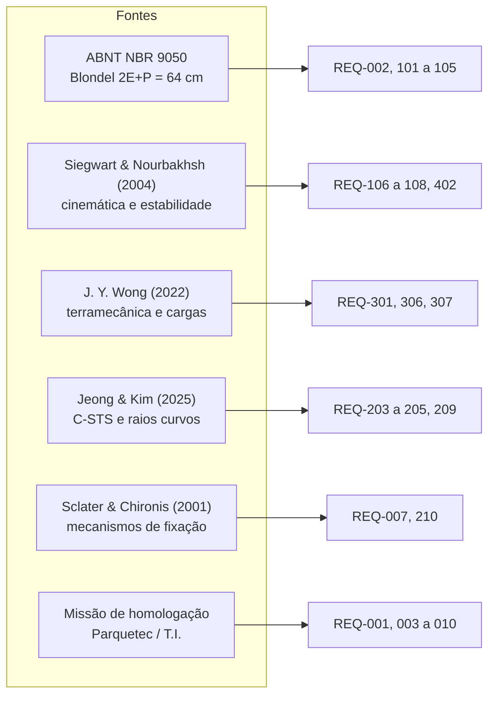

# 01. Requisitos de Engenharia e Matriz de Rastreabilidade

> **Para que serve.** Em R1 os critérios de sucesso estavam numa tabela e os
> ensaios em outra, sem vínculo — não era possível responder "qual evidência
> prova este requisito?". Aqui cada requisito tem identificador, valor,
> **método de verificação** e **artefato de evidência**.
>
> **Métodos de verificação** (convenção clássica de engenharia de sistemas):
> **A** análise · **S** simulação · **E** ensaio · **D** demonstração · **I** inspeção.
>
> **Situação:** ✅ verificado · 🟡 verificado em simulação, pendente de ensaio ·
> ⬜ pendente · ➖ fora do escopo desta fase.

---

## 1. Requisitos de missão (nível de sistema)

| ID | Requisito | Valor | Verif. | Evidência | Situação |
| :--- | :--- | :--- | :---: | :--- | :---: |
| **REQ-001** | Transportar carga útil de notebook + fonte | ≥ 2,5 kg (meta 3,0) | E | ENS-08 (pesagem + missão com carga) | ⬜ |
| **REQ-002** | Transpor degraus de escada civil padrão | E ≤ 180 mm, P ≥ 280 mm | S+E | `b1_dimensionamento_roda.png`, ENS-06 | 🟡 |
| **REQ-003** | Velocidade em terreno plano | ≥ 0,5 m/s (meta 1,0) | S+E | `b5_tracao.png`, ENS-03 | 🟡 |
| **REQ-004** | Choque vertical máximo na carga | ≤ 2,0 g (meta 1,5) | S+E | `b2_b3_suspensao.png`, ENS-07 | 🟡 |
| **REQ-005** | Autonomia em ciclo misto | ≥ 30 min (meta 45) | A+E | Relatório §4.1, ENS-09 | 🟡 |
| **REQ-006** | Alcance do enlace de teleoperação | ≥ 150 m NLOS (meta 300) | E | ENS-10 | ⬜ |
| **REQ-007** | Substituição de peça crítica | ≤ 15 min (meta 10) | D | Roteiro de montagem, DEM-02 | ⬜ |
| **REQ-008** | Custo de materiais novos | ≤ US$ 1.000 | I | Prestação de contas | ⬜ |
| **REQ-009** | Transpor porta e corredor estreitos | vão ≥ 800 mm | S+D | Gêmeo digital, DEM-03 | 🟡 |
| **REQ-010** | Integridade funcional da carga após transporte | boot normal, sem dano | D | Ata de homologação | ⬜ |

---

## 2. Requisitos de locomoção e geometria

| ID | Requisito | Valor | Verif. | Evidência | Situação |
| :--- | :--- | :--- | :---: | :--- | :---: |
| **REQ-101** | Marcha síncrona na escada de referência | D ≤ 2·r_max·sin(π/N) | A | `test_alcance_nariz_a_nariz_bate_com_a_formula` | ✅ |
| **REQ-102** | Escalar a partir de qualquer fase de aproximação | 100% das fases | S | `test_roda_adotada_escala_toda_a_familia_de_blondel` | ✅ |
| **REQ-103** | Cobrir a família de escadas de Blondel | E de 160 a 180 mm | S | Auditoria A-01, tabela de robustez | ✅ |
| **REQ-104** | Vão livre do ventre acima do espelho | ≥ E + 20 mm | A | `test_vao_livre_supera_o_espelho` | ✅ |
| **REQ-105** | Fase travada entre eixos na escada | L = k·D | A | `test_entre_eixos_e_multiplo_do_passo_do_degrau` | ✅ |
| **REQ-106** | Margem de tombamento longitudinal na escada | ≥ 10° | A | `test_margem_de_tombamento_atende_ao_kpi` | ✅ |
| **REQ-107** | Giro no próprio eixo dentro do curso dos servos | β ≤ 55° | A | `test_giro_no_eixo_cabe_no_curso_dos_servos` | ✅ |
| **REQ-108** | Ausência de arrasto lateral em 4WS coordenado | resíduo < 1e-9 m/s | A | `test_sem_arrasto_lateral` | ✅ |
| **REQ-109** | Rolamento em piso plano sem ripple destrutivo | ripple ≤ 10 mm | S | `test_aro_elastico_e_indispensavel_em_piso_plano` | ✅ |
| **REQ-110** | Transpor meio-fio urbano | ≥ 150 mm | S+E | `test_meio_fio_e_transposto`, ENS-05 | 🟡 |

---

## 3. Requisitos de suspensão e estrutura

| ID | Requisito | Valor | Verif. | Evidência | Situação |
| :--- | :--- | :--- | :---: | :--- | :---: |
| **REQ-201** | Curso da suspensão absorve a queda da marcha | ≥ 90 mm | A+S | `test_curso_da_suspensao_cobre_a_queda_da_marcha` | ✅ |
| **REQ-202** | Afundamento estático dentro da boa prática | 20 a 30% do curso | A | Parâmetros mestres §3 | ✅ |
| **REQ-203** | C-STS dimensionada para o torque de projeto | Δθ ≤ 35° em T_max | A | `test_rigidez_de_projeto_bate_com_torque_sobre_deflexao` | ✅ |
| **REQ-204** | Tensão de flexão na espiral C-STS | FS ≥ 2,0 | A | `test_espiral_cabe_no_cubo_e_tem_fator_de_seguranca` | ✅ |
| **REQ-205** | Espiral C-STS cabe dentro do cubo | r_ext < r_cubo | A | idem | ✅ |
| **REQ-206** | Pêndulo da caixa é estável | CG abaixo da fixação | A | `test_pendulo_e_estavel` | ✅ |
| **REQ-207** | Aro elástico colapsa na quina liberando o raio | F_colapso ≈ 90 N | E | ENS-04 (bancada) | ⬜ |
| **REQ-208** | Vida em fadiga do feixe de elásticos | ≥ 50 ciclos, deformação residual < 15% | E | ENS-11 | ⬜ |
| **REQ-209** | Raio curvo suporta a carga de ponta | FS ≥ 3,0 | A+E | Análise de viga, ENS-12 | 🟡 |
| **REQ-210** | Troca de caixa organizadora sem ferramenta | ≤ 2 min | D | DEM-02 | ⬜ |

---

## 4. Requisitos de tração, energia e térmica

| ID | Requisito | Valor | Verif. | Evidência | Situação |
| :--- | :--- | :--- | :---: | :--- | :---: |
| **REQ-301** | Margem de torque no pior caso de escada | ≥ 1,50 | A | `test_margem_de_torque_na_escada_atende_ao_kpi` | ✅ |
| **REQ-302** | Missão completa cabe na energia útil | ≤ 80% do pack | A | `test_missao_cabe_na_energia_util` | ✅ |
| **REQ-303** | Célula suporta a corrente de pico | ≥ 5C contínuo | I | Datasheet da célula adotada | ⬜ |
| **REQ-304** | Proteção térmica impede dano ao enrolamento | corte antes de 115 °C | A+E | `test_limite_termico...`, ENS-13 | 🟡 |
| **REQ-305** | Pausa de resfriamento entre lances de escada | imposta pelo firmware | I+D | Revisão de código, DEM-04 | ⬜ |
| **REQ-306** | Atrito disponível cobre a escada seca | μ ≥ 0,72 | A+E | `test_atrito_disponivel...`, ENS-06 | 🟡 |
| **REQ-307** | Frenagem em rampa sem deriva | parada em ≤ 0,5 m | E | ENS-14 | ⬜ |

---

## 5. Requisitos de controle, segurança e teleoperação

| ID | Requisito | Valor | Verif. | Evidência | Situação |
| :--- | :--- | :--- | :---: | :--- | :---: |
| **REQ-401** | Failsafe por perda de enlace | motores parados em ≤ 300 ms | E | ENS-10 | ⬜ |
| **REQ-402** | Limiar anti-tombamento por modo | 35° piso / 52° escada | I+S | Firmware, gêmeo digital | 🟡 |
| **REQ-403** | Calibração dos servos 4WS | erro ≤ 1,0° por servo | E | ENS-02 | ⬜ |
| **REQ-404** | Odometria compensa a complacência do C-STS | erro ≤ 5% em 10 m | A+E | `02_Engenharia/08`, ENS-15 | ⬜ |
| **REQ-405** | Frequência da malha de controle | ≥ 200 Hz | I | Revisão de firmware | ⬜ |
| **REQ-406** | Latência do vídeo FPV | ≤ 50 ms | E | ENS-10 | ⬜ |
| **REQ-407** | Parada de emergência independente do enlace | acionável no veículo | I+D | Inspeção, DEM-05 | ⬜ |
| **REQ-408** | Registro de telemetria da missão | ≥ 20 Hz, exportável | D | Gêmeo digital (CSV), ENS-16 | 🟡 |

---

## 5b. Requisitos de simulação e gêmeo digital

| ID | Requisito | Valor | Verif. | Evidência | Situação |
| :--- | :--- | :--- | :---: | :--- | :---: |
| **REQ-501** | Descrição do robô sem números duplicados | URDF lê o arquivo mestre | A | `test_massa_total_bate_com_o_arquivo_mestre` | ✅ |
| **REQ-502** | Inércias fisicamente admissíveis | positivas-definidas, desigualdade triangular | A | `test_inercias_positivas_definidas` | ✅ |
| **REQ-503** | Colisão preserva a geometria de raios | primitivas, não casco convexo | A | `test_variante_sem_aro_usa_cadeia_de_esferas` | ✅ |
| **REQ-504** | Cadeia de colisão sem lacunas | sobreposição ≥ 85% | A | `test_esferas_cobrem_o_raio_sem_buracos` | ✅ |
| **REQ-505** | Encalhe do ventre é detectável em simulação | colisão na cota do vão livre | A | `test_ventre_tem_colisao` | ✅ |
| **REQ-506** | Escada simulada = escada de projeto | E e P do arquivo mestre | A | `test_escada_do_mundo_e_a_escada_do_projeto` | ✅ |
| **REQ-507** | Passo de integração resolve o contato | ω·Δt < 0,5 | A | `test_passo_de_integracao_resolve_o_contato` | ✅ |
| **REQ-508** | Malha de juntas passivas mais rápida que a dinâmica | ≥ 20·√(k/m) | A | `controladores.yaml` (1000 Hz) | ✅ |
| **REQ-509** | Cinemática do nó ROS = referência analítica | ≤ 0,1° e 1 mm/s (ENS-01) | A | `test_no_ros_bate_com_o_simulador` | ✅ |
| **REQ-510** | Malhas imprimíveis | sem furos, volume positivo | A | `test_malhas_nao_tem_furos` | ✅ |
| **REQ-511** | Massa declarada reflete a geometria real | ±20% do volume das malhas | A | `test_massa_das_rodas_bate_com_as_malhas` | ✅ |
| **REQ-512** | Telemetria de simulação = telemetria do firmware | mesmas colunas | I | `registrador.py` × `02_Engenharia/08` §5 | ✅ |
| **REQ-513** | Supervisor não aborta subida normal | 43° em escada é operação | A | `test_arfagem_normal_de_escada_nao_dispara_protecao` | ✅ |
| **REQ-514** | Modo escada bloqueado sem piso seco | confirmação explícita | A | `test_modo_escada_bloqueado_sem_confirmar_piso_seco` | ✅ |
| **REQ-515** | Rearme após failsafe é sempre explícito | nunca automático | A | `test_rearme_e_sempre_explicito` | ✅ |
| **REQ-516** | Validação do modelo contra ensaio físico | ±40% no pico de aceleração | S+E | ENS-06 | ⬜ |

---

## 6. Rastreabilidade inversa: de onde veio cada requisito

---

## 7. Estado consolidado

| Situação | Quantidade | Observação |
| :--- | ---: | :--- |
| ✅ Verificado por análise/simulação automatizada | 33 | cobertos por 143 testes automatizados |
| 🟡 Verificado em simulação, pendente de ensaio físico | 13 | dependem da Fase 4 |
| ⬜ Pendente | 15 | dependem de hardware montado |

> **Regra de encerramento de fase.** A Fase 2 (engenharia e simulação) só se
> encerra com todos os requisitos de nível A/S em ✅. A Fase 5 (homologação) só se
> encerra com todos os requisitos de missão em ✅.
