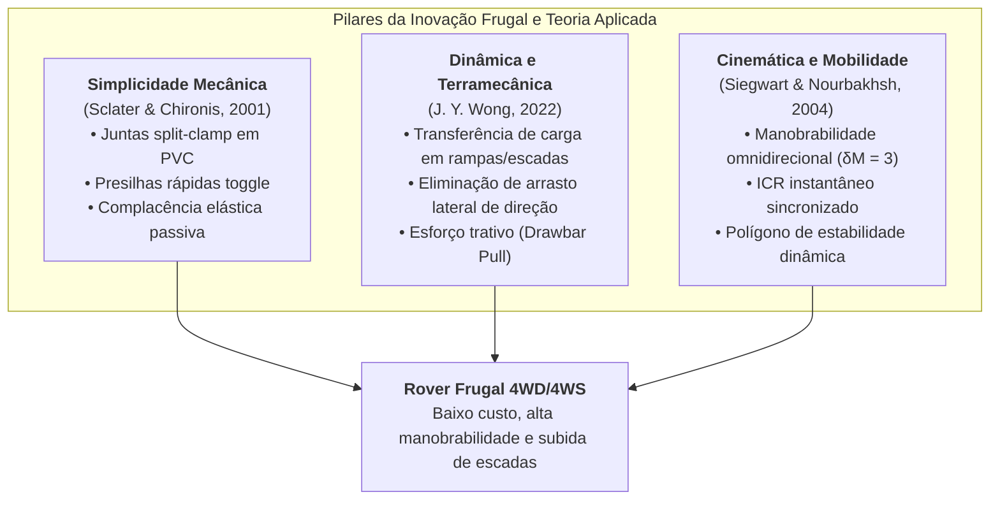
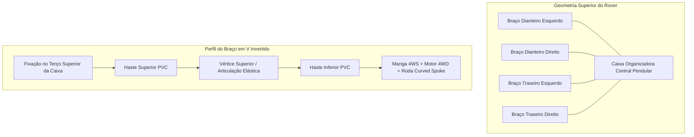

# 01. Visão Geral do Projeto, Escopo e Fundamentação Teórica
## Projeto Rover Frugal 4WD/4WS para Transporte de Cargas Leves

---

## 1. Justificativa e Filosofia da Inovação Frugal

O presente projeto visa a concepção, modelagem, simulação, prototipagem física e validação operacional de um **Veículo Terrestre Não Tripulado (UGV / Rover)** focado no transporte de pequenas cargas em ambientes urbanos e prediais (como parques tecnológicos, campi universitários e instalações corporativas).

Diferente de projetos robóticos convencionais que demandam usinagem CNC de precisão em alumínio aeronáutico, fibra de carbono e atuadores industriais de alto custo, este projeto adota como premissa norteadora a **Inovação Frugal (*Frugal Engineering*)**, amparada pela literatura científica de robótica e dinâmica veicular:

* **Simplicidade Extrema e Manutenção Instantânea**: Utilização de geometrias funcionais que resolvem desafios complexos de mobilidade (como subir escadas e superar desníveis) por meio de cinemática mecânica passiva e complacente, e não por complexidade mecatrônica excessiva.
* **Baixíssimo Custo de Construção e Manutenção**: Emprego massivo de componentes comerciais de prateleira (*COTS - Commercial Off-The-Shelf*), materiais de construção civil amplamente disponíveis (como canos de PVC de água fria) e manufatura aditiva básica (impressoras 3D FDM populares).
* **Modularidade e Reparo Imediato**: Todas as peças estruturais e articulações podem ser substituídas em minutos com ferramentas manuais comuns (serra de arco, chaves allen e parafusos métricos padrão).

---

## 2. Especificações Conceituais e Materiais Previstos

| Subsistema | Material / Solução Adotada | Racional Técnico e Embasamento Científico |
| :--- | :--- | :--- |
| **Estrutura dos Braços** | Canos de PVC rígido de água fria (padrão predial 20mm/25mm ou 1/2" e 3/4") | Baixíssimo custo, alta disponibilidade, excelente rigidez à torção/flexão, leveza e facilidade de corte/ajuste. Conforme *Sclater & Chironis (2001)*, estruturas tubulares associadas a abraçadeiras de aperto radial eliminam concentrações de tensão de furos passantes. |
| **Articulações e Junções** | Peças impressas em 3D (PETG / PLA+) com abraçadeiras *split-clamp* | Conexão rápida entre os tubos de PVC, permitindo geometrias angulares customizadas e aperto por compressão radial com parafusos tangenciais. |
| **Rodas Especiais** | Rodas impressas em 3D com formato *Curved Spokes* (Raios Curvos) | Permitem vencer degraus e escadas aproveitando o engate dos raios em quinas vivas (efeito garra rotativa complacente). |
| **Sistema de Suspensão** | Elementos elastoméricos com **elásticos comuns de escritório** e batentes mecânicos | Atuam como molas complacentes de baixo custo com amortecimento histerético intrínseco, absorvendo choques de transição ao subir degraus (baseado na teoria C-STS de *Jeong & Kim, 2025* e nos mecanismos elásticos de *Sclater & Chironis, 2001*). |
| **Compartimento de Carga** | Caixa organizadora plástica convencional (polipropileno) | Recipiente leve, estanque, barato e padronizado para abrigar a carga útil (ex.: notebook, cabos, periféricos). |
| **Fixação e Modularidade** | Encaixes destacáveis tipo *Toggle Clamps* no terço superior da caixa | Os módulos de locomoção e braços podem ser desmontados e reinstalados em uma nova caixa em menos de 5 minutos (*Sclater & Chironis, 2001*). |
| **Sistema de Tração** | 4WD (4 Motores independentes, 1 por roda) | Garante torque dedicado em cada ponto de contato. Essencial segundo *Wong (2022)*, pois a transferência de carga em escadas descarrega as rodas dianteiras e sobrecarrega as traseiras. |
| **Sistema de Direção** | 4WS (4 Motores / Servos de esterçamento independente) | Proporciona Grau de Manobrabilidade $\delta_M = 3$ (*Siegwart & Nourbakhsh, 2004*), viabilizando manobras omnidirecionais (giro no próprio eixo, modo caranguejo e Ackermann duplo) sem o consumo energético excessivo de *skid-steering*. |
| **Unidade de Controle** | ESP32 (Dual Core 240MHz) com FreeRTOS | Gestão em tempo real de 8 canais PWM independentes (4 tração + 4 direção), fusão sensorial IMU/Odometria e telemetria sem fio de baixa latência. |

---

## 3. Configuração Geométrica e Cinemática

### 3.1. Arranjo Radial em "X" e Polígono de Suporte (Siegwart & Nourbakhsh, 2004)
Os 4 braços mecânicos projetam-se radialmente a partir da caixa organizadora central em um padrão em "X". Essa disposição oferece:
1. **Polígono de Sustentação Isométrico**: Maximiza a margem de estabilidade estática e dinâmica em todas as direções de deslocamento ($X$ e $Y$).
2. **Distribuição Simétrica de Cargas**: Facilita a modelagem matemática e o equilíbrio dinâmico dos 4 atuadores de tração e 4 de esterçamento.

### 3.2. Geometria dos Braços em "V Invertido"
Cada perna do rover possui uma conformação em "V invertido" ($\Lambda$), conectando a estrutura superior ao conjunto de roda na extremidade inferior:
* **Elevado Vão Livre do Solo (*Ground Clearance*)**: Evita que o fundo da caixa colida com as bordas dos degraus.
* **Triangulação Rígida**: Transforma momentos fletores em forças axiais de tração e compressão nos tubos de PVC, aproveitando a máxima resistência mecânica do material com espessura mínima.

### 3.3. Fixação Pendular e Centro de Gravidade (CG) (Wong, 2022)
* A caixa organizadora é fixada nos braços em seu **terço superior**, deixando o corpo principal da caixa suspenso abaixo do ponto de ancoragem.
* **Efeito Pêndulo Auto-Estabilizador**: Conforme as equações de equilíbrio estático de veículos em rampa (*Wong, 2022*), ao concentrar o peso da carga (notebook, baterias e eletrônica pesada) próximo ao fundo da caixa, a cota vertical do Centro de Gravidade ($h_{CG}$) é substancialmente rebaixada em relação ao eixo virtual de sustentação. Isso aumenta o ângulo crítico de tombamento ($\alpha_{tip} = \arctan(b / h_{CG})$), conferindo estabilidade natural em subidas de escada de até $35^\circ$.

---

## 4. Limites do Escopo (O que é e o que não é o projeto)

### 4.1. Escopo Positivo (Incluído)
* Desenvolvimento de modelos CAD 3D de todas as peças customizadas (rodas *curved spokes*, cubos, mangas 4WS, juntas *split-clamp* de PVC e presilhas *toggle* da caixa).
* Simulação física digital de locomoção, cinemática 4WD/4WS e controle de estabilidade em degraus e terreno irregular.
* Construção física de 1 (um) protótipo funcional completo de UGV com tração 4WD e esterçamento 4WS.
* Implementação do sistema de controle remoto FPV e telemetria para operação por um piloto humano.
* Realização do ensaio de homologação final: buscar um notebook em qualquer ponto do Itaipu Parquetec e entregá-lo no departamento de T.I.
* Formulação dos planos de transição para as fases subsequentes (longa distância e versão com fibra óptica).

### 4.2. Escopo Negativo (Excluído da Fase Executiva Inicial)
* Navegação totalmente autônoma por SLAM LiDAR 3D e inteligência artificial de auto-direção (o foco da fase 1 a 6 é teleoperação robusta e mecânica frugal).
* Carcaças blindadas usinadas em metal pesado ou vedações estanques para submersão (IP68).
* Sistemas de armas ou integração cinética ativa (a fase de defesa será conceituada como UGV de reconhecimento/transporte via fibra óptica na Fase 7).

---

## 5. Fatores Críticos de Sucesso (FCS)
1. **Custo Unitário Direto Mínimo**: A estrutura física do chassi não deve ultrapassar uma fração diminuta de rovers industriais.
2. **Capacidade de Vencer Escadas Padrão**: As rodas em *curved spokes* conjugadas com a suspensão elástica devem transpor degraus de até 17 cm de espelho.
3. **Estabilidade da Carga Útil**: O notebook transportado na caixa organizadora não deve sofrer impactos mecânicos superiores a 2.0g durante a operação.
4. **Desmontabilidade e Manutenção**: Qualquer componente danificado deve ser substituível em menos de 10 minutos utilizando peças sobressalentes pré-impressas e tubos de PVC.
