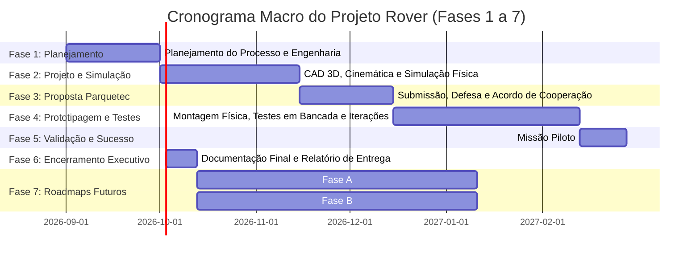

# 02. Estrutura de Fases, EAP (WBS) e Cronograma Geral
## Ciclo de Vida Completo do Projeto Rover

---

## 1. Visão Geral das Fases do Projeto

O ciclo de vida do projeto foi desenhado em 7 fases sequenciais e integradas, garantindo que o desenvolvimento técnico, a captação de recursos institucionais, a execução de testes e as perspectivas futuras estejam perfeitamente alinhados:

---

## 2. Detalhamento das 7 Fases do Projeto

### 📌 Fase 1: Planejamento Global e Estruturação do Processo
* **Objetivo**: Estruturar todas as diretrizes técnicas, de gestão, operacionais e orçamentárias do projeto antes da execução física.
* **Principais Entregas**:
  * Matriz de Escopo, Requisitos de Engenharia e Critérios de Sucesso.
  * Estrutura Analítica do Projeto (EAP / WBS) e Dicionário da EAP.
  * Estruturação dos modelos de governança alinhados ao PMBOK 7ª Edição.
  * Mapeamento de riscos preliminares e estratégias de contingência.

---

### 📌 Fase 2: Engenharia de Detalhe, Modelagem CAD e Prototipação Digital / Simulação
* **Objetivo**: Desenvolver todo o projeto mecânico, elétrico e de software em ambiente virtual, validando a viabilidade física por simulação antes de gastar recursos materiais.
* **Principais Entregas**:
  * Modelagem CAD 3D de todas as peças (juntas de PVC, suportes de motor, cubos de roda e geometrias de raios curvos *curved spokes*).
  * Simulação dinâmica multicorpo (subida de degraus, resposta da suspensão por elásticos, torque requerido nos motores 4WD).
  * Definição da arquitetura de controle eletrônico (seleção entre ESP32, Arduino e Raspberry Pi) e diagrama esquemático de potência.
  * Firmware base de acionamento de motores e rotinas de telemetria/teleoperação.

---

### 📌 Fase 3: Apresentação e Proposta de Parceria ao Itaipu Parquetec
* **Objetivo**: Firmar parceria estratégica de apoio técnico e infraestrutural com o Parque Tecnológico Itaipu (Itaipu Parquetec).
* **Modelo da Proposta**:
  * **Contrapartida Própria**: Aporte financeiro de **US$ 1.000,00 (mil dólares americanos)** para aquisição de componentes comerciais específicos e insumos que não estejam disponíveis no estoque do parque.
  * **Solicitação de Recursos Humanos ao Parquetec**:
    1. **1 Especialista em Hardware / Mecatrônica**: Suporte na validação de circuitos de potência, integração de motores e instrumentação.
    2. **1 Especialista em Software / Embarcados**: Apoio na arquitetura de firmware, comunicação sem fio de baixa latência e interface do piloto.
    3. **1 Bolsista / Estagiário**: Dedicação à manufatura aditiva (impressão 3D), montagem física, cabeamento e testes de bancada.
  * **Solicitação de Infraestrutura ao Parquetec**: Acesso às oficinas/laboratórios de prototipagem, fazenda de impressoras 3D, ferramentas mecânicas e aproveitamento de itens já existentes em almoxarifado (controladores, fios, conectores, sensores).

---

### 📌 Fase 4: Fabricação Física, Montagem, Testes e Iterações
* **Objetivo**: Construir fisicamente o protótipo do rover, realizar testes funcionais em ambiente controlado e iterar melhorias de projeto até a estabilidade operacional completa.
* **Principais Entregas**:
  * Impressão 3D das rodas *curved spokes*, articulações e caixas de engrenagens.
  * Corte, conformação e montagem da estrutura de braços em PVC com a caixa organizadora pendular.
  * Calibração da suspensão elastomérica com elásticos de escritório (ajuste da constante de mola e pré-tensão).
  * Integração do sistema de tração 4WD e esterçamento 4WS com calibração de malha aberta/fechada.
  * Bateria de testes incrementais: tração plana $\rightarrow$ subida de meio-fio $\rightarrow$ escada padrão $\rightarrow$ transporte com carga útil nominal de 3 kg.

---

### 📌 Fase 5: Missão de Homologação e Declaração de Sucesso
* **Objetivo**: Executar o teste definitivo de campo que valida integralmente todos os requisitos operacionais do protótipo.
* **Critério de Sucesso Inquestionável**:
  > **"O protótipo do rover deve ser capaz de se deslocar até qualquer ponto designado dentro do Itaipu Parquetec, embarcar um notebook em sua caixa organizadora e transportá-lo com segurança até o departamento de Tecnologia da Informação (T.I.), sendo operado remotamente por um piloto humano."**
* **Principais Entregas**:
  * Execução documentada em vídeo e telemetria da missão de busca e entrega.
  * Relatório de integridade da carga útil (ausência de choques críticos, fixação estável).
  * Homologação formal com a equipe do Itaipu Parquetec.

---

### 📌 Fase 6: Encerramento da Fase Executiva do Projeto
* **Objetivo**: Concluir formalmente a fase de desenvolvimento do protótipo base, consolidar a documentação técnica e prestar contas da parceria.
* **Principais Entregas**:
  * Relatório final de engenharia com lições aprendidas e métricas de desempenho.
  * Repositório completo de arquivos abertos (Open Hardware / Open Source): CADs (.STEP, .STL), esquemáticos eletrônicos, firmware e manuais de operação.
  * Prestação de contas do aporte de US$ 1.000,00 e dos recursos institucionais empregados.

---

### 📌 Fase 7: Roadmaps Futuros Pós-Sucesso (Projetos de Continuidade)
* **Objetivo**: Expandir o escopo tecnológico com base na plataforma validada nas fases anteriores.
* **Frentes de Continuidade (já requeridas formalmente)**:
  * **Fase 7.1 / Fase A — Extensão de Distâncias e Ambientes Reais**:
    * Aumento de autonomia energética (baterias LiFePO4 / Li-Ion de alta capacidade).
    * Comunicação via enlace 4G/5G celular de longo alcance ou repetidores locais.
    * Selagem e intemperismo (resistência à poeira, chuva leve e lama - padrão IP54).
  * **Fase 7.2 / Fase B — Operacionalização para Uso Dual / Tático com Fibra Óptica**:
    * Adaptação do chassi para missões de segurança, inspeção tática e reconhecimento em áreas hostis.
    * Substituição/redundância do enlace de rádio por **bobina de microfibra óptica descartável (tethered control)**, garantindo imunidade absoluta contra guerra eletrônica (*jamming* de RF), transmissão de vídeo 4K sem compressão/latência e operação indetectável por analisadores de espectro eletromagnético.

---

## 3. Estrutura Analítica do Projeto (EAP / WBS)

```mermaid
graph TD
    WBS[1.0 Projeto Rover Frugal] --> W1[1.1 Planejamento & Gestão]
    WBS --> W2[1.2 Engenharia & Simulação]
    WBS --> W3[1.3 Articulação Institucional]
    WBS --> W4[1.4 Manufatura & Montagem]
    WBS --> W5[1.5 Testes & Validação]
    WBS --> W6[1.6 Roadmaps Futuros]

    W1 --> W1_1[1.1.1 Documentação e Escopo]
    W1 --> W1_2[1.1.2 Governança PMBOK 7]
    W1 --> W1_3[1.1.3 Matriz de Riscos]

    W2 --> W2_1[1.2.1 CAD Chassi PVC + Juntas 3D]
    W2 --> W2_2[1.2.2 CAD Rodas Curved Spokes]
    W2 --> W2_3[1.2.3 Simulação Dinâmica de Escadas]
    W2 --> W2_4[1.2.4 Esquemático Eletrônico e Firmware]

    W3 --> W3_1[1.3.1 Dossiê de Apresentação Parquetec]
    W3 --> W3_2[1.3.2 Acordo de Contrapartida $1k USD]
    W3 --> W3_3[1.3.3 Alocação de Profissionais e Bolsista]

    W4 --> W4_1[1.4.1 Impressão 3D e Corte de PVC]
    W4 --> W4_2[1.4.2 Montagem Mecânica da Caixa Pendular]
    W4 --> W4_3[1.4.3 Instalação dos Motores 4WD + 4WS]
    W4 --> W4_4[1.4.4 Chicote Elétrico e Instalação de Controle]

    W5 --> W5_1[1.5.1 Testes de Bancada e Calibração]
    W5 --> W5_2[1.5.2 Ensaios de Rampa e Degraus]
    W5 --> W5_3[1.5.3 Missão Piloto: Busca de Notebook no Parquetec]

    W6 --> W6_1[1.6.1 Projeto Longa Distância / Ambientes Reais]
    W6 --> W6_2[1.6.2 Projeto Dual Use / Controle por Fibra Óptica]
```

