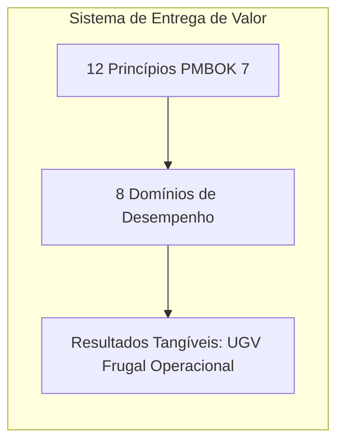
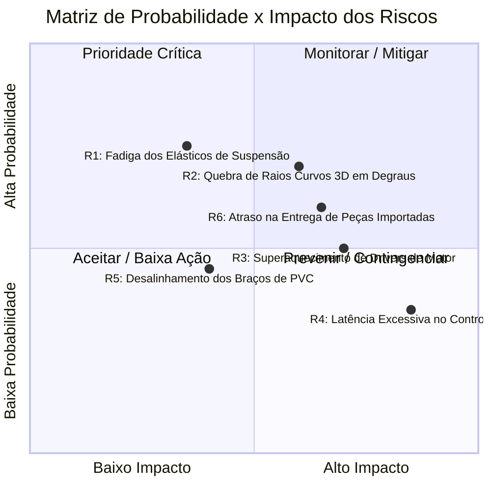

# 03. Governança, Gestão e Alinhamento com o PMBOK 7ª Edição
## Sistema de Entrega de Valor e Domínios de Desempenho

---

## 1. O Modelo PMBOK 7ª Edição Aplicado ao Rover Frugal

O **PMBOK 7ª Edição** transcende a visão puramente processual tradicional, orientando a gestão para **Princípios de Entrega de Valor** e **Domínios de Desempenho do Projeto**. Para um projeto de prototipagem rápida e inovação frugal, essa flexibilidade é essencial para assegurar agilidade sem perder o rigor técnico.

---

## 2. Aplicação dos 12 Princípios de Gerenciamento de Projetos

1. **Responsabilidade e Cuidado (*Stewardship*)**: Uso ético e transparente dos recursos públicos/institucionais do Itaipu Parquetec e do aporte privado de US$ 1.000,00.
2. **Ambiente Colaborativo da Equipe (*Team*)**: Integração harmoniosa entre o líder do projeto, o especialista em hardware, o especialista em software e o bolsista operacional.
3. **Engajamento Eficaz das Partes Interessadas (*Stakeholders*)**: Alinhamento contínuo com a gestão do Parquetec e com a equipe de TI (cliente final do transporte de notebooks).
4. **Foco no Valor (*Value*)**: Cada escolha técnica prioriza a relação custo/benefício (ex.: usar canos de PVC e elásticos em vez de componentes industriais caros).
5. **Pensamento Holístico / Sistêmico (*Systems Thinking*)**: Reconhecer a interdependência entre a deformação elástica dos braços de PVC, a aderência das rodas de raios curvos e o consumo de corrente dos motores.
6. **Liderança Compartilhada (*Leadership*)**: Fomentar autonomia no bolsista e nos especialistas técnicos para propor otimizações práticas.
7. **Adaptação ao Contexto (*Tailoring*)**: Eliminação de burocracias desnecessárias, aplicando sprints semanais de prototipagem física e testes.
8. **Qualidade dos Processos e Resultados (*Quality*)**: Garantir que, apesar do baixo custo dos materiais, a estabilidade e a segurança da carga transportada sejam impecáveis.
9. **Navegação na Complexidade (*Complexity*)**: Tratar a não-linearidade da dinâmica de subida de escadas com apoio de simulação digital antes da manufatura.
10. **Otimização das Respostas aos Riscos (*Risk*)**: Mitigar quebras estruturais mantendo peças sobressalentes pré-fabricadas e designs modulares.
11. **Adaptabilidade e Resiliência (*Adaptability & Resiliency*)**: Capacidade de modificar a geometria dos braços ou a dureza dos elásticos com base em falhas nos primeiros testes de degrau.
12. **Capacitação para Mudança (*Change*)**: Preparar desde o início o UGV para evoluções arquiteturais (Fase 7: Longo Alcance e Fibra Óptica).

---

## 3. Estruturação dos 8 Domínios de Desempenho do Projeto

| Domínio de Desempenho | Aplicação no Projeto Rover | Instrumento / Artefato Prático |
| :--- | :--- | :--- |
| **1. Partes Interessadas (*Stakeholders*)** | Engajamento da Diretoria do Parquetec, Equipe de TI (receptores da carga), Piloto remoto e Comunidade acadêmica. | Matriz de Stakeholders e Reuniões quinzenais de demonstração. |
| **2. Equipe (*Team*)** | Coordenação dos 4 integrantes: Líder/Projetista, Especialista HW, Especialista SW e Bolsista de Manufatura. | Quadro Kanban de tarefas e divisão clara de responsabilidades técnicas. |
| **3. Abordagem de Desenvolvimento (*Development Approach*)** | Ciclo de vida híbrido: cascata para planejamento macro/compras e ágil/iterativo para prototipagem digital e física. | Sprints de 15 dias com marcos de testes funcionais. |
| **4. Planejamento (*Planning*)** | Cronograma de 7 fases, detalhamento de EAP/WBS e estimativas de custo e suprimentos COTS. | Documentos de cronograma, BOM (*Bill of Materials*) e orçamento. |
| **5. Trabalho do Projeto (*Project Work*)** | Gestão de horas de impressoras 3D, controle de insumos (tubos de PVC, filamento, parafusos) e rotinas de montagem. | Diário de laboratório e controle de estoque de peças sobressalentes. |
| **6. Entrega (*Delivery*)** | Validação de cada subconjunto (braço, roda, módulo de potência) culminando no rover completo funcional. | Critérios de Aceite por subsistema e Relatório de Homologação. |
| **7. Medição (*Measurement*)** | Avaliação quantitativa de métricas: velocidade média, torque consumido, aceleração da carga e taxa de subida de degraus. | Telemetria embarcada e análise de dados de ensaio. |
| **8. Incerteza e Riscos (*Uncertainty*)** | Gestão proativa de falhas térmicas, elásticas, mecânicas ou de latência de rádio durante os testes. | Matriz de Riscos e Planos de Contingência. |

---

## 4. Matriz de Gestão de Riscos do Projeto

### Detalhamento das Respostas aos Riscos:

1. **R1: Fadiga / Ruptura dos Elásticos Comuns de Escritório**:
   * *Ação Preventiva*: Utilizar feixes múltiplos de elásticos em paralelo; substituir preventivamente a cada 10 ciclos de teste completo.
   * *Contingência*: Encaixes rápidos no chassi que permitem a troca de elásticos em menos de 30 segundos.
2. **R2: Fratura nos Raios Curvos (*Curved Spokes*) durante Impacto em Quinas de Degraus**:
   * *Ação Preventiva*: Otimização da orientação de impressão 3D (para que as linhas de camada não fiquem normais à tração principal) e uso de filamento PETG ou PLA com 100% de preenchimento nos pontos de raio.
   * *Contingência*: Banco de rodas reservas pré-impressas no laboratório.
3. **R3: Sobrecarga e Travamento Térmico dos Drivers de Tração em Subida Prolongada**:
   * *Ação Preventiva*: Dimensionar drivers de motor com margem de corrente de 200% em relação à corrente nominal de stall e instalar dissipadores de alumínio com ventilação forçada.
4. **R4: Perda de Sinal de Rádio / Latência Elevada dentro de Prédios de Concreto do Parquetec**:
   * *Ação Preventiva*: Empregar protocolo de rádio de longo alcance e baixa latência (ex.: ExpressLRS em 915 MHz ou 2.4 GHz) e transmissor de vídeo analógico/digital robusto.
   * *Contingência*: Sistema de *Failsafe* embarcado que desliga os motores e aciona freio mecânico/regenerativo se o enlace for interrompido por mais de 500 ms.
