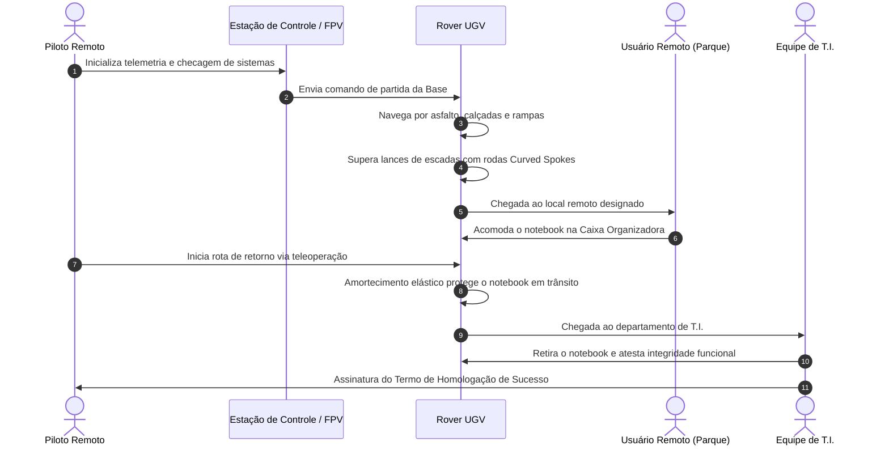

# 04. Critérios de Sucesso, Métricas de Desempenho e Validação Final
## Definição da Missão de Homologação Executiva

---

## 1. O Critério Maior de Sucesso (Declaração de Conclusão)

O encerramento formal e com êxito da fase executiva do projeto dar-se-á com o cumprimento do seguinte marco prático:

> ### 🎯 Declaração de Sucesso
> **"O protótipo do rover deve navegar a partir de sua base, deslocar-se até qualquer ponto designado dentro das dependências do Itaipu Parquetec, receber um notebook em sua caixa organizadora de carga e transportá-lo com integridade física total até a sala da Tecnologia da Informação (T.I.), sendo conduzido em tempo real por um piloto remoto."**

Este teste sintetiza a eficácia mecânica, a estabilidade da suspensão, o controle dos 4 motores de tração, o esterçamento 4WS, a confiabilidade da telemetria e o valor prático imediato da solução no ecossistema do parque.

---

## 2. Métricas Quantitativas de Engenharia (KPIs)

Para que a homologação seja considerada plenamente válida, o veículo deve atender aos seguintes limites de tolerância:

| Métrica / Parâmetro | Valor Meta / Especificação | Limite Aceitável | Método de Medição |
| :--- | :--- | :--- | :--- |
| **Capacidade de Carga Útil** | 3,0 kg (Notebook corporativo + carregador) | Mínimo 2,5 kg | Pesagem em balança digital de precisão. |
| **Transposição de Degraus** | Degraus de até 17 cm de altura | Mínimo 15 cm | Teste em escada padrão de alvenaria do parque. |
| **Velocidade de Deslocamento** | 0,8 a 1,5 m/s em terreno plano | Mínimo 0,5 m/s | Medição via GPS/Odometria e cronômetro. |
| **Nível de Vibração / Choque na Carga** | Aceleração vertical $< 1,5g$ | Máximo $< 2,5g$ | Acelerômetro de 3 eixos instalado na caixa de carga. |
| **Autonomia de Bateria** | $\ge 45$ minutos de operação contínua | Mínimo 30 minutos | Tempo total sob ciclo misto (plano + rampa + escada). |
| **Alcance do Link de Teleoperação** | $\ge 300$ metros sem linha de visada direta | Mínimo 150 metros | Teste de rádio através de paredes e edifícios do parque. |
| **Tempo de Substituição de Peça Crítica** | $< 10$ minutos (roda, junta ou tubo) | Máximo 15 minutos | Cronometragem de manutenção em bancada. |
| **Custo Total de Materiais Novos** | $\le \text{US\$ } 1.000,00$ | Máximo $\text{US\$ } 1.000,00$ | Prestação de contas das notas de compra. |

---

## 3. Protocolo de Testes da Missão de Homologação

---

## 4. Matriz de Aceite e Verificação

### 4.1. Verificação da Integridade do Notebook Transportado
1. **Inspeção Visual**: Ausência de arranhões, trincas ou deformações na carcaça.
2. **Inspeção Funcional**: Inicialização do sistema operacional (*boot* normal), tela sem danos e operação perfeita de teclado/trackpad após o transporte.
3. **Log de Telemetria de Impacto**: Verificação do registrador de aceleração ($g$-force) embarcado para comprovar que nenhuma desaceleração abrupta danificou componentes eletrônicos.

### 4.2. Condições de Reprovação do Teste
* Tombamento do veículo durante a subida ou descida de escadas.
* Queda ou desacoplamento da caixa organizadora em relação aos braços de suporte.
* Quebra estrutural de tubos de PVC ou juntas impressas em 3D que impeça o término autônomo da rota.
* Perda de tração permanente com queima de motores ou baterias.

---

## 5. Formalização do Encerramento Executivo

Após o cumprimento integral do protocolo com êxito:
1. Lavra-se a **Ata de Conclusão da Fase Executiva**.
2. Os membros técnicos do Itaipu Parquetec e o líder do projeto assinam a homologação.
3. Abre-se formalmente a transição para as fases subsequentes de pesquisa e expansão (Fases 7.1 e 7.2).
