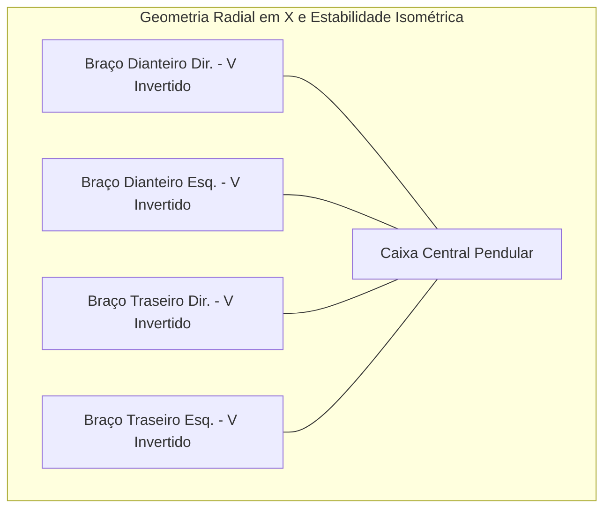
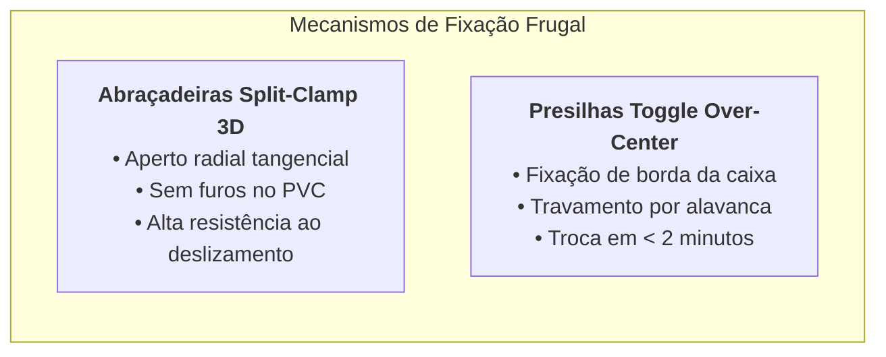

# 01. Arquitetura Mecânica, Geometria e Terramecânica Aplicada
## Chassi em Tubos de PVC, Juntas Split-Clamp, Fixação Toggle e Estabilidade Pendular

---

## 1. Concepção Estrutural e Filosofia Geométrica

O chassi do rover é projetado para integrar a simplicidade de manufatura frugal à rigorosa fundamentação de **Dinâmica Veicular de *J. Y. Wong (2022)*** e **Mecanismos Clássicos de *Sclater & Chironis (2001)***:




*(Renderização do protótipo: disposição em X dos braços de PVC em V invertido, juntas 3D laranjas, caixa organizadora central pendular, suspensão elástica e rodas de raios curvos)*

### Requisitos Geométricos Fundamentais:
1. **Polígono de Sustentação Isométrico (*Siegwart & Nourbakhsh, 2004*)**: Com a disposição radial em "X", a distância do Centro de Gravidade (CG) a qualquer uma das arestas do polígono de apoio é maximizada, conferindo margem de estabilidade estática e dinâmica uniforme tanto em rolagem (*roll*) quanto em arfagem (*pitch*).
2. **Elevado Vão Livre do Solo (*Ground Clearance*)**: O vão livre central ($h_{clear} \ge 180\text{ mm}$) é superior à altura máxima do espelho dos degraus ($170\text{ mm}$), evitando que o fundo da caixa colida com a quina dos degraus durante a escalada.
3. **Desacoplamento e Troca Rápida de Caixa (*Sclater & Chironis, 2001*)**: Sistema de fixação por presilhas rápidas que dispensa ferramentas para a substituição do compartimento de carga.

---

## 2. Geometria dos Braços em "V Invertido" e Triangulação Estrutural

Cada um dos 4 braços mecânicos é composto por uma treliça espacial em forma de **V invertido ($\Lambda$)**:
* **Haste Ascendente (Tubo PVC Superior - $L_1$)**: Parte da abraçadeira superior da caixa e estende-se em ângulo $\theta_1 \approx 40^\circ$ até o vértice.
* **Vértice Superior (Junta 3D Split-Clamp)**: Conecta as duas hastes de PVC e provê a ancoragem superior da suspensão elástica.
* **Haste Descendente (Tubo PVC Inferior - $L_2$)**: Desce do vértice em direção ao solo em ângulo $\theta_2 \approx 45^\circ$, sustentando o módulo de esterçamento 4WS e o motorredutor 4WD.

```
                  [Vértice Superior 3D / Split-Clamp]
                                  /\
                                 /  \
     Haste Ascendente PVC ($L_1$) /    \  Haste Descendente PVC ($L_2$)
                               /      \
                              /        \
    [Presilha Toggle Rápida    [Módulo de Esterçamento 4WS +
     Terço Superior da Caixa]   Motor 4WD + Roda Curved Spoke]
```

### Vantagens Mecânicas da Triangulação:
* Conforme a teoria das estruturas (*Wong, 2022*), a geometria triangular transforma momentos fletores complexos em **forças axiais de tração e compressão puras** ao longo do eixo dos tubos de PVC, aproveitando a elevada resistência à compressão do PVC rígido sem empenamento.

---

## 3. Dinâmica de Transferência de Carga e Estabilidade Pendular (Wong, 2022)

### 3.1. Equações de Transferência de Carga em Rampa e Escada
Ao subir uma escada ou rampa com ângulo de inclinação $\theta$ e aceleração longitudinal $a_x$, as cargas normais sobre os eixos dianteiro ($W_f$) e traseiro ($W_r$) redistribuem-se conforme as equações fundamentais de *J. Y. Wong (Theory of Ground Vehicles, Cap. 3 e 4)*:

$$W_f = \frac{W (l_r \cos\theta - h_{CG} \sin\theta) - \frac{W}{g} a_x h_{CG}}{L}$$

$$W_r = \frac{W (l_f \cos\theta + h_{CG} \sin\theta) + \frac{W}{g} a_x h_{CG}}{L}$$

Onde:
* $W$: Peso total do rover ($M_{total} \cdot g$).
* $L = l_f + l_r$: Distância entre-eixos longitudinal (*wheelbase*).
* $h_{CG}$: Altura do Centro de Gravidade em relação ao plano de apoio das rodas.
* $\theta$: Ângulo de inclinação da escada ($\approx 30^\circ \text{ a } 35^\circ$).

```
                      ESQUEMA DE CARGAS EM SUBIDA DE ESCADA (θ)
                            ^ z
                            |   / W_z (Normal)
                     CG .---|--'
                       /|   |   \ W_x (Tangencial)
                      / |   |
              W_f    /  |   |             W_r
             [O]====/===|===|============[O] --> Direção de Subida
             / / / / / / / / / / / / / / / / 
            / / / / / / / / / / / / / / / /  Plano Inclinado da Escada (θ)
```

### 3.2. O Efeito Pêndulo Auto-Estabilizador
* Ao fixar os braços no **terço superior da caixa organizadora**, a maior parte da massa (baterias pesadas, drivers e o notebook) fica posicionada a uma cota vertical bem abaixo do ponto de fixação ($h_{CG} \ll L/2$).
* **Redução Drástica do Termo $h_{CG} \sin\theta$**: Ao minimizar $h_{CG}$, a perda de carga normal no eixo dianteiro ($W_f$) é substancialmente amortecida, evitando o empinamento e o capotamento longitudinal para trás (*back-flip*).
* **Ângulo Crítico de Tombamento Estático**:
  $$\alpha_{tombamento} = \arctan\left(\frac{l_r}{h_{CG}}\right) \ge 55^\circ$$
  Como a inclinação máxima de uma escada padrão de alvenaria é de $\approx 35^\circ$, o rover opera com uma margem de segurança estática superior a $50\%$.

---

## 4. Juntas *Split-Clamp* e Presilhas Rápidas *Toggle* (Sclater & Chironis, 2001)

Para garantir máxima robustez sem enfraquecer os tubos de PVC com furações destrutivas, adotam-se duas soluções consagradas em mecanismos de precisão (*Sclater & Chironis, Cap. 10*):



### 4.1. Abraçadeiras Bipartidas com Fenda de Alívio (*Split-Clamp Collars*)
* As peças 3D de união dos vértices e mangas de eixo possuem um colar cilíndrico com fenda longitudinal de $2\text{ mm}$ e duas orelhas para parafuso Allen M4/M5 com porca autotravante (*parlock*).
* O aperto do parafuso gera uma **pressão de contato uniforme de $360^\circ$** sobre o diâmetro externo do tubo de PVC.
* **Benefício**: Elimina a necessidade de parafusos passantes que criariam concentradores de tensão e trincas no PVC sob esforços de impacto cíclico.

```
       [Perfil da Junta Split-Clamp de Compressão Radial 3D]
                 .---===---.
               /     | |     \     <- Fenda de Alívio (2 mm)
              |   (  Tubo )   |
              |   (  PVC  )   |    <- Pressão Radial Uniforme (360°)
               \  (       )  /
                '--+-----+--'
                   | (O) |         <- Parafuso Tangencial M4 com Porca Parlock
                   '-----'
```

### 4.2. Presilhas Rápidas Articuladas (*Quick-Release Toggle Clamps*)
* A fixação das 4 pernas na caixa organizadora é realizada por **4 presilhas de engate rápido tipo gafanhoto (*over-center toggle clamps*)** montadas na borda estrutural reforçada da caixa.
* **Mecanismo de Travamento**: O mecanismo atinge a rigidez máxima ao ultrapassar o ponto morto central (*over-center*), travando a estrutura por interferência elástica.
* **Troca de Caixa em Menos de 2 Minutos**: Em caso de avaria no plástico da caixa durante uma operação, o piloto destrava as 4 alavancas com as mãos, saca o conjunto mecânico/elétrico intacto e o reinstala instantaneamente em uma caixa reserva.
