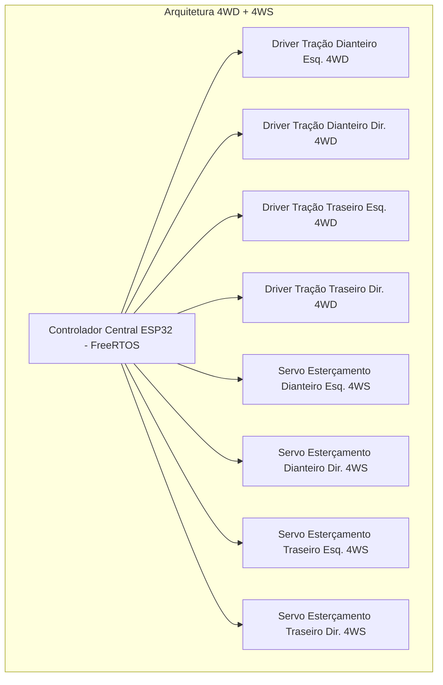
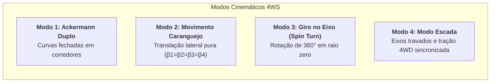

# 03. Cinemática de Locomoção: Tração 4WD e Esterçamento 4WS
## Modelo Cinemático Rigoroso (Siegwart & Nourbakhsh, 2004), ICR e Eficiência Energética (Wong, 2022)

> [!IMPORTANT]
> **Revisão R2 — corrigido em linha**
> A classificação cinemática de Siegwart deste documento estava incorreta (δm = 2 e δs = 4 somam 6, não 3) e a conclusão de holonomia não se sustenta. As correções estão marcadas no texto; ver [A-05](../00_Especificacao_Mestre/02_Auditoria_Tecnica.md#a-05) e [A-06](../00_Especificacao_Mestre/02_Auditoria_Tecnica.md#a-06).
>
> Parâmetros vigentes: [`00_Especificacao_Mestre/00_Parametros_Mestres.md`](../00_Especificacao_Mestre/00_Parametros_Mestres.md) ·
> Achados: [`02_Auditoria_Tecnica.md`](../00_Especificacao_Mestre/02_Auditoria_Tecnica.md)

---

---

## 1. Topologia Mecatrônica e Grau de Manobrabilidade

O rover frugal é projetado com **8 atuadores independentes** (4 motores de tração DC com redução e encoders + 4 servomotores digitais de esterçamento com retorno de posição):



### Grau de Manobrabilidade $\delta_M = 3$ (Siegwart & Nourbakhsh, 2004)

> **Corrigido em R2.** A versão anterior deste trecho afirmava $\delta_m = 2$ e
> $\delta_s = 4$ — que somam 6, não 3 — e concluía holonomia. Siegwart demonstra
> que $\delta_s \le 2$: com mais de duas rodas direcionais as demais são
> **redundantes**, pois os ângulos precisam convergir num ICR comum. O posto da
> matriz de restrições é calculado numericamente em
> `simulador_python/kinematics.py::classificar_siegwart`.

Conforme a formulação de *Siegwart & Nourbakhsh (Intro to Autonomous Mobile Robots,
Cap. 3)*, com as rodas em configuração **coordenada** (posto de $C_{1s}$ igual a 2):

* **Grau de Mobilidade**: $\delta_m = 3 - \text{posto}(C_{1s}) = 1$.
* **Grau de Dirigibilidade**: $\delta_s = 2$.
* **Grau de Manobrabilidade**: $\delta_M = \delta_m + \delta_s = 3$.

O rover pertence à categoria **"Two-Steer"** da Tabela 3.1 de Siegwart.

> **Implicação Fundamental**: $\delta_M = 3$ significa que o veículo **alcança**
> qualquer movimento no plano — translação em qualquer direção e rotação. Mas
> $\delta_s = 2$ significa que ele **não é holonômico**: para mudar a direção
> instantânea de movimento é preciso **parar e reorientar as rodas**. O custo
> medido dessa reconfiguração é de 0,10 s (modo escada) a 0,56 s (caranguejo), e
> entra no cronograma da missão.
>
> **Consequência de projeto:** as quatro direções formam um sistema
> **sobre-restrito**. Se as quatro normais não convergirem exatamente, o posto de
> $C_{1s}$ sobe para 3, $\delta_m$ cai a zero e o veículo **trava** — na prática,
> arrasta lateralmente. Um erro de 1° em um único servo produz 15,5 mm/s de
> arrasto a 1 m/s. Daí o requisito de calibração de ±1,0° (REQ-403).

---

## 2. Modelagem Cinemática e Restrições de Rolamento Puro

Seja o vetor de postura do robô no referencial global $\xi_I = [x, y, \theta]^T$ e a velocidade no referencial do robô $\dot{\xi}_R = [\dot{x}_R, \dot{y}_R, \dot{\theta}_R]^T = R(\theta) \dot{\xi}_I$.

Para cada uma das 4 rodas orientáveis ($i = 1, 2, 3, 4$), posicionadas nas coordenadas polares $(l_i, \alpha_i)$ com ângulo de esterçamento $\beta_i$ e raio $r$:

```
                       ESQUEMA CINEMÁTICO DA RODA ORIENTÁVEL (i)
                                     y_R ^
                                         |    / V_i (Vetor de Velocidade da Roda)
                                         |   /
                            (x_i, y_i) --+--/---> beta_i (Ângulo de Esterçamento)
                                         | /  |
                                         |/   |
                                         +----+---------> x_R
                                        /
                                       / l_i (Distância Radial)
                                      /
                                     O (Centro de Massa / Origem do Robô)
```

### 2.1. Condição de Rolamento Longitudinal sem Escorregamento
$$[\cos(\alpha_i + \beta_i) \quad \sin(\alpha_i + \beta_i) \quad l_i \sin\beta_i] \dot{\xi}_R = r \dot{\varphi}_i$$

Onde $\dot{\varphi}_i$ é a velocidade angular de rotação do motor de tração da roda $i$.

### 2.2. Condição de Não-Deslizamento Lateral (Restrição Não-Holonômica Instantânea)
$$[-\sin(\alpha_i + \beta_i) \quad \cos(\alpha_i + \beta_i) \quad l_i \cos\beta_i] \dot{\xi}_R = 0$$

Ao orientar dinamicamente os 4 ângulos $\beta_i$ através dos servos 4WS, o controlador ESP32 garante que todas as retas normais às rodas convirjam exatamente para um único **Centro Instantâneo de Rotação (ICR)**, eliminando o escorregamento lateral (*lateral scrub*).

---

## 3. Modos Operacionais de Navegação e Cálculo do ICR



### 3.1. Modo 1: Ackermann Duplo (Geometria 4WS - Wong, 2022)
Para uma curva com raio $R$ no centro da caixa e entre-eixos $L$:
$$\delta_{frente} = \arctan\left(\frac{L/2}{R \mp B/2}\right), \quad \delta_{traseira} = -\arctan\left(\frac{L/2}{R \mp B/2}\right)$$
* As rodas dianteiras e traseiras giram em sentidos opostos, reduzindo o raio de curva pela metade em relação a veículos comuns e permitindo transitar em portas de $80\text{ cm}$.

### 3.2. Modo 2: Movimento em Caranguejo (*Crab Walk*)
* Todos os 4 servos assumem o mesmo ângulo $\beta_1 = \beta_2 = \beta_3 = \beta_4 = \theta_{desejado}$.
* Todos os 4 motores giram na mesma velocidade linear $v$.
* O rover translada lateralmente ou diagonalmente sem alterar a orientação do chassi.

### 3.3. Modo 3: Rotação no Próprio Eixo (*Zero-Radius Spin Turn*)
* O ICR é posicionado exatamente no Centro de Gravidade ($x_{ICR} = 0, y_{ICR} = 0$).
* Os 4 servos posicionam as rodas perpendiculares às diagonais do "X": $\beta_i = \alpha_i \pm 90^\circ$.
* As rodas do lado esquerdo e direito giram em sentidos contrários, efetuando rotação de $360^\circ$ sobre a própria projeção da caixa.

---

## 4. Comparativo de Eficiência Energética: 4WS vs Skid-Steering (Wong, 2022)

Conforme a análise de terramecânica de *J. Y. Wong (Theory of Ground Vehicles, Cap. 6)*, veículos com direção por derrapagem diferencial (*Skid-Steer*) demandam um momento resistente lateral gigantesco devido ao atrito por arraste dos pneus:

$$M_{r} = \frac{\mu_{t} \cdot W \cdot L}{4}$$

A potência gasta apenas para vencer esse arrasto é $P_{arrasto} = M_r\,\omega$ —
e ela **não existe** no 4WS coordenado, cujo resíduo de deslizamento é nulo por
construção (verificado em `test_sem_arrasto_lateral`, resíduo < 10⁻¹² m/s).
A 0,8 m/s em curva de 1,2 m: **2,1 W (4WS) contra 10,5 W (skid-steer)**.

| Métrica de Desempenho | Skid-Steering Convencional | Arquitetura 4WS com Servos (Adotada) |
| :--- | :--- | :--- |
| **Atrito Lateral nas Curvas** | Alto (Deslizamento forçado contínuo) | **Nulo (Rolamento puro com alinhamento de ICR)** |
| **Pico de Corrente em Manobra** | $12\text{A a } 20\text{A}$ (motores em quase-stall) | **$< 3,5\text{A}$ (corrente de rolamento suave)** |
| **Desgaste das Rodas 3D** | Rápida abrasão dos raios de plástico | **Mínimo desgaste (preserva os raios curvos)** |
| **Autonomia de Bateria** | Reduzida em até 40% em pisos rugosos | **Autonomia maximizada ($\ge 45\text{ minutos}$)** |
