# 04. Eletrônica, Arquitetura de Controle e Sistema de Potência
## Dimensionamento Mecatrônico (Sclater & Chironis, 2001), Odometria e Fusão Sensorial (Siegwart & Nourbakhsh, 2004)

> [!IMPORTANT]
> **Revisão R2 — parcialmente superado**
> A arquitetura embarcada continua válida. O **dimensionamento de tração** (§2) usava r = 0,10 m e massa de 10 kg — ambos inconsistentes com o resto do projeto — e foi substituído por [`07_Orcamento_de_Tracao_Energia_e_Termica.md`](07_Orcamento_de_Tracao_Energia_e_Termica.md). O limiar anti-tombamento de 40° (§3) foi substituído por limiar dependente de modo. A arquitetura de software está em [`08_Arquitetura_de_Firmware_e_Seguranca_Funcional.md`](08_Arquitetura_de_Firmware_e_Seguranca_Funcional.md).
>
> Parâmetros vigentes: [`00_Especificacao_Mestre/00_Parametros_Mestres.md`](../00_Especificacao_Mestre/00_Parametros_Mestres.md) ·
> Achados: [`02_Auditoria_Tecnica.md`](../00_Especificacao_Mestre/02_Auditoria_Tecnica.md)

---

---

## 1. Arquitetura Geral do Sistema Embarcado

A eletrônica do rover combina baixo custo, operação em tempo real estrito (*hard real-time*) e alta confiabilidade de potência para acionamento simultâneo de **8 atuadores mecatrônicos** (4 de tração 4WD + 4 de esterçamento 4WS):

```mermaid
graph TD
    subgraph Barramento de Potência (11.1V ~ 14.8V)
        BAT[Bateria LiPo 3S / LiFePO4 4S] --> FUSE[Fusível 30A + Chave E-Stop]
        FUSE --> BUCK_LOGIC[Conversor Buck 5V 5A - Lógica]
        FUSE --> BUCK_SERVO[Conversor Buck 6V/7.4V 10A - Servos 4WS]
        FUSE --> MOT_DRV[2x Pontes H Duplas BTS7960 43A]
    end

    subgraph Controle e Sensores (Tempo Real)
        BUCK_LOGIC --> MCU[Microcontrolador ESP32-S3 Dual-Core]
        MCU --> IMU[Sensor IMU BNO055 / MPU6050 - Pitch/Roll/Yaw]
        MCU --> ENC[Leitura de Encoders em Quadratura 4WD]
        MCU --> RX[Receptor ExpressLRS 915MHz / 2.4GHz]
    end

    subgraph Atuadores e Visão
        BUCK_SERVO --> SERVOS[4x Servos Digitais 25 kgf·cm 4WS]
        MOT_DRV --> MOTORS[4x Motorredutores DC 12V 4WD]
        FUSE --> FPV[Câmera FPV 1200TVL + VTX 5.8GHz 600mW]
        MCU -.->|PWM 4WS| SERVOS
        MCU -.->|PWM + Dir| MOT_DRV
    end
```

---

## 2. Dimensionamento de Tração e Curva de Potência (Wong, 2022)

Para garantir que o UGV vença rampas e escadas de inclinação $\theta = 35^\circ$ com massa total $M = 10\text{ kg}$ e velocidade de cruzeiro $v = 1,0\text{ m/s}$, calcula-se o esforço trativo total conforme *J. Y. Wong (Theory of Ground Vehicles, Cap. 3)*:

$$F_{tracao\_total} = W \sin\theta + f_r W \cos\theta + \frac{W}{g} a_x$$

| Parâmetro de Cálculo | Valor Considerado | Força Requerida |
| :--- | :--- | :--- |
| **Resistência de Subida ($W \sin 35^\circ$)** | $10\text{ kg} \cdot 9,81 \cdot \sin(35^\circ)$ | $56,2 \text{ N}$ |
| **Resistência ao Rolamento ($f_r W \cos 35^\circ$)** | $0,05 \cdot 98,1 \cdot \cos(35^\circ)$ | $4,0 \text{ N}$ |
| **Força de Aceleração Dinâmica ($m \cdot a_x$)** | $10\text{ kg} \cdot 0,5 \text{ m/s}^2$ | $5,0 \text{ N}$ |
| **Força Trativa Total Exigida ($F_{total}$)** | Somatório das forças resistentes | **$65,2 \text{ N}$** |
| **Torque Total nos 4 Eixos ($r_{roda} = 0,10\text{ m}$)** | $T_{total} = F_{total} \cdot r$ | **$6,52 \text{ N}\cdot\text{m}$** |
| **Torque Mínimo por Motorredutor (4WD)** | $T_{motor} = T_{total} / 4$ | **$1,63 \text{ N}\cdot\text{m} \ (16,3 \text{ kgf}\cdot\text{cm})$** |

> **Superado em R2.** A tabela acima usa $r_{roda} = 0,10$ m (o resto do projeto
> usava 0,15 m) e massa de 10 kg (o simulador usava 7,5 kg), e ignora o torque
> **geométrico de içamento** sobre o nariz do degrau, que é o caso dimensionante.
> Com o modelo completo: torque exigido de **5,40 N·m por roda**, redução
> **1:172**, stall de **12,49 N·m** e margem de **1,92**. Ver
> [`07_Orcamento_de_Tracao_Energia_e_Termica.md`](07_Orcamento_de_Tracao_Energia_e_Termica.md).

---

## 3. Odometria e Estimativa de Estado com Fusão Sensorial (Siegwart & Nourbakhsh, 2004)

O controlador embarcado executa um algoritmo de **Odometria e Dead-Reckoning** para calcular o deslocamento do rover no espaço e monitorar a integridade da carga útil (*Siegwart & Nourbakhsh, Cap. 4 e 5*):

```mermaid
graph LR
    subgraph Fusão Sensorial no ESP32
        E[Encoders de Roda 4WD] --> ODOM[Cálculo de Deslocamento Odométrico]
        I[Giroscópio / Acelerômetro IMU] --> KF[Filtro Complementar / Kalman]
        ODOM & I --> KF
        KF --> EST[Estimativa de Postura: x, y, theta + Pitch/Roll]
        EST --> PROT[Proteção Anti-Tombamento e Failsafe]
    end
```



1. **Cálculo Odométrico de Posição ($x, y, \theta$)**:
   $$\Delta x_k = v_{linear} \cdot \cos(\theta_k) \cdot \Delta t, \quad \Delta y_k = v_{linear} \cdot \sin(\theta_k) \cdot \Delta t$$
2. **Monitoramento Ativo de Inclinação (*Anti-Tipover Guard*)**:
   * O sensor IMU (BNO055 / MPU6050) mede continuamente os ângulos de *Pitch* e *Roll* da caixa organizadora.
   * **Intervenção Automática (corrigido em R2)**: o limiar de arfagem é
     **dependente de modo** — $35^\circ$ em piso e $52^\circ$ em modo escada.
     Um limiar único de $40^\circ$ abortaria toda subida: numa escada de $29{,}5^\circ$
     a oscilação da marcha de 3 raios leva o chassi a $\approx 43^\circ$ em
     **operação normal**. O tombamento estático longitudinal ocorre em $52{,}6^\circ$.
3. **Telemetria de Vibração da Carga (Notebook)**:
   * Registro contínuo dos picos de aceleração vertical ($a_z$). Se $a_z > 2,0g$, um aviso sonoro é enviado à tela FPV do piloto (*OSD*).

---

## 4. Sistema de Vídeo FPV de Latência Zero (< 20ms)

* **Câmera FPV Micro (1200 TVL com WDR)**: Instalada no terço superior frontal da caixa organizadora, oferecendo visão angular de $150^\circ$ do terreno e dos degraus.
* **Transmissor de Vídeo Analógico 5.8GHz 600mW (VTX)**: Transmite o sinal de vídeo diretamente para os óculos ou monitor do piloto sem compressão digital pesada, garantindo **latência $< 20\text{ milissegundos}$**. Isso é vital para que o piloto humano sinta a reação do UGV e ajuste o stick de controle com precisão milimétrica durante a subida de escadas.
