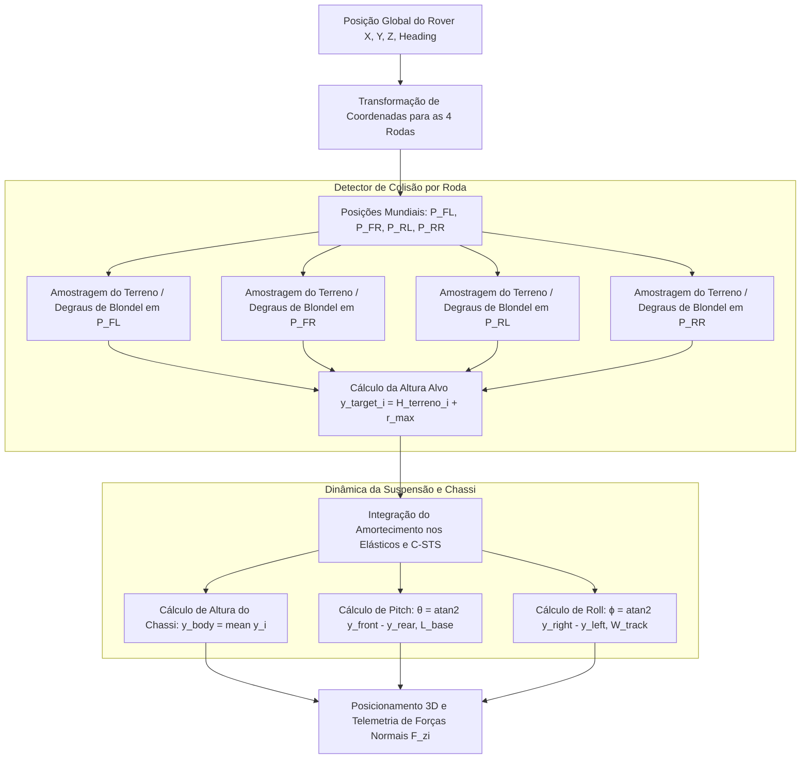

# 05. Dimensionamento das Rodas pelo Cálculo de Blondel e Dinâmica de Colisão Multicorpo
## Relação entre a Lei de Blondel (NBR 9050), a Cinemática de 3 Raios Curvos (Jeong & Kim, 2025) e o Modelo de Contato 4WD

---

## 1. O Cálculo de Blondel e as Escadas Civis Padrão

A **Fórmula de Nicolas-François Blondel (1675)** é a norma universal de ergonomia e engenharia civil para dimensionamento de escadas confortáveis e seguras, consagrada na **ABNT NBR 9050**:

$$2E + P = 63\text{ cm a } 64\text{ cm} \quad (\text{Valor de Projeto: } 64\text{ cm})$$

Onde:
* **$E$ (*Espelho* / Altura do Degrau / *Riser*)**: Altura vertical de cada degrau. Faixa normativa: $16\text{ cm} \le E \le 18\text{ cm}$.
* **$P$ (*Piso* / Profundidade do Degrau / *Tread*)**: Largura horizontal onde o pé apoia. Faixa normativa: $28\text{ cm} \le P \le 32\text{ cm}$.

### Escada de Referência do Campus Itaipu Parquetec
Adotando as dimensões padrão das escadarias do Parque Tecnológico:
* **Espelho**: $E = 170\text{ mm} = 17\text{ cm}$
* **Piso**: $P = 300\text{ mm} = 30\text{ cm}$
* **Verificação de Blondel**:
  $$2(17\text{ cm}) + 30\text{ cm} = 34 + 30 = 64\text{ cm} \quad \text{(100% em Conformidade)}$$

---

## 2. Dimensionamento Analítico da Roda de 3 Raios Curvos

Para que uma roda com $N = 3$ raios curvos transponha com continuidade uma escada projetada pela Lei de Blondel, a geometria da roda deve satisfazer dois critérios cinemáticos fundamentais:

```
                  [Geometria de Contato no Degrau de Blondel]
                         Piso (P = 300 mm)
                   +---------------------------+
                   |                           |
                   |                           | Espelho (E = 170 mm)
                   |                           |
     +-------------+                           +-------------+
     |             | <--- D_degrau = 344.8 mm
     |             |
     +-------------+
```

### 2.1. Critério 1: Alcance Diagonal do Raio Curvo ($r_{max}$)
A diagonal do degrau de Blondel ($D_{degrau}$) representa a hipotenusa que a roda deve vencer em cada rotação de $120^\circ$:

$$D_{degrau} = \sqrt{E^2 + P^2} = \sqrt{170^2 + 300^2} = \sqrt{28900 + 90000} = \sqrt{118900} \approx 344,8\text{ mm}$$

Como a roda possui **3 raios defasados a $120^\circ$**, o avanço linear teórico por raio sem escorregamento é dado por:

$$\Delta s = \frac{2\pi \cdot r_{efetivo}}{3} \approx 2,094 \cdot r_{efetivo}$$

Para garantir que o avanço por raio ultrapasse a profundidade do piso ($\Delta s \ge P = 300\text{ mm}$):

$$r_{efetivo} \ge \frac{300\text{ mm}}{2,094} \approx 143,26\text{ mm}$$

Adotando um fator de folga dinâmico de segurança de $5\%$ para compensar a deflexão elástica do C-STS:
$$\mathbf{r_{max} = 150\text{ mm}} \quad \implies \quad \mathbf{\Phi_{roda} = 300\text{ mm} = 30\text{ cm}}$$

### 2.2. Critério 2: Raio do Cubo C-STS e Curvatura do Raio
* **Raio do Cubo ($r_{min}$)**: $r_{min} = 45\text{ mm}$ ($\Phi_{hub} = 90\text{ mm}$), garantindo espaço interno suficiente para a mola espiral plana C-STS ($b = 15\text{ mm}$, $t = 5\text{ mm}$, $L = 827\text{ mm}$) e os rolamentos de suporte.
* **Raio de Curvatura do Arco ($r_0$)**: $r_0 = 135\text{ mm}$, gerando um perfil espiral suave em arco circular que engata progressivamente na aresta do degrau.

---

## 3. Modelo de Dinâmica de Colisão Multicorpo (4 Rodas Independentes)

No simulador 3D, cada uma das 4 rodas ($i \in \{FL, FR, RL, RR\}$) possui detecção de colisão e resposta de contato independentes.



### 3.1. Equações de Altura, Pitch e Roll do Chassi
Sendo $(x_i, z_i)$ a coordenada no plano da roda $i$ e $y_{ground}(x_i, z_i)$ a cota do piso de Blondel:

$$y_{target, i} = y_{ground}(x_i, z_i) + r_{max}$$

Com o entre-eixos $L_{wheelbase} = 1,36\text{ m}$ e a bitola $W_{track} = 1,36\text{ m}$:
* **Altura Média do Chassi**:
  $$y_{chassi} = \frac{y_{FL} + y_{FR} + y_{RL} + y_{RR}}{4}$$
* **Ângulo de Arfagem (*Pitch* $\theta$)**:
  $$\theta = \arctan\left(\frac{(y_{FL} + y_{FR}) - (y_{RL} + y_{RR})}{2 \cdot L_{wheelbase}}\right)$$
* **Ângulo de Rolamento (*Roll* $\phi$)**:
  $$\phi = \arctan\left(\frac{(y_{FR} + y_{RR}) - (y_{FL} + y_{RL})}{2 \cdot W_{track}}\right)$$

### 3.2. Transferência Dinâmica de Cargas Normais nas 4 Rodas
Em rampa ou escada inclinada com ângulo de arfagem $\theta$, as reações normais $F_{z, front}$ e $F_{z, rear}$ redistribuem-se conforme Wong (2022):

$$F_{z, front} = W \cdot \left(\frac{L_r}{L} \cos\theta - \frac{h_{CG}}{L} \sin\theta\right)$$
$$F_{z, rear} = W \cdot \left(\frac{L_f}{L} \cos\theta + \frac{h_{CG}}{L} \sin\theta\right)$$

Graças à caixa organizadora suspensa no terço superior, o CG rebaixado ($h_{CG} \approx 0,18\text{ m}$) garante que $F_{z, front} > 0$ mesmo em inclinações de até $45^\circ$, impedindo o tombamento para trás durante a subida dos degraus de Blondel.
