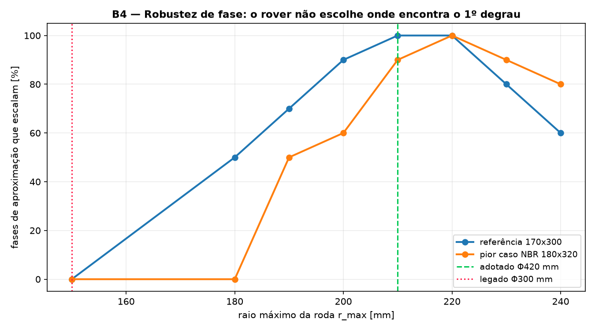
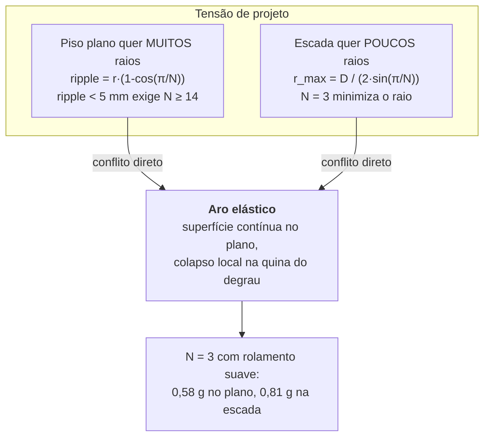

# 06. Síntese da Roda e Geometria de Escalada
## Da fórmula de Blondel ao diâmetro da roda, com verificação numérica

> **Documento central da revisão R2.** Substitui a dedução de `05_Dimensionamento_Blondel`,
> que usava um critério de rolamento em piso plano para dimensionar uma roda que
> não rola — ela salta de degrau em degrau. Ver auditoria [A-01](../00_Especificacao_Mestre/02_Auditoria_Tecnica.md#a-01).

---

## 1. O problema, colocado corretamente

Uma roda de *N* raios não tem superfície contínua de rolamento. Sobre uma escada,
o movimento é uma sequência de **pivotamentos**: a roda gira em torno do ponto de
contato corrente até que outro raio toque a estrutura, e o contato se transfere.
São exatamente os dois estados descritos por Jeong & Kim (2025):

* **CCS** (*Continuous Contact State*) — o contato migra ao longo da curva de um
  mesmo raio; o raio efetivo cresce de `r_cubo` até `r_max` e o cubo sobe;
* **DCS** (*Discontinuous Contact State*) — o contato salta para o raio seguinte;
  o raio efetivo despenca e o cubo cai.

A pergunta de projeto não é "qual arco a roda percorre por volta", e sim:

> **O raio seguinte alcança o nariz do degrau seguinte?**

---

## 2. Condição de marcha síncrona

Sejam:

* $E$ o espelho e $P$ o piso do degrau;
* $D = \sqrt{E^2+P^2}$ o **passo nariz-a-nariz** (a distância entre arestas de
  degraus consecutivos);
* $N$ o número de raios, defasados de $2\pi/N$;
* $r_{max}$ o raio da ponta do raio.

No instante da transferência ideal, dois raios consecutivos tocam dois narizes
consecutivos. O cubo está a distância $r_1$ de um e $r_2$ do outro, com ângulo
$2\pi/N$ entre eles. Pela lei dos cossenos:

$$D^2 = r_1^2 + r_2^2 - 2\,r_1 r_2 \cos\!\left(\frac{2\pi}{N}\right)$$

Esse valor é máximo quando ambos os contatos ocorrem na ponta
($r_1 = r_2 = r_{max}$), o que dá a corda do polígono regular inscrito:

$$D_{max} = 2\,r_{max}\sin\!\left(\frac{\pi}{N}\right)$$

Logo, a **condição necessária de marcha síncrona** (um degrau por raio):

$$\boxed{\;D \;\le\; 2\,r_{max}\sin\!\left(\frac{\pi}{N}\right)
\qquad\Longleftrightarrow\qquad
r_{max}\;\ge\;\frac{D}{2\sin(\pi/N)}\;}\tag{1}$$

### 2.1. Aplicação ao degrau de referência

Para $E = 170$ mm e $P = 300$ mm (2E+P = 64 cm, conforme NBR 9050):

$$D = \sqrt{170^2+300^2} = 344{,}8\ \text{mm}, \qquad \theta = \arctan(E/P) = 29{,}5^\circ$$

| $N$ | $r_{max}$ mínimo | $\Phi$ mínimo |
| ---: | ---: | ---: |
| **3** | **199,1 mm** | **398 mm** |
| 4 | 243,8 mm | 488 mm |
| 5 | 293,3 mm | 587 mm |
| 6 | 344,8 mm | 690 mm |

> **N = 3 é o mínimo global.** Como $\sin(\pi/N)$ decresce com $N$, mais raios
> exigem rodas **maiores** para a mesma escada. Essa é a justificativa quantitativa
> para os três raios de Jeong & Kim — que R1 adotava sem demonstrar.

### 2.2. Por que a roda de R1 não sobe

A roda original ($N=3$, $r_{max}=150$ mm) tem alcance

$$2 \times 150 \times \sin 60^\circ = 259{,}8\ \text{mm} \;<\; 344{,}8\ \text{mm}$$

**Déficit de 85 mm.** O raio seguinte não alcança o nariz seguinte: o cubo desce
para dentro do degrau e o raio acaba apoiando na **face vertical do espelho**,
onde a reação necessária sai do cone de atrito. A roda escorrega em vez de subir.

---

## 3. Do critério analítico ao projeto: robustez de fase

A Equação (1) é **necessária, não suficiente**. Ela garante que o alcance existe,
mas não que o engate aconteça a partir de qualquer posição de chegada. E a fase
com que o rover encontra o primeiro degrau **não é controlável pelo piloto**.

Por isso o dimensionamento final é feito por varredura: para cada candidato,
simula-se a marcha a partir de 12 fases de aproximação distribuídas ao longo de
um passo completo, em todas as escadas da família de Blondel.

```bash
python3 -m simulador_python.main --sintese
```

| $\Phi$ [mm] | E16/P32 | E17/P30 | E18/P28 | pior caso |
| ---: | ---: | ---: | ---: | ---: |
| 300 (R1) | 0% | 0% | 0% | **0%** |
| 360 | 50% | 50% | 58% | 50% |
| 400 | 75% | 83% | 92% | 75% |
| **420 (adotado)** | **100%** | **100%** | **100%** | **100%** ✔ |
| 440 | 100% | 100% | 100% | 75%¹ |
| 460 | 83% | 75% | 83% | 75% |
| 480 | 67% | 58% | 42% | 42% |

¹ falha nas escadas fora de norma mais curtas (E16/P28).



> **O sucesso não é monotônico no raio.** Subdimensionar trava na face do
> espelho; **sobredimensionar** faz a roda ultrapassar o nariz e cair dentro do
> degrau. Existe um ótimo, e ele é **Φ 420 mm**.

**Parâmetros adotados:** $N = 3$, $r_{max} = 210$ mm, $r_{cubo} = 70$ mm.

---

## 4. Consequências geométricas do dimensionamento

### 4.1. Entre-eixos travado em fase com a escada

Se o entre-eixos for múltiplo inteiro do passo do degrau, os eixos dianteiro e
traseiro engatam **em fase** e a arfagem do chassi oscila menos:

$$L = k \cdot D = 2 \times 344{,}8 = 689{,}6 \approx \mathbf{690\ mm}$$

### 4.2. Vão livre do ventre

Dois critérios independentes, vale o maior:

| Critério | Valor |
| :--- | ---: |
| (a) folga até a linha dos narizes na subida (medida na marcha) | 210 − 79 + 20 = 151 mm |
| (b) aproximação frontal do primeiro degrau: ventre > espelho + margem | 170 + 20 = **190 mm** |

**Adotado: 190 mm** — critério (b) domina.

### 4.3. Torque de içamento

O torque exigido no eixo é o momento da carga em relação ao ponto de contato:

$$T = F_z \cdot \max\!\left(0,\; x_{contato} - x_{cubo}\right)$$

A hipótese de carga correta: **na subida a transferência de carga é para trás**,
portanto quem faz o esforço são as rodas **traseiras**.

$$F_{z,tras} = W\left(\frac{l_f}{L}\cos\theta + \frac{h_{CG}}{L}\sin\theta\right)
= 50{,}8\ \text{N (eixo)} \Rightarrow 25{,}4\ \text{N por roda}$$

Envelope do torque de pico sobre toda a família de escadas e todas as fases:
**T = 5,40 N·m por roda** — é este valor que dimensiona a redução do motorredutor
(cap. 07) e a rigidez do C-STS (§5).

### 4.4. Queda de cubo e o curso da suspensão

A marcha síncrona tem um preço inescapável: entre transferências, o cubo cai

$$\Delta y \approx r_{max}\left(1-\cos\frac{\pi}{N}\right) = 210 \times 0{,}5 = 105\ \text{mm}$$

O valor medido na escada é de **89 mm** (o aro elástico e a inclinação reduzem
um pouco). Absorver essa energia dentro do limite de 2,0 g exige **90 mm de curso
de suspensão** — e não os 35 mm de R1. Ver [A-03](../00_Especificacao_Mestre/02_Auditoria_Tecnica.md#a-03).

---

## 5. Dimensionamento do C-STS por semelhança dimensional

A rigidez torsional da mola espiral plana e a tensão de flexão na lâmina:

$$k_t = \frac{E\,b\,t^3}{12\,L}, \qquad \sigma = \frac{6M}{b\,t^2},
\qquad L \approx \pi\,n\,(r_i + r_o)$$

O procedimento **inverte** a relação: em vez de copiar o $k_t$ do artigo, parte-se
do requisito.

1. **Rigidez de projeto:** $k_t = T_{projeto} / \Delta\theta_{adm} = 5{,}40 / \text{30}^\circ = 10{,}31$ N·m/rad
2. **Compensação do FDM:** $k_{t,teórico} = k_t / 0{,}828 = 12{,}46$ N·m/rad
   — o fator 0,828 é a razão entre rigidez experimental e teórica medida por
   Jeong & Kim, e reflete a aderência parcial entre filetes. **Esse** é o
   resultado transferível do artigo, não o valor absoluto de $k_t$.
3. **Geometria:** resolve-se $t$ para cada número de voltas $n$, aceitando a
   primeira solução que caiba na banda radial do cubo e satisfaça FS ≥ 2.

```
C-STS em PETG: b=30,0 mm, t=9,71 mm, L=386 mm, 1,5 voltas (r 20→62 mm)
  kt teórico / efetivo ..... 12,46 / 10,31 N·m/rad
  tensão de flexão ......... 11,4 MPa (FS = 4,4)
  energia no pico .......... 1,41 J
  massa .................... 143 g
```

Comparação com a cópia direta do artigo:

| | Jeong & Kim (escala do artigo) | Este projeto |
| :--- | ---: | ---: |
| $k_t$ | 0,547 N·m/rad | **10,31 N·m/rad** |
| Deflexão sob T = 5,40 N·m | 566° (enrola por completo) | **30°** ✔ |
| Espessura da lâmina | 5,0 mm | **9,71 mm** |

---

## 6. O aro elástico: item crítico, não acessório

Sem aro, a roda de 3 raios é uma *rimless wheel* e o cubo oscila **105 mm em piso
plano** — a cada 120° de rotação. A missão é majoritariamente piso plano.



**Como funciona.** Em superfície contínua o aro sustenta o veículo a
$r_{max}$ menos a deflexão estática ($\approx 6$ mm sob 21 N), e o rover rola como
uma roda convencional. Ao encontrar a quina de um degrau, a carga se concentra num
ponto e o aro **colapsa localmente**, expondo a ponta do raio, que engata no
nariz.

**Especificação e o que ainda precisa ser medido:**

| Parâmetro | Valor de projeto | Como verificar |
| :--- | ---: | :--- |
| Rigidez radial | 3500 N/m | ENS-04: carga x deflexão em bancada |
| Curso até colapso | 25 mm | ENS-04 |
| Força de colapso local | 90 N | ENS-04: célula de carga contra aresta viva |
| Massa por roda | 90 g | pesagem |

> **Risco em aberto.** A janela entre "rígido o bastante para carregar no plano" e
> "macio o bastante para colapsar na quina" ainda não foi medida fisicamente. Se
> a janela for estreita demais na prática, a alternativa é aro segmentado com
> molas de lâmina — mecanismo clássico de Sclater & Chironis, cap. 10.
> Este é o **maior risco técnico remanescente** do projeto (ver FMEA, `09`).

---

## 7. Verificação

```bash
python3 -m simulador_python.main --marcha    # marcha na escada de referência
python3 -m simulador_python.main --sintese   # varredura do espaço de projeto
python3 -m pytest testes/test_geometria_escada.py -v
```

O simulador de marcha (`simulador_python/geometria_escada.py`) resolve o
movimento por **eventos de contato**, sem nenhum fator de ajuste: pivota em torno
do contato corrente, isola por bisseção o instante em que outro ponto da roda toca
o terreno e transfere o pivô. Limitações e domínio de validade do modelo estão em
[`03_Simulacao/04_Verificacao_e_Validacao_do_Modelo.md`](../03_Simulacao_e_Prototipacao_Digital/04_Verificacao_e_Validacao_do_Modelo.md).
