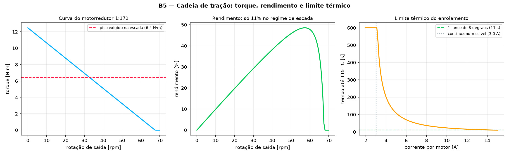
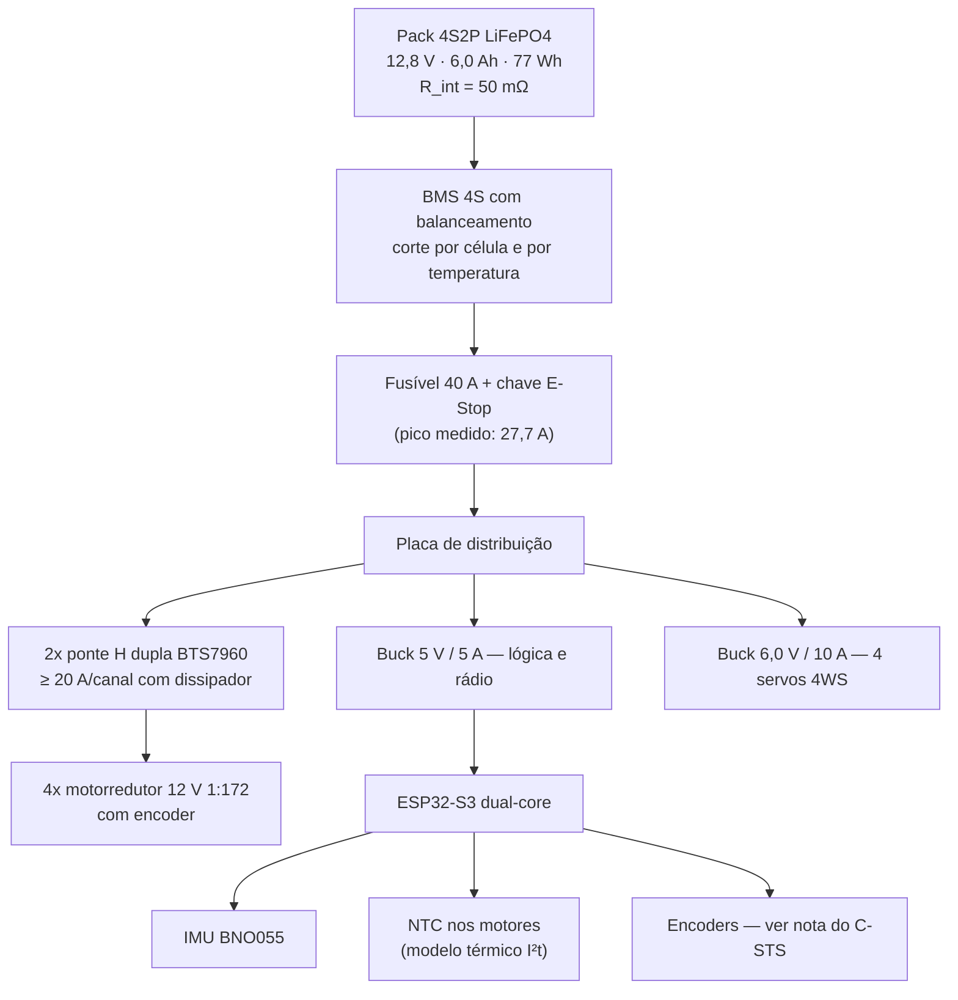

# 07. Orçamento de Tração, Energia e Térmica
## Curva real do motorredutor, pack de bateria e o limite que ninguém tinha visto

> Substitui o dimensionamento de `04_Eletronica_Controle_e_Potencia` §2, que
> usava r = 0,10 m para a roda (o resto do projeto usava 0,15 m) e massa de 10 kg
> (o simulador usava 7,5 kg). Ver [A-07](../00_Especificacao_Mestre/02_Auditoria_Tecnica.md#a-07).

---

## 1. Modelo do motorredutor

Motor CC de ímã permanente com redutor planetário metálico:

$$T_{rotor} = K_t\,(I - I_0), \qquad I = \frac{V - K_e\,\omega_{rotor}}{R_a},
\qquad K_t = K_e = \frac{60}{2\pi K_v}$$

$$T_{saida} = T_{rotor}\cdot i \cdot \eta_{red}, \qquad
\omega_{saida} = \frac{\omega_{rotor}}{i}$$

| Parâmetro | Valor | Origem |
| :--- | ---: | :--- |
| Tensão nominal | 12,0 V | pack 4S LiFePO4 |
| $K_v$ | 1000 rpm/V | classe 550 |
| $R_a$ | 1,10 Ω | catálogo |
| $I_0$ (a vazio) | 0,35 A | catálogo |
| **Redução $i$** | **1:172** | valor de catálogo, dimensionado aqui |
| $\eta_{red}$ | 0,72 | trem planetário de 3 estágios |
| **Torque de stall na saída** | **12,49 N·m** | calculado |
| **Rotação a vazio na saída** | **69,8 rpm** (1,53 m/s) | calculado |



### 1.1. Por que 1:172

O torque exigido no pior caso é **6,44 N·m por roda** (§4.3 do documento 06). Na
velocidade de escada (0,25 m/s → 1,14 rad/s na saída, 16% da rotação a vazio) o
motor entrega ~84% do stall:

| Redução | Stall na saída | Disponível a 0,25 m/s | Margem | $v_{max}$ |
| ---: | ---: | ---: | ---: | ---: |
| 1:100 | 7,26 N·m | 6,55 N·m | 1,02 ✘ | 2,64 m/s |
| 1:131 | 9,51 N·m | 8,29 N·m | 1,29 ✘ | 2,01 m/s |
| **1:172** | **12,49 N·m** | **10,38 N·m** | **1,61** ✔ | **1,53 m/s** |
| 1:270 | 19,60 N·m | 14,42 N·m | 2,24 ✔ | 0,98 m/s ✘ |

1:131 **não** atende (1,29 < 1,50) depois da correção de massa do achado A-21 —
o que mostra por que a margem de KPI existe. **1:172** é a escolha: margem de
**1,61** e ainda 1,53 m/s de velocidade máxima, acima da meta de 1,0 m/s. 1:270
daria mais margem de torque, mas sacrificaria a velocidade em terreno plano —
que é 95% da missão.

---

## 2. Pack de bateria

| Parâmetro | Valor |
| :--- | ---: |
| Configuração | 4S2P LiFePO4 |
| Tensão nominal / cheia / corte | 12,8 / 14,6 / 11,2 V |
| Capacidade | 6,0 Ah |
| Energia total / útil (reserva 20%) | 76,8 / 61,4 Wh |
| Resistência interna do pack | 50 mΩ |

**Escolha da química.** LiFePO4 em vez de LiPo: a diferença de densidade
energética não é limitante aqui (a missão usa 15% da energia), enquanto a
segurança térmica, a vida em ciclos e a tolerância a carga mal feita — num
laboratório compartilhado com bolsistas — são vantagens diretas.

**Requisito derivado (REQ-303):** a corrente de pico é **27,7 A = 4,6C**. Células
de 3 Ah precisam suportar ≥ 5C contínuo. Nem toda célula LiFePO4 de 26650 atende:
**verificar no datasheet antes de comprar.**

---

## 3. Orçamento da missão de homologação

Percurso completo de `05_Execucao/03`, integrado trecho a trecho:

| Trecho | Dist. | Dur. | Torque/roda | Margem | Corrente | Energia |
| :--- | ---: | ---: | ---: | ---: | ---: | ---: |
| Base → calçada (asfalto) | 180 m | 188 s | 0,14 N·m | 53,1 | 1,9 A | 1,76 Wh |
| Rampa de acessibilidade (8%) | 25 m | 37 s | 0,52 N·m | 18,7 | 3,2 A | 0,54 Wh |
| Calçada de paver | 120 m | 125 s | 0,21 N·m | 35,0 | 2,1 A | 1,29 Wh |
| Meio-fio + soleira | 6 m | 20 s | 3,57 N·m | 3,6 | 13,5 A | 1,07 Wh |
| Corredor interno | 60 m | 104 s | 0,10 N·m | 110,1 | 1,7 A | 0,90 Wh |
| Embarque do notebook | — | 10 s | — | — | 1,9 A | 0,09 Wh |
| Retorno com carga | 150 m | 156 s | 0,21 N·m | 34,3 | 2,1 A | 1,60 Wh |
| **Escada de 8 degraus** | 2,8 m | 11 s | **7,78 N·m** | **1,67** | **27,7 A** | 1,14 Wh |
| Corredor até a T.I. | 45 m | 78 s | 0,10 N·m | 108,5 | 1,7 A | 0,67 Wh |
| **TOTAL** | **589 m** | **12,2 min** | — | **1,67** | pico 27,7 A | **9,1 Wh** |

* Consumo: **15% da energia útil** — a missão não é limitada por energia.
* Autonomia em ciclo misto (75% plano, 20% rampa, 5% escada): **60 min**
  (KPI ≥ 30 min, meta 45) ✔

---

## 4. O limite real da escada é térmico

Na escada o ponto de operação fica a **~11% de rendimento**: quase toda a
potência elétrica vira calor ôhmico no enrolamento.

Modelo térmico de primeira ordem (enrolamento → ambiente):

$$T(t) = T_\infty + (T_0 - T_\infty)\,e^{-t/\tau},
\qquad T_\infty = T_{amb} + I^2 R_a R_{th}, \qquad \tau = R_{th}C_{th}$$

Com $R_{th} = 8$ K/W, $C_{th} = 30$ J/K ($\tau = 240$ s), $T_{amb} = 35$ °C
(pior caso de verão em Foz do Iguaçu) e limite de classe de 115 °C:

| Corrente/motor | Regime | Tempo até 115 °C |
| ---: | ---: | ---: |
| **3,02 A** | 115 °C | **∞ — corrente contínua admissível** |
| 5,0 A | 255 °C | 108 s |
| 6,9 A | 457 °C | 50 s |
| **9,2 A (escada)** | 781 °C | **27 s** |
| 13,5 A (meio-fio) | 1639 °C | 12 s |

> **Um lance de 8 degraus a 0,25 m/s leva ~11 s.** Cabe. **Dois lances
> consecutivos sem pausa consomem quase toda a margem térmica.** Um prédio de
> três andares — situação perfeitamente plausível no Parquetec — **não é
> executável sem pausas de resfriamento**.

**Requisitos derivados:**

* **REQ-304** — proteção I²t no firmware, com modelo térmico embarcado
  (não basta desarmar por corrente instantânea: o dano é integral).
* **REQ-305** — pausa de resfriamento obrigatória entre lances, com o tempo
  calculado pelo modelo e exibido ao piloto.
* Sensor de temperatura (NTC) colado na carcaça de pelo menos um motor,
  para calibrar $R_{th}$ e $C_{th}$ no ENS-13 e substituir a estimativa.

---

## 5. Dimensionamento elétrico consolidado



> **Nota sobre encoders e o C-STS.** Sob torque nominal a roda **atrasa 30°** em
> relação ao eixo do motor (é essa a função da mola). Encoder no motor mede o
> motor, não a roda. Duas saídas: encoder magnético no lado da roda, ou
> compensação explícita $\theta_{roda} = \theta_{motor} - T/k_t$ no firmware.
> Sem uma das duas, a odometria acumula erro sistemático em toda subida.

---

## 6. Reprodução

```bash
python3 -c "
from simulador_python.powertrain import *
o = OrcamentoEnergia()
r = o.avaliar_missao(missao_parquetec())
print('energia %.1f Wh, margem mínima %.2f, pico %.1f A' %
      (r['energia_total_wh'], r['margem_torque_minima'], r['corrente_pico']))
print(o.autonomia_ciclo_misto())"

python3 -m pytest testes/test_powertrain.py -v
```
