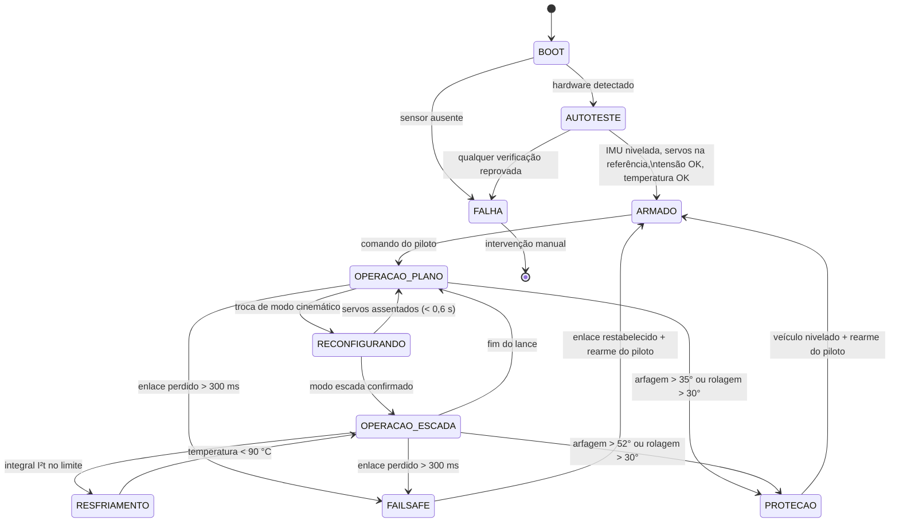

# 08. Arquitetura de Firmware e Segurança Funcional
## Máquina de estados, orçamento de tempo real e as proteções que a física exige

> Documento novo em R2. R1 descrevia o hardware embarcado mas não o software:
> não havia máquina de estados, orçamento de tempo, tratamento de falha nem
> especificação das proteções. Várias proteções obrigatórias só apareceram
> depois da análise física — ver [A-04](../00_Especificacao_Mestre/02_Auditoria_Tecnica.md#a-04),
> [A-08](../00_Especificacao_Mestre/02_Auditoria_Tecnica.md#a-08) e
> [A-09](../00_Especificacao_Mestre/02_Auditoria_Tecnica.md#a-09).

---

## 1. Máquina de estados do veículo



> **Rearme é sempre explícito.** Nenhuma transição de FAILSAFE ou PROTEÇÃO
> volta a operar sozinha. Um rover que sai de uma parada de emergência por conta
> própria é um rover que atropela alguém enquanto o piloto olha para outro lado.

---

## 2. Tarefas de tempo real (ESP32-S3, FreeRTOS)

| Tarefa | Freq. | Núcleo | Prio. | Orçamento | Função |
| :--- | ---: | :---: | ---: | ---: | :--- |
| `ctrl_tracao` | 200 Hz | 1 | 5 | 1,2 ms | malha de velocidade das 4 rodas, limitação de torque |
| `ctrl_estercamento` | 100 Hz | 1 | 4 | 0,8 ms | rampa de posição dos 4 servos, respeitando a taxa máxima |
| `estimador_estado` | 200 Hz | 1 | 5 | 1,0 ms | fusão IMU + encoders, arfagem/rolagem, odometria |
| `supervisor` | 100 Hz | 0 | 6 | 0,5 ms | máquina de estados, limiares, I²t, failsafe |
| `enlace_rc` | 250 Hz | 0 | 5 | — | recepção ELRS, watchdog do enlace |
| `telemetria` | 20 Hz | 0 | 2 | 3,0 ms | pacote de telemetria e registro em cartão |
| `termico` | 10 Hz | 0 | 3 | 0,3 ms | integração do modelo térmico dos motores |

**Orçamento do núcleo 1 (tempo real estrito):** 3,0 ms de 5,0 ms disponíveis a
200 Hz — **60% de ocupação**, com 40% de folga.

> **`supervisor` tem prioridade mais alta que as malhas de controle.** É
> deliberado: a decisão de parar precisa preemptar a decisão de andar.

---

## 3. As proteções que a física exige

### 3.1. Limiar anti-tombamento dependente de modo

R1 especificava desaceleração automática acima de **40° de arfagem**. Mas a
arfagem em **operação normal** na escada chega a **43°** (29,5° da rampa +
oscilação da marcha de 3 raios). O limiar único abortaria toda subida no meio.

| Modo | Limiar de arfagem | Limiar de rolagem | Referência |
| :--- | ---: | ---: | :--- |
| piso / rampa | 35° | 30° | tombamento estático: 52,6° long., 48,6° lat. |
| escada | **52°** | 30° | arfagem normal esperada: ~43° |

```c
float limiar_arfagem(modo_t modo) {
    return (modo == MODO_ESCADA) ? 52.0f : 35.0f;   /* graus */
}
```

### 3.2. Proteção térmica por integral I²t

Desarmar por corrente instantânea **não protege**: o dano ao esmalte é integral.
O firmware embarca o mesmo modelo de primeira ordem usado no dimensionamento:

```c
/* 10 Hz — modelo térmico do enrolamento (ver 02_Engenharia/07 §4) */
float regime = T_AMB + i_motor * i_motor * R_A * R_TH;
t_enrol += (regime - t_enrol) * (dt / (R_TH * C_TH));

if (t_enrol > 115.0f)      estado = RESFRIAMENTO;   /* corta tração */
else if (t_enrol > 100.0f) fator_torque = 0.5f;     /* reduz antes de cortar */
```

Constantes $R_{th}$ e $C_{th}$ a **calibrar no ENS-13** com NTC na carcaça — os
valores atuais são estimativas de classe.

### 3.3. Compensação da complacência do C-STS na odometria

Sob torque nominal a roda **atrasa 30°** em relação ao eixo do motor. Encoder no
motor mede o motor, não a roda:

```c
/* Se o encoder está no motor, subtrair a torção da mola */
float theta_roda = theta_motor - (torque_estimado / KT_CSTS);
```

Alternativa preferida: **encoder magnético no lado da roda** (ímã diametral +
AS5600), que mede diretamente o que interessa e elimina a dependência da
estimativa de torque.

### 3.4. Bloqueio do modo escada por condição de piso

O atrito exigido na escada é **μ ≥ 0,72**; concreto molhado oferece 0,55 e
mármore polido, 0,40. O modo escada exige **confirmação explícita do piloto** de
que o piso está seco, registrada no log da missão.

### 3.5. Detecção de saturação de esterçamento

Quando um servo satura, a solução cinemática deixa de ser exata e **a odometria
passa a errar**. O supervisor sinaliza a condição em vez de deixá-la silenciosa:

```c
if (algum_servo_saturado) {
    flag_odometria_degradada = true;   /* sobe no OSD do piloto */
}
```

---

## 4. Failsafe e comportamento em falha

| Falha | Detecção | Ação | Tempo alvo |
| :--- | :--- | :--- | ---: |
| Perda do enlace de rádio | watchdog de pacotes | corta tração, freio dinâmico | ≤ 300 ms |
| Tensão de pack abaixo do corte | ADC + BMS | reduz velocidade, alerta, retorno | imediato |
| Sobretemperatura de motor | modelo I²t | estado RESFRIAMENTO | imediato |
| Inclinação crítica | IMU | corta tração, alerta sonoro | ≤ 50 ms |
| Corrente de pico em um canal | sensor de corrente | limita PWM daquela roda | ≤ 20 ms |
| Servo sem resposta | realimentação de posição | trava o modo, alerta | ≤ 100 ms |
| Travamento do supervisor | watchdog de hardware | reset e entrada em ARMADO | ≤ 2 s |

> **Freio dinâmico, não roda-livre.** Em rampa, cortar o PWM e deixar as rodas
> livres faz o rover descer sozinho. O failsafe curto-circuita os enrolamentos
> pelas pontes H, transformando os motores em freio.

---

## 5. Protocolo de telemetria (20 Hz)

Mesmo conjunto de campos que o gêmeo digital exporta em CSV — assim os dados de
ensaio e de simulação são diretamente comparáveis:

```
t, x, z, y, velocidade, arfagem_deg, rolagem_deg,
carga_vert_g, carga_long_g,
corrente_A, tensao_V, soc, temp_motor_C, margem_torque,
fz_FL, fz_FR, fz_RL, fz_RR, csts_FL_deg, energia_csts_J
```

Esse alinhamento é o que permite **validar o modelo** com dados reais na Fase 4
(ver `03_Simulacao/04`, seção de validação).

---

## 6. Do simulador ao firmware

A cinemática inversa 4WS já está implementada e testada em
[`simulador_python/kinematics.py`](../simulador_python/kinematics.py) e replicada em
[`prototipo_3d/fisica.js`](../prototipo_3d/fisica.js). O firmware implementa a
**mesma formulação**:

```c
/* Para cada roda i em (x_i, y_i), referencial x=frente, y=esquerda */
float v_ix = vx - omega * y_i;
float v_iy = vy + omega * x_i;
float beta = atan2f(v_iy, v_ix);
float v    = hypotf(v_ix, v_iy);
if (beta >  M_PI_2) { beta -= M_PI; v = -v; }   /* normaliza para |β| ≤ 90° */
if (beta < -M_PI_2) { beta += M_PI; v = -v; }
```

**Verificação cruzada obrigatória (ENS-01):** alimentar o firmware e o simulador
Python com a mesma sequência de comandos e comparar β e v roda a roda. Divergência
aceitável: 0,1° e 1 mm/s.
