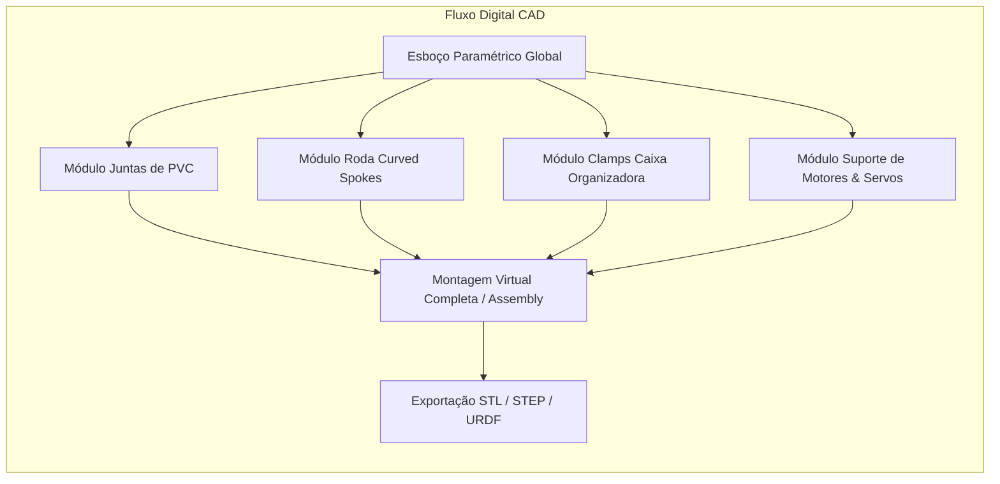

# 01. Plano de Modelagem CAD 3D e Engenharia de Manufatura Aditiva
## Parametrização de Peças, Juntas de PVC e Diretrizes de Impressão 3D

---

## 1. Fluxo de Trabalho de Modelagem Paramétrica CAD

Toda a modelagem geométrica do rover é estruturada em software CAD 3D paramétrico (como Onshape, Autodesk Fusion 360 ou FreeCAD), garantindo exportação universal em formatos abertos (**STEP, IGES e STL/3MF**).



---

## 2. Catálogo de Componentes Customizados para Impressão 3D

| Código da Peça | Nome do Componente | Função Primária | Material Sugerido | Preenchimento (*Infill*) |
| :--- | :--- | :--- | :--- | :--- |
| **CAD-01** | *Box-Clamp-Top* | Abraçadeira de fixação rápida no terço superior da caixa plástica | PETG / ABS | 50% (Padrão Gyroid) |
| **CAD-02** | *Arm-Vertex-Joint* | Junta do vértice superior em V invertido com engate de PVC e olhal elástico | PETG | 70% |
| **CAD-03** | *Wheel-Curved-Spoke* | Roda de 4 raios curvos de perfil espiral logarítmica para escadas | PETG / PLA+ | 80% a 100% nos raios |
| **CAD-04** | *Steering-Knuckle-4WS* | Manga de eixo de esterçamento com alojamento para rolamento 608ZZ | PETG | 60% |
| **CAD-05** | *Motor-Mount-Bracket* | Suporte do motorredutor DC com flange de fixação no tubo de PVC inferior | PETG / PLA+ | 50% |
| **CAD-06** | *Elastic-Tension-Spool* | Carretel pino-guia para ancoragem dos elásticos comuns de escritório | PLA+ / PETG | 100% |
| **CAD-07** | *Tire-Tread-Ring* (Opcional) | Anel externo de banda de rodagem de alta aderência para os raios | TPU Flexível | 100% |

---

## 3. Tolerâncias Dimensionais para Encaixe de Tubos de PVC

Os tubos de PVC prediais de água fria apresentam variações de diâmetro externo ($\pm 0,3 \text{ mm}$) dependendo do lote e fabricante (Tigre, Amanco, Krona):
* **Furos de Encaixe Cilíndrico**: Devem ser modelados com diâmetro nominal $+ 0,4 \text{ mm}$ de folga.
* **Fenda de Aperto por Parafuso (*Split-Clamp*)**: Todas as juntas de encaixe possuem um corte longitudinal de $2 \text{ mm}$ e orelhas para parafuso M4. Dessa forma, ao apertar o parafuso, a peça plástica abraça e trava rigidamente o cano de PVC sem depender de cola química, viabilizando ajustes e desmontagens em campo.

```
       [Visão Superior da Junta Split-Clamp de PVC]
               .---===---.
             /     | |     \     <- Corte Longitudinal (2 mm)
            |    ( Tubo )   |
             \   ( PVC  )  /
              '--+-----+--'
                 | (O) |         <- Parafuso Allen M4 com Porca Parlock
                 '-----'
```

---

## 4. Diretrizes de Impressão 3D FDM (Parâmetros Recomendados)

1. **Orientação das Peças na Mesa**:
   * As rodas *curved spokes* devem ser impressas deitadas na mesa ($XY$), garantindo que as linhas de extrusão acompanhem a curvatura do raio, maximizando a resistência à tração e evitando delaminação por cisalhamento.
2. **Paredes e Perímetros**: Mínimo de **4 a 5 perímetros externos** (paredes de $1,6 \text{ a } 2,0 \text{ mm}$ com bico de $0,4 \text{ mm}$), assegurando integridade estrutural mesmo sob choques.
3. **Temperatura e Adesão**:
   * PETG: Bico a $235^\circ\text{C} - 245^\circ\text{C}$, mesa a $75^\circ\text{C} - 85^\circ\text{C}$ (excelente tenacidade e resistência a intempéries).
   * PLA+: Bico a $210^\circ\text{C} - 220^\circ\text{C}$, mesa a $60^\circ\text{C}$ (fácil impressão para iterações rápidas).
