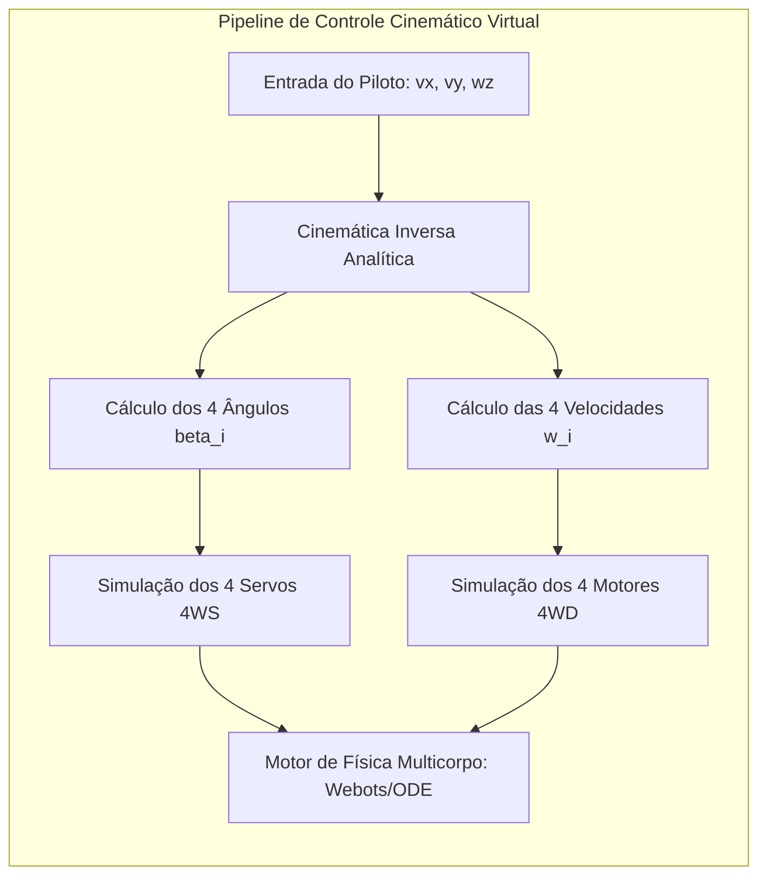

# 02. Simulação Dinâmica, Cinemática Inversa e Física de Contato
## Modelagem em Webots/Gazebo com Base em Siegwart (2004) e Wong (2022)

---

## 1. Algoritmo de Cinemática Inversa 4WS/4WD na Simulação

Para comandar os 8 atuadores no simulador virtual a partir dos comandos do joystick do piloto (velocidade longitudinal $v_x$, velocidade lateral $v_y$ e velocidade angular de guinada $\omega_z$), implementa-se o modelo analítico fechado de **Cinemática Inversa (*Siegwart & Nourbakhsh, 2004*)**:

Para cada roda $i \in \{1, 2, 3, 4\}$ posicionada nas coordenadas relativas $(x_i, y_i)$:

```
           [VETOR DE VELOCIDADE EM CADA RODA NO SIMULADOR]
                 v_{ix} = v_x - \omega_z \cdot y_i
                 v_{iy} = v_y + \omega_z \cdot x_i
                 
                 \beta_i = \text{atan2}(v_{iy}, v_{ix})        <- Ângulo do Servo 4WS
                 \dot{\varphi}_i = \frac{\sqrt{v_{ix}^2 + v_{iy}^2}}{r_{roda}}  <- Rotação Motor 4WD
```



---

## 2. Modelagem da Física de Contato com Degraus (Wong, 2022)

A interação entre as pontas dos raios curvos e as quinas dos degraus na simulação física é governada pelas equações de contato e atrito de Coulomb-Janosi (*J. Y. Wong, Theory of Ground Vehicles, Cap. 2*):

$$F_N = k_c \cdot \delta_p^n + c_c \cdot \dot{\delta}_p$$

$$F_T \le \mu_{estatico} \cdot F_N \cdot (1 - e^{-j/K})$$

Onde:
* $\delta_p$: Penetração elástica de contato do raio curvo de PETG contra o degrau de concreto.
* $j$: Escorregamento tangencial relativo (*shear displacement*).
* $K$: Módulo de deformação de cisalhamento da banda de borracha vulcanizada.
* $\mu_{estatico} = 0,85$: Coeficiente de atrito borracha-concreto calibrado experimentalmente.

---

## 3. Matriz de Cenários de Teste em Simulação

| Teste Virtual | Descrição do Cenário | Variáveis Monitoradas | Critério de Aprovação na Simulação |
| :--- | :--- | :--- | :--- |
| **SIM-01: Manobrabilidade 4WS** | Execução de manobras de Ackermann duplo, caranguejo e giro no próprio eixo em plano liso ($\mu = 0,6$). | Erro de convergência de ICR e raio de giro mínimo. | Desvio do centro da caixa $< 3 \text{ cm}$ no giro de $360^\circ$. |
| **SIM-02: Transposição de Degrau Único** | Impacto frontal e superação de degrau reto de $150 \text{ mm}$ a $0,5 \text{ m/s}$. | Aceleração vertical na caixa ($a_z$) e torque máximo nos motores. | $a_z < 2,0g$; Torque de pico $< 3,0 \text{ N}\cdot\text{m}$. |
| **SIM-03: Subida Contínua de Escadas** | Escalada de lance de 6 degraus consecutivos (espelho: $170 \text{ mm}$, piso: $280 \text{ mm}$, inclinação: $31^\circ$). | Estabilidade angular de pitch da caixa pendular e derrapagem das rodas. | Subida sem capotamento longitudinal e sem perda de contato permanente. |
| **SIM-04: Resposta ao Choque da Suspensão** | Avaliação da desaceleração de transição de raio (*Jeong & Kim, 2025*). | Métrica de Estabilidade Dinâmica $\Delta a = \max|\dot{v}_x|$. | Redução de mais de $40\%$ no pico de desaceleração com elásticos. |

---

## 4. Integração do Simulador com o Gêmeo Digital

* O código do controlador em C++ testado na simulação no **Webots** é transferido diretamente para o microcontrolador **ESP32** com compilação cruzada (*ESP-IDF / Arduino Core*), garantindo que $100\%$ da lógica de cinemática e limites de segurança desenvolvidos digitalmente sejam executados no protótipo físico sem retrabalho.
