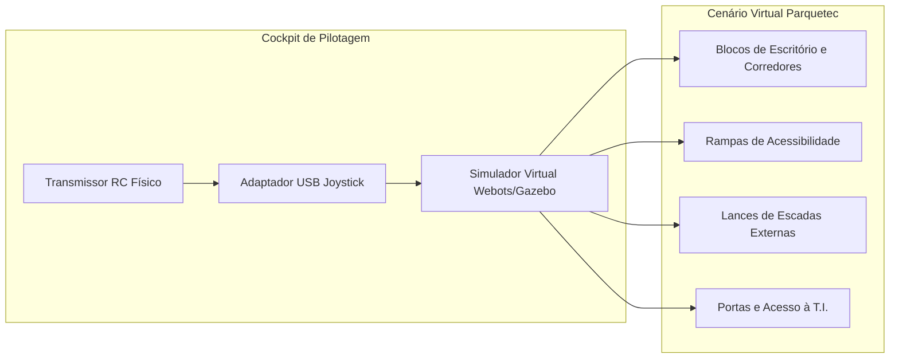

# 03. Ambiente Virtual, Gêmeo Digital (*Digital Twin*) e Treinamento de Piloto
## Modelagem do Cenário do Itaipu Parquetec e Cockpit de Teleoperação

---

## 1. Concepção do Gêmeo Digital (*Digital Twin*)

Para mitigar riscos de acidentes e quebra de componentes durante os primeiros ensaios práticos, o projeto adota o conceito de **Gêmeo Digital**:
* O modelo dinâmico tridimensional do rover é inserido em uma réplica virtual simplificada das rotas e edifícios do **Itaipu Parquetec**.
* Isso permite ao piloto praticar as manobras de direção 4WS, a aproximação de escadas e a gestão de inércia da carga útil antes de ligar o veículo real.

---

## 2. Reconstrução do Cenário Operacional do Itaipu Parquetec

O mapa virtual contempla as principais feições topográficas presentes no parque tecnológico:
1. **Trechos Asfálticos e Calçadas de Paver**: Superfícies de rolamento padrão com coeficiente de atrito médio a alto.
2. **Guias e Meio-Fio (Desníveis de 10 a 15 cm)**: Pontos de transição entre via e calçada onde o engate das rodas *curved spokes* é colocado à prova.
3. **Escadarias de Acesso aos Prédios**: Simulação de degraus de concreto com dimensões reais (espelho: $16 \text{ a } 17,5 \text{ cm}$).
4. **Portas Automáticas e Corredores Internos**: Espaços confinados de 90 cm a 1,20 m de largura que exigem esterçamento Ackermann duplo ou movimento caranguejo.

---

## 3. Protocolo de Treinamento e Habilitação do Piloto

Antes de assumir o comando do protótipo físico na missão de homologação com o notebook, o operador/piloto deve cumprir o seguinte programa de treinamento no simulador:

| Módulo de Treinamento Virtual | Meta de Proficiência | Critério de Aprovação |
| :--- | :--- | :--- |
| **Mód. 1: Manobras Finas 4WS** | Estacionamento lateral e navegação em corredor em "S" sem encostar em paredes. | 0 colisões em 5 tentativas consecutivas. |
| **Mód. 2: Alinhamento em Escadas** | Aproximação frontal ortogonal ($\pm 5^\circ$) do primeiro degrau em subida e descida. | 100% de engates simétricos dos raios dianteiros. |
| **Mód. 3: Simulação de Pane e Failsafe** | Resposta a perda de sinal simulada ou escorregamento súbito em declive. | Tempo de reação do piloto $< 0,5 \text{ segundos}$. |
| **Mód. 4: Rota Completa da Missão** | Percurso virtual completo da base até o ponto remoto de coleta e entrega na T.I. | Tempo total $< 10 \text{ minutos}$ sem tombar a carga. |
