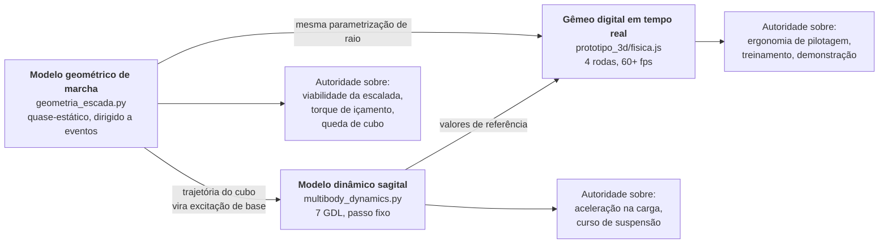

# 04. Verificação e Validação do Modelo de Simulação
## O que o modelo prova, o que ele não prova, e como saber a diferença

> Um simulador só vale como evidência de engenharia se o seu **domínio de
> validade** estiver declarado. Este documento faz o que R1 não fazia: separa
> **verificação** ("o código resolve corretamente as equações que escrevi?") de
> **validação** ("essas equações descrevem o rover real?"), e diz explicitamente
> quais conclusões ainda dependem de ensaio físico.

---

## 1. Arquitetura dos modelos

Existem três modelos, com propósitos diferentes e níveis diferentes de rigor:



> **Hierarquia de autoridade.** Quando os três discordam, vale o modelo
> geométrico para questões de viabilidade e o modelo dinâmico para questões de
> carga. O gêmeo digital em tempo real faz aproximações em nome do desempenho e
> **não é evidência de engenharia** — é ferramenta de pilotagem e comunicação.

---

## 2. Hipóteses e domínio de validade

### 2.1. Modelo geométrico de marcha

| # | Hipótese | Consequência se violada |
| :--- | :--- | :--- |
| H1 | Movimento no plano sagital (sem guinada durante a subida) | aproximação oblíqua da escada não é coberta — daí a exigência de alinhamento ±5° no treinamento do piloto |
| H2 | Roda rígida; a complacência é tratada à parte | subestima a área de contato e superestima a nitidez das transições |
| H3 | Rolamento sem escorregamento no ponto de contato | válido enquanto μ_exigido < μ_disponível (verificado em §4) |
| H4 | Quase-estático: carga vertical constante no cubo | não captura efeitos inerciais em velocidade alta; válido até ~0,4 m/s na escada |
| H5 | Contato pontual amostrado ao longo da curva do raio | resolução de contato ≈ 1 mm com 220 amostras por raio |
| H6 | Terreno rígido e indeformável | válido para concreto; **inválido** para grama, brita ou areia |

**Domínio declarado:** escadas de concreto com E de 150 a 190 mm e P de 250 a
340 mm, aproximação frontal com desalinhamento ≤ 5°, velocidade ≤ 0,4 m/s.

### 2.2. Modelo dinâmico sagital

| # | Hipótese | Consequência se violada |
| :--- | :--- | :--- |
| H7 | Meio-veículo: eixos esquerdo e direito simétricos | não cobre degrau com um lado mais alto (escada danificada) |
| H8 | Excitação de base cinemática (a roda não altera o terreno) | válido; terreno rígido |
| H9 | Molas lineares com batente rígido | a não-linearidade real do elástico de borracha (histerese) é aproximada por amortecimento viscoso equivalente |
| H10 | Pêndulo da caixa com um grau de liberdade | não cobre balanço lateral da carga |
| H11 | Integração de Euler semi-implícito com ω·dt ≤ 0,10 | passo é calculado a partir da maior rigidez; configurações sem suspensão exigem passo menor (o código reduz automaticamente) |

### 2.3. Gêmeo digital em tempo real

| # | Aproximação | Motivo |
| :--- | :--- | :--- |
| H12 | Assentamento por quadro em vez de eventos de contato | custo computacional |
| H13 | Taxa de variação do alvo de contato limitada por \|dy/dt\| ≤ ω·r_max | corrige a descontinuidade introduzida por H12 — o assentamento a x fixo salta onde o terreno salta, o pivotamento real não |
| H14 | 26 amostras por raio (contra 220) | desempenho; resolução de contato ≈ 8 mm |
| H15 | Torque resistente estimado por fração da carga normal | evita resolver a geometria de contato completa a cada quadro |

---

## 3. Verificação (o código resolve o que foi escrito?)

73 verificações automatizadas em `testes/`. As mais significativas:

| Verificação | O que prova | Teste |
| :--- | :--- | :--- |
| Conservação de carga | Σ Fz = W·cos(θ) para toda inclinação | `test_cargas_somam_a_componente_normal_do_peso` |
| Reações não negativas | nenhuma roda "puxa" o solo | `test_reacoes_nunca_sao_negativas` |
| Ausência de interferência | nenhum ponto da roda penetra o terreno na marcha | `test_cubo_nunca_penetra_o_terreno` |
| Monotonicidade do avanço | o cubo nunca recua durante a marcha | `test_marcha_avanca_monotonicamente` |
| Fórmula analítica × numérica | alcance nariz-a-nariz bate com 2r·sin(π/N) | `test_alcance_nariz_a_nariz_bate_com_a_formula` |
| Solução analítica conhecida | ripple em piso plano = r(1−cos(π/N)) | `test_ripple_em_piso_plano_e_o_da_roda_sem_aro` |
| Inversibilidade | cinemática direta desfaz a inversa | `test_odometria_recupera_o_comando` |
| Restrição satisfeita | resíduo de deslizamento < 1e-12 m/s | `test_sem_arrasto_lateral` |
| Consistência de escala | kt ∝ t³/L | `test_kt_escala_com_o_cubo_da_espessura` |
| Estabilidade numérica | ω·dt ≤ 0,10 em toda configuração | `test_passo_de_integracao_respeita_a_frequencia_natural` |
| Coerência ida-e-volta | motor: corrente ↔ torque | `test_corrente_para_torque_e_inversa_do_ponto_de_operacao` |

**Casos com solução analítica conhecida** usados como referência:

1. **Roda sem aro em piso plano** — ripple teórico r(1−cos(π/N)) = 105 mm;
   simulado 94 mm (diferença de 10%, atribuída ao perfil curvo do raio, que
   suaviza a transferência em relação à roda de raios retos).
2. **Distribuição de cargas em plano** — W/4 por roda, exato.
3. **Alcance nariz-a-nariz** — corda do polígono inscrito, exato.
4. **Motor a vazio e em stall** — pontos extremos da curva, exatos.

---

## 4. Validação (as equações descrevem o rover real?)

> **Estado atual: o modelo NÃO está validado contra hardware.** Nenhuma peça foi
> fabricada. Todas as conclusões de R2 são **previsões**, e o documento de
> requisitos marca cada uma como 🟡 até o ensaio correspondente.

### 4.1. O que sustenta a confiança no modelo hoje

| Elemento | Base |
| :--- | :--- |
| Condição de marcha síncrona | geometria pura, sem parâmetro empírico |
| Fator 0,828 de correção FDM do C-STS | medido por Jeong & Kim (2025) em três espessuras |
| Coeficientes de atrito | faixas de literatura para borracha/concreto |
| Curva do motor | modelo clássico de motor CC com dados de catálogo |
| Resistência ao rolamento | faixas de Wong (2022) por tipo de piso |

### 4.2. O que é estimativa e precisa de medição

| Parâmetro | Valor usado | Confiança | Ensaio |
| :--- | ---: | :--- | :--- |
| Rigidez do feixe de elásticos | 1000 N/m | **baixa** — não medida | ENS-11 |
| Amortecimento histerético do feixe | 25 N·s/m | **baixa** | ENS-11 |
| Rigidez radial do aro elástico | 3500 N/m | **baixa** | ENS-04 |
| Força de colapso local do aro | 90 N | **baixa** | ENS-04 |
| R_th e C_th do motor | 8 K/W, 30 J/K | **média** — classe do motor | ENS-13 |
| Rendimento do redutor | 0,72 | média | ENS-02 |
| Inércia da roda | 0,0125 kg·m² | média — estimada em CAD | pesagem + pêndulo |
| μ borracha/concreto | 0,85 | média | ENS-06 |

> **Os quatro parâmetros de confiança baixa concentram-se na suspensão.** É por
> isso que ENS-04 e ENS-11 são pré-requisitos para a Fase 5, e não ensaios de
> conveniência.

### 4.3. Plano de validação

| Ensaio | Mede | Valida | Critério de aceite |
| :--- | :--- | :--- | :--- |
| ENS-04 | curva carga × deflexão do aro; força de colapso na aresta | H2, aro elástico | rigidez dentro de ±30% do modelo |
| ENS-11 | rigidez, histerese e deformação residual do feixe | H9, curso da suspensão | rigidez ±30%; residual < 15% em 50 ciclos |
| ENS-12 | fadiga da espiral C-STS | F-13 | 5000 ciclos sem perda > 10% de rigidez |
| ENS-13 | resposta térmica do motor sob corrente constante | modelo I²t | τ dentro de ±40% |
| ENS-06 | subida instrumentada com acelerômetro na carga | modelo dinâmico completo | pico vertical dentro de ±40% do previsto |
| ENS-01 | comparação firmware × simulador (β e v por roda) | cinemática | divergência ≤ 0,1° e 1 mm/s |

**Critério de validação do modelo:** ENS-06 é o teste integrador. Se o pico de
aceleração medido na carga durante uma subida real ficar dentro de ±40% do
previsto, o modelo é declarado validado para o domínio de §2.1. Fora disso, os
parâmetros de baixa confiança são reajustados **com os dados medidos** e a
predição é refeita — não o contrário.

---

## 5. Como reproduzir tudo

```bash
pip install -r requirements.txt

python3 -m simulador_python.main --parametros    # configuração resolvida
python3 -m simulador_python.main --marcha        # marcha na escada de referência
python3 -m simulador_python.main --sintese       # varredura do espaço de projeto
python3 -m simulador_python.main --benchmark     # figuras dos 6 benchmarks
python3 -m simulador_python.main --relatorio     # Relatório de Engenharia completo
python3 -m pytest testes/ -q                     # 73 verificações
```

Toda figura e todo número do Relatório de Engenharia são regenerados a partir do
arquivo mestre de parâmetros. **Nenhum resultado é digitado à mão.**

---

## 6. Registro de limitações conhecidas em aberto

1. **Aproximação oblíqua da escada** não é modelada (H1). Se a operação real
   exigir entrar em escadas em ângulo, é preciso um modelo 3D de contato.
2. **Terreno deformável** (grama, brita, areia) não é modelado (H6). A Fase A do
   roadmap depende disso — Wong (2022) cap. 2 e Shrivastava et al. (2020) dão a
   base para a extensão.
3. **Descida de escadas** não foi analisada com o mesmo rigor da subida. A
   dinâmica é diferente (gravidade ajuda, mas o risco de tombamento frontal
   cresce) e merece documento próprio antes da Fase 5.
4. **Histerese real do elástico de borracha** é aproximada por amortecimento
   viscoso. Elastômeros têm amortecimento dependente da frequência.
5. **Vida em fadiga de PETG impresso** não tem base experimental própria nem
   dados de literatura suficientes para o carregamento cíclico deste projeto.
