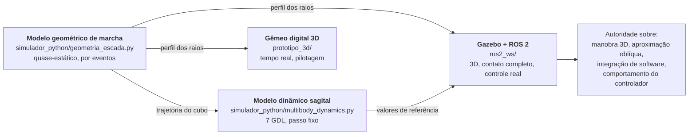

# 05. Simulação Multicorpo em ROS 2 e Gazebo
## Do URDF ao contato: o que é difícil de simular numa roda de raios curvos

> **Situação anterior.** `02_Simulacao_Dinamica_e_Controle` prometia "modelagem
> multicorpo (URDF/SDF)" em "Webots/Gazebo", e `03_Ambiente_Virtual` prometia um
> gêmeo digital do Parquetec. Não existia nenhum URDF, nenhum mundo, nenhum
> pacote — apenas a intenção. Este documento descreve a implementação real, em
> [`ros2_ws/`](../ros2_ws/), e as decisões de modelagem que ela exigiu.

**Alvo:** ROS 2 **Jazzy Jalisco** (LTS) com **Gazebo Harmonic** (`gz-sim` 8) e
`gz_ros2_control`.

---

## 1. Por que Gazebo, e não Webots

| Critério | Gazebo (gz-sim) | Webots |
| :--- | :--- | :--- |
| Integração com ROS 2 | nativa (`ros_gz`, `gz_ros2_control`) | via `webots_ros2`, com camada extra |
| Motor de física | DART, com molas e amortecimento em junta | ODE próprio |
| Contato com muitas primitivas | maduro; a marcha de raios exige centenas de esferas | funcional, menos usado nesse regime |
| Descrição do robô | SDF, com conversão direta de URDF | PROTO próprio, sem URDF nativo |
| Reprodutibilidade em CI | headless simples (`-s -r`) | exige display virtual |

A decisão pesa sobretudo o **URDF nativo** e o `ros2_control`: o mesmo arquivo de
descrição alimenta RViz, o Gazebo e — depois — o `ros2_control` do hardware real.
A menção a Webots foi removida dos documentos para não sugerir duas cadeias
paralelas de ferramentas.

---

## 2. Onde o Gazebo entra na hierarquia de modelos



> **O Gazebo não substitui o modelo analítico.** Para viabilidade de escalada e
> torque de içamento, quem manda é o modelo geométrico (`03_Simulacao/04`, §1).
> O Gazebo responde ao que o modelo sagital **não** cobre: manobra em três
> dimensões, aproximação oblíqua da escada, e — o mais importante — se o
> **software de controle** funciona.

---

## 3. Estrutura do workspace

```
ros2_ws/src/
├── rover_frugal_description/   URDF/xacro, malhas STL, RViz
│   ├── config/parametros.yaml      ← GERADO do arquivo mestre
│   ├── meshes/*.stl                ← GERADAS do mesmo perfil de raio da física
│   └── urdf/rover_frugal.urdf.xacro   escrito à mão, SEM nenhum número
├── rover_frugal_control/       cinemática 4WS, molas passivas, supervisor
├── rover_frugal_gazebo/        mundos SDF (gerados), ponte ros_gz, launch
└── rover_frugal_bringup/       missão, ensaios, registrador de telemetria
```

A cadeia de geração fecha o mesmo princípio do resto do repositório:

```
parametros_mestres.yaml
   ├─→ gerar_malhas.py        → meshes/*.stl
   ├─→ gerar_ros_config.py    → config/parametros.yaml + controladores.yaml
   └─→ gerar_mundo_gazebo.py  → worlds/*.sdf
```

**O xacro não contém um único número de engenharia.** Ele carrega o YAML com
`xacro.load_yaml` e monta o robô a partir dele. Trocar o diâmetro da roda no
arquivo mestre muda a malha, a inércia, a colisão, os limites de junta, os ganhos
do controlador e a escada do mundo — de uma vez.

---

## 4. As cinco decisões difíceis

### 4.1. A cadeia cinemática tem quatro juntas por roda, nessa ordem

```
base_link
  └─ suporte_i   ← prismática  susp_i     PASSIVA · mola 1000 N/m · curso 90 mm
       └─ manga_i     ← revoluta  esterco_i  ATUADA · servo 4WS · ±55°
            └─ cubo_i      ← contínua  tracao_i   ATUADA · motorredutor 1:172
                 └─ roda_i      ← revoluta  csts_i     PASSIVA · mola 12,3 N·m/rad
```

A ordem não é arbitrária e **não pode ser simplificada**: a suspensão fica entre
o braço e a manga, o esterçamento gira a manga inteira (com motor e roda), o
motor aciona o cubo, e o C-STS fica **entre o cubo e a roda**. Colapsar o C-STS
apagaria justamente o elemento que o projeto adota de Jeong & Kim (2025); colocá-lo
antes do motor faria a mola trabalhar contra o esterçamento em vez do torque.

São 16 juntas móveis: 8 atuadas e 8 passivas.

### 4.2. Molas passivas ficam num nó ROS, não no SDF

`<spring_stiffness>` existe em SDF mas **depende do motor de física** (DART
aplica, ODE ignora) e não existe em URDF. A lei de mola vive em
`rover_frugal_control/molas_passivas.py`, aplicada por um
`effort_controllers/JointGroupEffortController`:

$$F_{susp} = -k\,x - c\,\dot{x} \;(+ \text{batente}), \qquad
\tau_{C\text{-}STS} = -k_t\,\theta - c_t\,\dot{\theta} \;(+ \text{batente})$$

Três consequências que o projeto ganha com isso:

1. **Portabilidade.** A mesma lei roda no Gazebo, em qualquer outro simulador e —
   se um dia houver suspensão semiativa — no hardware.
2. **Constantes idênticas às do dimensionamento.** `k = 1000 N/m` e
   `kt = 12,3 N·m/rad` vêm do mesmo arquivo mestre que dimensionou a mola.
3. **Requisito de taxa explícito.** A malha precisa ser bem mais rápida que a
   frequência natural mais alta: com $k$ = 1000 N/m e massa não suspensa de
   0,64 kg, $\omega = \sqrt{k/m} \approx 40$ rad/s. O gerador calcula o mínimo
   (**792 Hz**) e o `controller_manager` roda a **1000 Hz**. Simular molas a
   100 Hz — a taxa "natural" de um nó ROS — produziria oscilação numérica que
   pareceria dinâmica real.

### 4.3. O casco convexo de uma roda de raios é um disco

Este é o ponto mais delicado da simulação. Se a colisão da roda for a malha STL,
DART e ODE usam o **casco convexo** — que para uma roda de três raios é
simplesmente um **disco**. A simulação rodaria linda e escalaria qualquer escada,
porque a geometria de raios de que todo o projeto depende teria sido apagada
silenciosamente pelo motor de física.

A colisão é, portanto, feita de **primitivas**: uma cadeia de esferas segue a
linha média de cada raio, com espaçamento adaptativo que garante sobreposição.

| | Variante `aro_elastico:=true` | Variante `aro_elastico:=false` |
| :--- | :--- | :--- |
| Colisão da roda | 1 cilindro em $r_{max}$ | **81 esferas** (27 por raio) |
| Rigidez de contato | $k_p$ = 3500 N/m (= rigidez do aro) | $k_p$ = 10⁵ N/m (pastilha sobre PETG) |
| Uso | percurso, piso plano, manobra | marcha em escada, engate no nariz |

O espaçamento é resolvido por caminhada adaptativa: uma esfera nova só é aceita
quando ainda houver **85% de sobreposição** com a anterior. Espaçar demais faria
o nariz do degrau "passar entre" as esferas e a roda atravessaria a quina —
falha silenciosa e difícil de diagnosticar olhando a animação.

### 4.4. O aro elástico não colapsa em corpo rígido

O aro funciona porque **colapsa localmente** na quina do degrau, expondo a ponta
do raio. Nenhum motor de física de corpos rígidos representa isso: um toro rígido
rolaria por cima do degrau.

A solução honesta é **duas variantes do modelo**, e dizer isso em voz alta:

* **com aro** — cilindro em $r_{max}$ com contato mole ($k_p$ = 3500 N/m, a
  própria rigidez radial do aro). Sob $W/4$ = 24,6 N a roda afunda 7,0 mm,
  exatamente o que o modelo analítico prevê. E porque a complacência está no
  **contato** e não no raio, o afundamento responde à carga em vez de ser fixo;
* **sem aro** — raios expostos, contato rígido, marcha de escada real.

A transição entre os dois regimes — o colapso local — é o que o modelo Python
trata e o Gazebo não. Ela é também o maior risco técnico em aberto do projeto
(F-01 na FMEA) e o objeto do ensaio ENS-04.

### 4.5. Massa e inércia vêm das malhas, não de estimativa

O gerador de malhas calcula o volume de material de cada peça — considerando
preenchimento real de impressão (raios e lâmina do C-STS a 100%, cubos e mangas
a ~50%) e o aro como casca fina — e o compara com o arquivo mestre. Foi assim que
apareceu o achado
[A-21](../00_Especificacao_Mestre/02_Auditoria_Tecnica.md#a-21): as quatro rodas
Φ420 pesam **2,55 kg**, não os 1,80 kg orçados. A massa total subiu de 8,72 para
**10,03 kg**, o torque de projeto de 5,40 para **6,44 N·m** e a rigidez do C-STS
de 10,31 para **12,30 N·m/rad**.

Um teste trava isso:
`testes/test_ros_urdf.py::test_massa_das_rodas_bate_com_as_malhas`.

---

## 5. Mundos

Gerados por `ferramentas/gerar_mundo_gazebo.py` — a escada simulada é
**necessariamente** a que dimensiona a roda.

| Mundo | Conteúdo | Para quê |
| :--- | :--- | :--- |
| `percurso_parquetec.sdf` | meio-fio, rampa de 8%, escadaria de 8 degraus, porta de 800 mm, corredor de 900 mm, marcadores da missão | missão de homologação completa |
| `bancada_degrau.sdf` | 4 degraus + meio-fio, passo de 0,5 ms | ensaio ENS-06 instrumentado |
| `escada_molhada.sdf` | mesma escada com μ = 0,55 | a restrição operacional de [A-10](../00_Especificacao_Mestre/02_Auditoria_Tecnica.md#a-10) vira cenário executável |

> O mundo molhado existe para que a restrição "não sobe escada molhada" deixe de
> ser uma frase num documento e passe a ser algo que o piloto **vê acontecer** no
> treinamento.

**Passo de integração.** 1 ms no percurso, 0,5 ms na bancada. O critério é
$\omega\,\Delta t < 0{,}5$ com $\omega = \sqrt{k_p/m_{ns}}$ na variante mais
rígida — verificado por teste automatizado.

---

## 6. Tópicos: a simulação fala a língua do firmware

A ponte `ros_gz` e o registrador foram montados para que os dados de simulação
sejam **diretamente comparáveis** aos de ensaio de campo, sem conversão:

| Tópico | Tipo | Origem no rover real |
| :--- | :--- | :--- |
| `/cmd_vel` | `geometry_msgs/Twist` | comandos do rádio ELRS |
| `/cinematica_4ws/modo` | `std_msgs/String` | chave de modo no transmissor |
| `/imu` | `sensor_msgs/Imu` | BNO055 (com ruído representativo) |
| `/camera_fpv/image_raw` | `sensor_msgs/Image` | câmera FPV 150°, 640×480 |
| `/joint_states` | `sensor_msgs/JointState` | encoders + realimentação dos servos |
| `/contatos` | `ros_gz_interfaces/Contacts` | *(só em simulação)* onde a roda toca |
| `/supervisor/estado` | `std_msgs/String` | máquina de estados de `02_Engenharia/08` |
| `/molas_passivas/energia_csts` | `Float64MultiArray` | energia armazenada nas quatro molas |

O CSV do registrador tem **as mesmas colunas** que o gêmeo digital 3D exporta.

> **Sobre `/contatos`:** é o tópico que permite verificar *onde* a roda toca —
> no nariz, no piso ou na **face do espelho**. O apoio na face do espelho é
> exatamente o modo de falha do achado A-01, e sem instrumentar o contato ele
> apareceria apenas como "o rover não subiu", sem explicar por quê.

---

## 7. Como rodar

```bash
cd ros2_ws
rosdep install --from-paths src --ignore-src -r -y
colcon build --symlink-install
source install/setup.bash

# Missão completa, com aro elástico
ros2 launch rover_frugal_bringup missao.launch.py

# Ensaio de escada, sem interface, telemetria em CSV
ros2 launch rover_frugal_bringup ensaio_escada.launch.py arquivo:=/tmp/ens06.csv

# Escada com piso molhado — a restrição de A-10, executável
ros2 launch rover_frugal_gazebo simulacao.launch.py \
    mundo:=escada_molhada.sdf aro_elastico:=false

# Só a geometria, no RViz
ros2 launch rover_frugal_description visualizar.launch.py
```

Pilotagem, em outro terminal:

```bash
ros2 run teleop_twist_keyboard teleop_twist_keyboard
ros2 topic pub --once /cinematica_4ws/modo std_msgs/String "data: crab"
ros2 topic pub --once /supervisor/piso_seco std_msgs/Bool "data: true"
```

---

## 8. Verificação sem ROS instalado

O pacote é validado na integração contínua **sem instalar ROS**: `xacro` e
`yourdfpy` vêm do PyPI, expandem o xacro e carregam o URDF.

```bash
python3 -m pytest testes/test_ros_urdf.py testes/test_ros_controle.py -v
```

| Verificação | O que garante |
| :--- | :--- |
| massa do URDF = massa do arquivo mestre | o robô simulado é o robô projetado |
| inércias positivas-definidas e com desigualdade triangular | o solver não explode por tensor impossível |
| FK das rodas = entre-eixos e bitola de projeto | geometria correta |
| limites de junta = curso do servo, curso da suspensão, batente do C-STS | limites físicos, não arbitrários |
| esferas de colisão sem lacuna e dentro de $r_{max}$ | contato fiel ao raio curvo |
| colisão no ventre na cota do vão livre | encalhe no nariz é detectável |
| escada do mundo = escada do projeto | não se simula outra escada |
| $\omega\,\Delta t < 0{,}5$ | passo de integração resolve o contato |
| cinemática do nó ROS = `simulador_python.kinematics` | **ENS-01 em software** |
| supervisor: 43° de arfagem em escada não dispara proteção | o limiar por modo funciona |
| supervisor: I²t corta e retoma após resfriar | a proteção térmica é integral |

---

## 9. Limitações conhecidas

1. **O colapso local do aro não é simulado** (§4.4). São duas variantes, e a
   transição entre elas fica com o modelo Python.
2. **Deformação do PVC não é modelada.** Os braços são rígidos; a flexão real
   dos tubos muda um pouco a geometria de contato sob carga.
3. **Histerese do elástico** é aproximada por amortecimento viscoso linear.
4. **Não há modelo elétrico dentro do Gazebo.** O limite de torque é aplicado
   como limite de junta; corrente e temperatura são estimadas fora, pelo
   supervisor. Um `hardware_interface` com o modelo do motorredutor é o próximo
   passo natural.
5. **Descida de escada** não foi analisada com o mesmo rigor da subida — vale
   para todos os modelos do projeto.
6. **Custo de contato.** A variante sem aro tem 324 esferas de colisão no total;
   ela é feita para os mundos de ensaio, não para o percurso completo.

---

## 10. Próximos passos

| Passo | Por quê |
| :--- | :--- |
| `hardware_interface` com o modelo do motorredutor | traz curva torque-velocidade, corrente e I²t para dentro do `ros2_control`, e o mesmo controlador passa a servir simulação e hardware |
| Rodar ENS-06 em simulação e comparar com o modelo sagital | fecha o laço de validação previsto em `03_Simulacao/04` §4.3 |
| Aproximação oblíqua da escada | é o caso que só o modelo 3D pode responder (H1 do documento de V&V) |
| `ros2_control` no ESP32 via micro-ROS | permite que o **mesmo** nó de cinemática rode embarcado, cumprindo ENS-01 em hardware |
