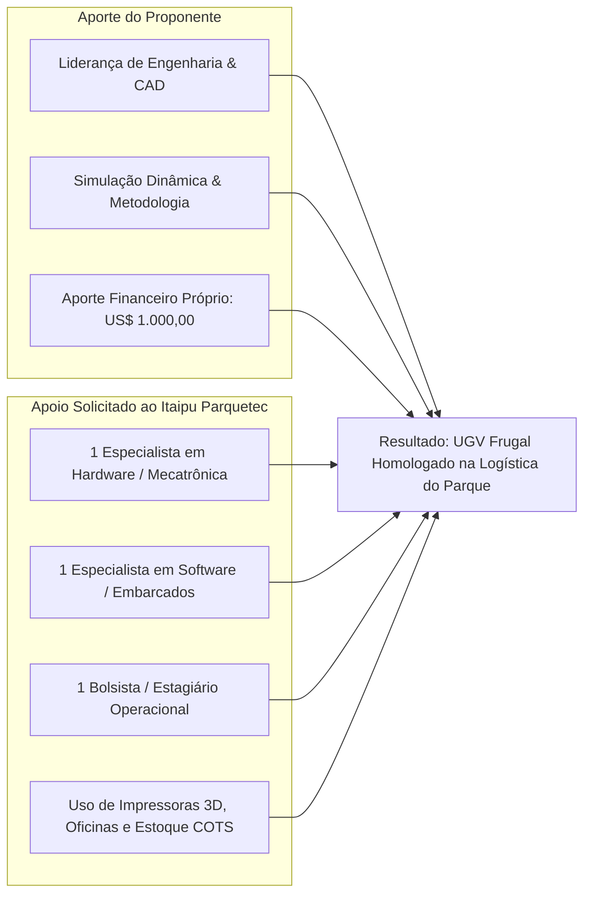

# 01. Proposta Executiva e Pitch Institucional: Itaipu Parquetec
## Parceria Estratégica para Desenvolvimento de Robótica Móvel Frugal

---

## 1. Sumário Executivo da Proposta

O presente documento formaliza a proposta de cooperação técnica submetida à diretoria e equipe de inovação do **Itaipu Parquetec (Parque Tecnológico Itaipu)** para a viabilização, fabricação física e validação de um **Veículo Terrestre Não Tripulado (UGV / Rover) de Baixo Custo para Transporte Logístico de Pequenas Cargas**.

O projeto posiciona o Itaipu Parquetec na vanguarda da **Inovação Frugal Aplicada**, demonstrando como conceitos mecânicos inteligentes (rodas em *curved spokes*, amortecimento por elásticos comuns e estrutura em PVC) combinados com manufatura aditiva e eletrônica comercial de prateleira (COTS) podem solucionar demandas logísticas reais a uma fração do custo das soluções industriais fechadas.

---

## 2. A Proposta de Valor para o Itaipu Parquetec

1. **Validação de Logística Autônoma e Teleoperada no Campus**:
   * O UGV atenderá a uma demanda real e imediata: o transporte seguro e ágil de notebooks, peças e periféricos entre os blocos do parque e o departamento de Tecnologia da Informação (T.I.).
2. **Demonstrador de Inovação Frugal e Democratização Tecnológica**:
   * Prova de conceito de que robôs capazes de subir escadas e superar terrenos complexos não exigem orçamentos milionários, valorizando a criatividade de engenharia e a sustentabilidade de materiais.
3. **Capacitação e Formação de Capital Humano**:
   * Oportunidade prática de formação multidisciplinar para bolsistas e técnicos do parque em áreas de alta demanda: manufatura aditiva, cinemática de robôs móveis 4WD/4WS, sistemas de controle embarcado e teleoperação.
4. **Visibilidade Institucional e Propriedade Aberta**:
   * Geração de artigos científicos conjuntos, registros de propriedade intelectual ou divulgação como caso de sucesso (*case study*) em feiras de tecnologia e inovação (como Show Rural, Campus Party e eventos do setor elétrico/segurança).

---

## 3. Estrutura da Parceria e Modelo de Contrapartida

| Dimensão | Aporte do Proponente do Projeto | Apoio Solicitado ao Itaipu Parquetec |
| :--- | :--- | :--- |
| **Recursos Financeiros** | **US$ 1.000,00 (mil dólares americanos)** em recursos próprios para aquisição de peças críticas não disponíveis. | Não há solicitação de aporte financeiro direto em dinheiro. |
| **Recursos Humanos** | Gestão de projeto, modelagem CAD 3D, simulação física e condução dos testes como piloto. | Alocação parcial de:  • 1 Profissional de Hardware/Eletrônica; • 1 Profissional de Software/Firmware; • 1 Bolsista para fabricação e montagem. |
| **Infraestrutura** | Ferramentas manuais próprias e computadores de simulação. | Acesso às oficinas, laboratórios de prototipagem, impressoras 3D e componentes/controladores já existentes em almoxarifado. |

---

## 4. Cronograma de Apresentação e Marco de Decisão

* **Passo 1: Reunião de Pitch e Demonstração Virtual**: Apresentação dos resultados das simulações dinâmicas (Fase 2) comprovando a viabilidade física de subir escadas e transportar a carga.
* **Passo 2: Assinatura do Termo de Cooperação**: Formalização das responsabilidades e liberação de acesso às oficinas e impressoras 3D.
* **Passo 3: Liberação das Compras com o Aporte de US$ 1.000,00**: Aquisição dos itens aprovados na lista de materiais faltantes.
