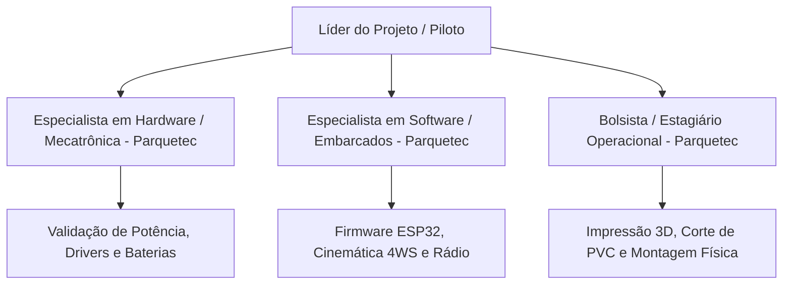

# 02. Especificação de Recursos Humanos, Perfis e Infraestrutura
## Alocação de Equipe Técnica e Acesso aos Laboratórios do Itaipu Parquetec

---

## 1. Mapeamento de Recursos Humanos Solicitados

Para maximizar a velocidade de execução da Fase 4 (Prototipagem Física) e assegurar a robustez do sistema, solicita-se a integração de três perfis do corpo técnico do Itaipu Parquetec:

---

## 2. Perfis e Atribuições Detalhadas

### 👤 1. Especialista em Hardware / Mecatrônica (Profissional do Parque)
* **Carga Horária Estimada**: 4 a 6 horas semanais durante a fase de montagem e integração.
* **Atribuições Principais**:
  * Revisar o dimensionamento das pontes H e dos barramentos de corrente contínua de 12V.
  * Apoiar na confecção da placa de distribuição de energia (PDB) e fixação dos conversores DC-DC Step-Down.
  * Garantir a conformidade dos sistemas de proteção (fusíveis, chave E-Stop e isolamento elétrico contra vibrações).
  * Auxiliar nos ensaios de consumo e estresse térmico dos motores sob carga em bancada.

### 👤 2. Especialista em Software / Embarcados (Profissional do Parque)
* **Carga Horária Estimada**: 4 a 6 horas semanais durante a fase de programação e calibração.
* **Atribuições Principais**:
  * Estruturar a arquitetura de firmware em C++/FreeRTOS no microcontrolador ESP32.
  * Implementar as equações cinemáticas de conversão de comandos do piloto (joystick) para sinais individuais de tração (4WD) e ângulos de esterçamento (4WS).
  * Configurar a pilha de comunicação sem fio de baixa latência (ExpressLRS / ESP-NOW) e as rotinas de emergência (*Failsafe*).
  * Instrumentar a telemetria em tempo real (dados de corrente, tensão e aceleração da carga útil).

### 👤 3. Bolsista / Estagiário de Nível Superior (Execução Operacional)
* **Carga Horária Estimada**: 12 a 20 horas semanais (dedicação contínua na oficina).
* **Atribuições Principais**:
  * Gerenciar as impressões 3D no laboratório (preparação de fatiamento no software slicer, troca de filamentos e pós-processamento de peças).
  * Executar o corte, lixamento e furação dos tubos de PVC predial conforme gabaritos do CAD.
  * Montar os conjuntos mecânicos (abraçadeiras na caixa organizadora, instalação de parafusos, rolamentos e feixes de elásticos).
  * Apoiar a realização dos ensaios de campo, anotação de logs de teste e manutenção rápida de peças.

---

## 3. Infraestrutura Laboratorial e Equipamentos Requeridos

A parceria solicita o compartilhamento da infraestrutura já instalada no Itaipu Parquetec:

| Recurso / Laboratório | Finalidade no Projeto | Frequência de Uso |
| :--- | :--- | :--- |
| **Laboratório de Prototipagem Rápida (Impressão 3D)** | Produção de rodas *curved spokes*, mangas de eixo, juntas angulares e suportes de motor em filamento PETG/PLA. | Intensivo nas 3 primeiras semanas de montagem. |
| **Bancada Mecânica / Oficina de Marcenaria/Serralheria** | Corte preciso de tubos de PVC, furadeira de bancada, morsa para ajuste de peças e bancada de montagem. | Semanal durante montagens e iterações. |
| **Bancada de Eletrônica e Instrumentação** | Estação de solda regulável, multímetro True-RMS, fonte de bancada ajustável (0-30V / 10A) e osciloscópio para análise de PWM. | Periódico na montagem do chicote e calibração. |
| **Estoque de Insumos Existentes (*Almoxarifado COTS*)** | Reaproveitamento de materiais sobressalentes já em estoque: placas de microcontroladores (ESP32/Arduino), fios de silicone, conectores XT60/Dupont, parafusos métricos (M3/M4/M5), porcas e fitas organizadoras. | Conforme disponibilidade interna do parque. |
