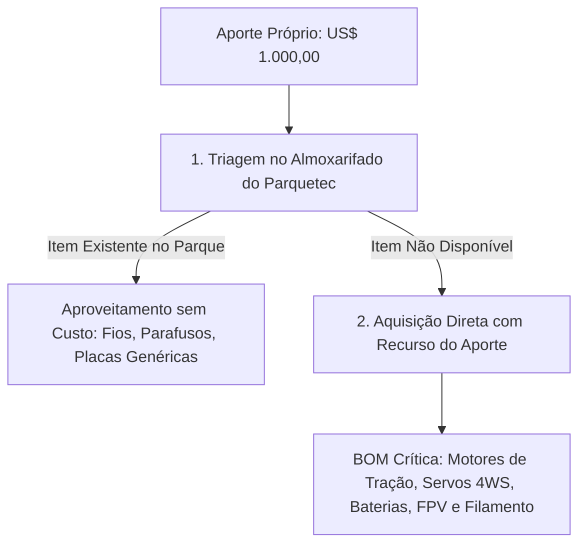

# 03. Planejamento Orçamentário e Aplicação do Aporte Próprio (US$ 1.000,00)
## Lista Técnica de Materiais (BOM) e Critérios de Aquisição de Itens Faltantes

---

## 1. Diretriz de Aplicação dos Recursos Financeiros

O aporte financeiro próprio de **US$ 1.000,00 (mil dólares americanos)** destina-se estritamente à aquisição de componentes comerciais de prateleira (COTS) e insumos que **não estejam previamente disponíveis** nas oficinas e almoxarifados do Itaipu Parquetec.

---

## 2. Lista de Materiais (BOM) — revisão R2

> **O que mudou em relação a R1.** O redimensionamento da roda (Φ300 → Φ420 mm) e
> da cadeia de tração (1:70 → 1:172) alterou motores, filamento e bateria. Foram
> acrescentados itens que a análise de R2 tornou obrigatórios: **aro elástico**
> (sem ele não há rolamento suave), **encoders no lado da roda** (a complacência do
> C-STS impede medir a roda pelo motor) e **sensores de corrente e temperatura**
> (a proteção I²t é o que impede queimar motor em escada).

A lista está separada em três blocos porque **o risco de cada um é diferente**.

### Bloco A — Crítico, sem substituto, precisa ser comprado

| Item | Qtd. | Unit. | Total |
| :--- | :---: | ---: | ---: |
| Motorredutor 12 V, redução metálica **1:172**, com encoder | 5 un. | $ 22,00 | $ 110,00 |
| Servomotor digital 25 kgf·cm, engrenagem metálica, curso ≥ 180° | 5 un. | $ 11,00 | $ 55,00 |
| Driver ponte H BTS7960 (≥ 20 A/canal) | 4 un. | $ 8,00 | $ 32,00 |
| Célula LiFePO4 26650 3 Ah **com descarga ≥ 5C** ⚠️ | 8 un. | $ 6,00 | $ 48,00 |
| BMS 4S 30 A + suporte + fita de níquel | 1 kit | $ 18,00 | $ 18,00 |
| Carregador balanceador compatível com LiFePO4 | 1 un. | $ 32,00 | $ 32,00 |
| Filamento PETG 1 kg (rodas Φ420, cubos, mangas, juntas) | 5 un. | $ 20,00 | $ 100,00 |
| Filamento TPU 95A 0,5 kg (aro elástico impresso) | 1 un. | $ 25,00 | $ 25,00 |
| Câmara de ar de bicicleta 20" (aro elástico frugal, alternativa) | 4 un. | $ 3,00 | $ 12,00 |
| Encoder magnético AS5600 + ímã diametral (lado da roda) | 4 un. | $ 3,00 | $ 12,00 |
| Sensor de corrente por canal (INA226 ou ACS712) | 4 un. | $ 4,00 | $ 16,00 |
| Termistor NTC 10k + chicote de sensor | 1 kit | $ 8,00 | $ 8,00 |
| Presilha toggle over-center com trava secundária | 8 un. | $ 2,50 | $ 20,00 |
| Espuma técnica de alta densidade (berço do notebook) | 1 un. | $ 12,00 | $ 12,00 |
| **Subtotal do Bloco A** | | | **$ 500,00** |

⚠️ **Verificar no datasheet antes de comprar:** a corrente de pico medida em
simulação é de 27,7 A = **4,6C**. Célula LiFePO4 comum de 3 Ah costuma ser
especificada para 2 a 3C contínuos — não serve.

### Bloco B — Provavelmente disponível no almoxarifado do Parquetec

Itens de uso geral, tipicamente já em estoque num parque tecnológico. **Triar
antes de comprar** — o que existir no parque libera orçamento para a reserva.

| Item | Qtd. | Unit. | Total se comprado |
| :--- | :---: | ---: | ---: |
| Microcontrolador ESP32-S3 DevKit | 3 un. | $ 7,00 | $ 21,00 |
| IMU BNO055 (fusão em hardware) | 1 un. | $ 22,00 | $ 22,00 |
| Rolamentos 608ZZ / 688ZZ | 16 un. | $ 1,00 | $ 16,00 |
| Tubo de PVC 25 mm (barra 3 m) + conexões | 4 bar. | $ 4,00 | $ 16,00 |
| Caixa organizadora 20 L com tampa | 2 un. | $ 12,00 | $ 24,00 |
| Elásticos nº 18 (pacote com 100) | 5 pct. | $ 1,50 | $ 7,50 |
| Parafusos M3/M4/M5, porcas parlock, XT60, cabo de silicone, velcro | — | $ 40,00 | $ 40,00 |
| Dissipadores + ventoinhas 30 mm | 1 kit | $ 12,00 | $ 12,00 |
| **Subtotal do Bloco B** | | | **$ 158,50** |

### Bloco C — Teleoperação e vídeo (reaproveitável ou emprestado)

| Item | Qtd. | Unit. | Total |
| :--- | :---: | ---: | ---: |
| Transmissor ExpressLRS 2.4 GHz / 915 MHz | 1 un. | $ 85,00 | $ 85,00 |
| Receptor ELRS nano com telemetria | 2 un. | $ 15,00 | $ 30,00 |
| Câmera FPV 1200 TVL + VTX 5.8 GHz + antenas | 1 kit | $ 55,00 | $ 55,00 |
| Monitor FPV 7" com receptor diversity | 1 un. | $ 95,00 | $ 95,00 |
| **Subtotal do Bloco C** | | | **$ 265,00** |

### Consolidação e análise de risco orçamentário

| Cenário | A | B | C | Subtotal | Reserva | Situação |
| :--- | ---: | ---: | ---: | ---: | ---: | :--- |
| **Pessimista** — nada disponível no parque | 500,00 | 158,50 | 265,00 | **923,50** | **$ 76,50 (8%)** | ⚠️ apertado |
| **Provável** — Bloco B parcialmente disponível | 500,00 | 80,00 | 265,00 | 845,00 | $ 155,00 (18%) | aceitável |
| **Favorável** — Bloco B no parque e rádio/FPV emprestados | 500,00 | 0,00 | 0,00 | 500,00 | $ 500,00 (100%) | confortável |

> **Risco a declarar na proposta.** No cenário pessimista a reserva cai a **8%**,
> insuficiente para frete internacional e tributos de importação, que no Brasil
> podem chegar a 60% a 100% sobre eletrônicos. **O aporte de US$ 1.000,00 só é
> suficiente se pelo menos o Bloco B vier do almoxarifado do parque.** Esta é uma
> premissa da proposta, não um detalhe operacional — e é a razão pela qual a
> triagem no almoxarifado (passo 1 do fluxo acima) precisa acontecer **antes** de
> qualquer compra.

**Mitigações previstas, em ordem de acionamento:**

1. Priorizar fornecedores nacionais para o Bloco B e para consumíveis (PVC,
   caixas, elásticos, parafusos, filamento) — evita frete e tributo de importação.
2. Usar a alternativa frugal do aro elástico (câmara de ar de bicicleta, $12) em
   vez do TPU impresso ($25), se o ensaio ENS-04 mostrar desempenho equivalente.
3. Dispensar o monitor FPV de 7" ($95) usando óculos ou celular já disponíveis.
4. Em último caso, reduzir de 5 para 4 as unidades de motor e servo, eliminando os
   sobressalentes — com aumento do risco de parada em caso de queima.

## 3. Gestão e Transparência Financeira

1. **Planilha de Prestação de Contas em Tempo Real**: Cada aquisição será registrada com nota fiscal/comprovante digital, discriminando data, fornecedor, valor em moeda original e vínculo com a EAP.
2. **Priorização de Fornecedores Nacionais**: Para itens de consumo rápido (tubos de PVC, caixas organizadoras, elásticos, parafusos e filamento 3D), priorizam-se distribuidores locais em Foz do Iguaçu e e-commerce nacional com entrega expressa para não travar o cronograma.
3. **Destinação dos Itens Finais**: Todos os componentes adquiridos com o aporte integrarão o patrimônio do protótipo desenvolvido para o parque.
