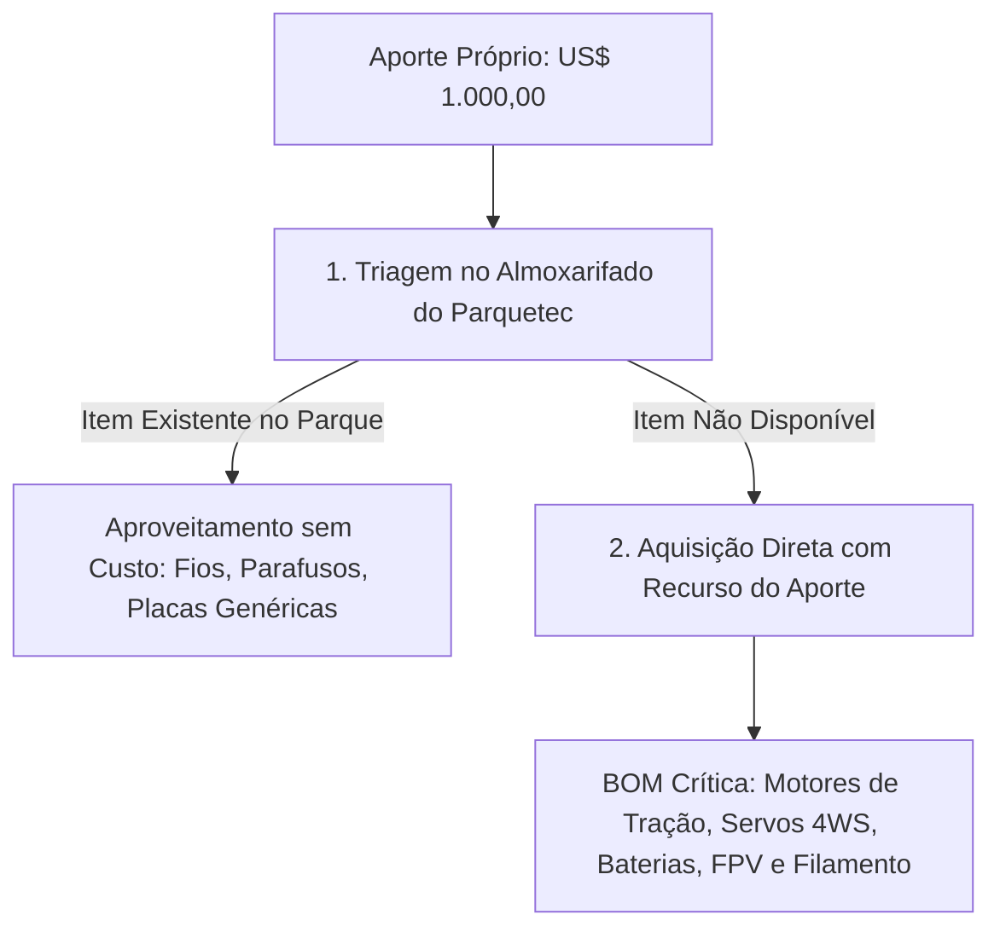

# 03. Planejamento Orçamentário e Aplicação do Aporte Próprio (US$ 1.000,00)
## Lista Técnica de Materiais (BOM) e Critérios de Aquisição de Itens Faltantes

---

## 1. Diretriz de Aplicação dos Recursos Financeiros

O aporte financeiro próprio de **US$ 1.000,00 (mil dólares americanos)** destina-se estritamente à aquisição de componentes comerciais de prateleira (COTS) e insumos que **não estejam previamente disponíveis** nas oficinas e almoxarifados do Itaipu Parquetec.

---

## 2. Lista de Materiais Estimada (*Bill of Materials - BOM*)

Abaixo está o planejamento detalhado de compras considerando cotações médias de mercado internacional/nacional para peças de alta confiabilidade mecatrônica:

| Item | Descrição do Componente | Qtd. | Custo Unit. Est. (USD) | Custo Total Est. (USD) | Prioridade de Aquisição |
| :--- | :--- | :---: | :---: | :---: | :---: |
| **1** | Motorredutores DC 12V com redução metálica planetária e encoders (4WD) | 5 un. | $ 14,00 | $ 70,00 | Crítica (Tração) |
| **2** | Servomotores digitais 25 kgf·cm com engrenagens metálicas (4WS) | 5 un. | $ 10,00 | $ 50,00 | Crítica (Direção) |
| **3** | Módulos Drivers Ponte H BTS7960 43A de alta potência | 4 un. | $ 8,00 | $ 32,00 | Crítica (Potência) |
| **4** | Bateria LiPo 3S 5000mAh 50C (ou LiFePO4 4S) de alta descarga | 2 un. | $ 45,00 | $ 90,00 | Crítica (Energia) |
| **5** | Carregador Inteligente Microprocessado Balanceador (tipo IMAX B6) | 1 un. | $ 35,00 | $ 35,00 | Suporte (Energia) |
| **6** | Transmissor Rádio Controle ExpressLRS (ELRS) 2.4GHz / 915MHz | 1 un. | $ 85,00 | $ 85,00 | Crítica (Controle) |
| **7** | Receptor de Rádio ELRS Nano com telemetria | 2 un. | $ 15,00 | $ 30,00 | Crítica (Controle) |
| **8** | Câmera FPV 1200TVL + Transmissor de Vídeo 5.8GHz 600mW + Antenas | 1 kit | $ 55,00 | $ 55,00 | Crítica (Visão Piloto) |
| **9** | Monitor Receptor FPV 7 polegadas com bateria e receptor Diversity | 1 un. | $ 95,00 | $ 95,00 | Crítica (Visão Piloto) |
| **10** | Microcontroladores ESP32-S3 DevKit com conector IPEX/antena externa | 3 un. | $ 7,00 | $ 21,00 | Lógica / Backup |
| **11** | Carreteis de Filamento PETG 1.75mm (1 kg cada) para peças estruturais | 4 un. | $ 20,00 | $ 80,00 | Manufatura 3D |
| **12** | Rolamentos de esferas miniatura (padrão 608ZZ / 688ZZ) | 16 un. | $ 1,00 | $ 16,00 | Mecânica |
| **13** | Tubos de PVC de Água Fria 20mm/25mm (barras de 3m) + Conexões | 4 bar. | $ 4,00 | $ 16,00 | Estrutura |
| **14** | Caixas Organizadoras Plásticas Transparentes 20L a 30L com tampa | 2 un. | $ 12,00 | $ 24,00 | Carga Útil |
| **15** | Pacotes de Elásticos de Borracha Comuns de Escritório nº 18 (100 un.) | 5 pct. | $ 1,50 | $ 7,50 | Suspensão |
| **16** | Parafusos, porcas parlock, arruelas, tiras velcro e conectores XT60 | Diversos | $ 35,00 | $ 35,00 | Fixação Elétrica |
| **--** | **Reserva Técnica para Fretes, Taxas e Imprevistos Mecânicos** | -- | -- | **$ 258,50** | Margem de Segurança |
| **TOTAL** | **Investimento Total Previsto (Aporte Próprio)** | -- | -- | **US$ 1.000,00** | -- |

---

## 3. Gestão e Transparência Financeira

1. **Planilha de Prestação de Contas em Tempo Real**: Cada aquisição será registrada com nota fiscal/comprovante digital, discriminando data, fornecedor, valor em moeda original e vínculo com a EAP.
2. **Priorização de Fornecedores Nacionais**: Para itens de consumo rápido (tubos de PVC, caixas organizadoras, elásticos, parafusos e filamento 3D), priorizam-se distribuidores locais em Foz do Iguaçu e e-commerce nacional com entrega expressa para não travar o cronograma.
3. **Destinação dos Itens Finais**: Todos os componentes adquiridos com o aporte integrarão o patrimônio do protótipo desenvolvido para o parque.
