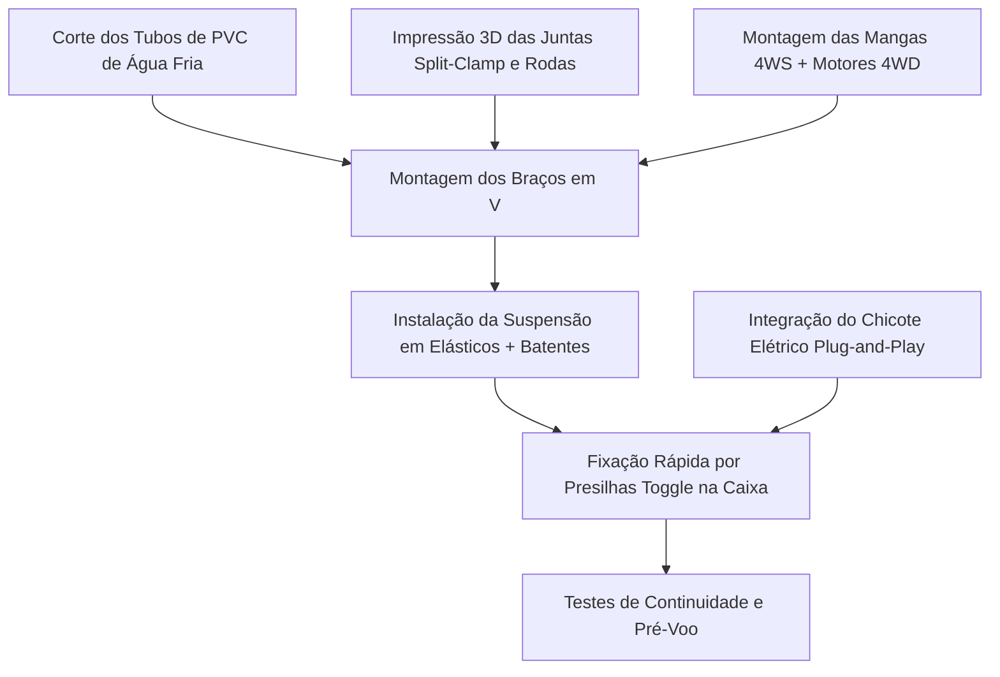

# 01. Roteiro Prático de Montagem, Mecanismos e Modularidade
## Guia Passo a Passo com Juntas Split-Clamp e Presilhas Toggle (Sclater & Chironis, 2001)

> [!IMPORTANT]
> **Revisão R2 — atualizado**
> Os comprimentos de corte de tubo (350/400 mm) não fecham com a geometria vigente e foram substituídos por tabela derivada dos parâmetros mestres. O curso da suspensão passou de 35 para **90 mm**, o que muda o projeto da manga.
>
> Parâmetros vigentes: [`00_Especificacao_Mestre/00_Parametros_Mestres.md`](../00_Especificacao_Mestre/00_Parametros_Mestres.md) ·
> Achados: [`02_Auditoria_Tecnica.md`](../00_Especificacao_Mestre/02_Auditoria_Tecnica.md)

---

---

## 1. Visão Geral do Processo Construtivo

A montagem do rover é dividida em módulos mecânicos desacoplados, permitindo que a estrutura tubular de PVC, os conjuntos de roda 4WS/4WD e a caixa de carga sejam montados de forma modular e independente:



---

## 2. Passo a Passo Detalhado de Montagem

### Etapa 1: Corte e Preparação dos Tubos de PVC

> **Lista de corte derivada, não digitada.** Os comprimentos abaixo são calculados
> a partir das posições de roda, da altura de fixação pendular e do curso da
> suspensão por `simulador_python/estrutura.py`. Se a geometria mudar no arquivo
> mestre, regenere com `python3 -m simulador_python.estrutura`.

| Qtd. | Peça | Comprimento de corte | Ângulo | Trecho |
| :---: | :--- | ---: | ---: | :--- |
| 4x | Haste superior (ascendente) | **185 mm** | +56.9° | abraçadeira da caixa → vértice do V |
| 4x | Haste inferior (descendente) | **288 mm** | +56.1° | vértice do V → manga de esterçamento 4WS |

O comprimento de corte já inclui **30 mm de encaixe dentro de cada junta
split-clamp** em ambas as extremidades. Tubo de PVC predial de água fria,
diâmetro nominal 25 mm.

**Envelope resultante do veículo:** 1110 mm (comprimento) ×
664 mm (largura) × 470 mm (altura).
Passa em porta de 800 mm com **136 mm de folga**;
raio de giro no próprio eixo: 667 mm.

1. Cortar com serra de arco e caixa de esquadria, conferindo cada peça com
   paquímetro (tolerância ±1 mm — erro de comprimento vira desalinhamento de roda).
2. Lixar as extremidades com lixa d'água grão 220 para remover rebarbas.
3. **Marcar com caneta permanente** a linha de inserção em cada extremidade: se o
   tubo escorregar dentro da junta em operação (modo de falha F-40 da FMEA), a
   marca denuncia visualmente antes que a geometria se perca.

### Etapa 2: Montagem das Mangas de Eixo 4WS e Motores 4WD
1. Inserir sob leve pressão os rolamentos de esferas 608ZZ nos alojamentos das mangas de eixo 3D.
2. Fixar o servomotor de esterçamento digital de 25 kgf·cm no suporte da manga e conectar o braço mecânico (*servo horn*) metálico ao eixo vertical da manga.
3. Parafusar o motorredutor DC de tração 12V 4WD na flange inferior da manga de eixo.
4. Acoplar a roda *curved spokes* impressa em PETG ao eixo do motorredutor utilizando acoplador sextavado de latão com parafuso prisioneiro (*grub screw*).

### Etapa 3: Instalação da Suspensão Elástica com Batente de Fim-de-Curso (Sclater & Chironis, 2001)
1. Conectar a manga de eixo à haste de PVC inferior através do pino de articulação em aço inoxidável M4.
2. Posicionar os carretéis de ancoragem impressos em 3D.
3. Instalar o feixe de elásticos de escritório comuns (**8 elásticos nº 18 por
   perna**, sob pré-alongamento de aproximadamente $20\%$), totalizando
   $\approx 1000\text{ N/m}$ por roda.
4. Verificar que o curso vertical livre da manga é de **90 mm** — e não 35 mm como
   na revisão anterior. Esse curso é dimensionado pela energia da queda de cubo na
   escada (89 mm de queda, 7,6 J a dissipar); com 35 mm a suspensão bate no
   batente a cada transferência de raio e a carga recebe 4,2 g em vez de 0,8 g.
5. Verificar se o **batente de fim-de-curso** (parafuso M4 + porca, **metálico**,
   não impresso — ver F-14 na FMEA) limita a sobre-extensão, protegendo o feixe.
6. Medir o **afundamento estático** com o veículo montado e carregado: deve ficar
   em torno de 22 mm (24% do curso). Fora da faixa de 18 a 28 mm, ajustar o número
   de elásticos por perna.

### Etapa 4: Montagem do Vértice Superior em "V Invertido" com Juntas *Split-Clamp*
1. Inserir a haste superior e a haste inferior na junta angular do vértice 3D.
2. Apertar os parafusos tangenciais Allen M4 com porcas autotravantes (*parlock*).
3. **Torque de Aperto Recomendado**: Aplicar torque de $1,8 \text{ a } 2,2 \text{ N}\cdot\text{m}$ (suficiente para travar o PVC por atrito de $360^\circ$ sem esmagar a parede do tubo).

### Etapa 5: Acoplamento na Caixa por Presilhas *Toggle Over-Center*
1. Posicionar os 4 suportes de fixação rápida nas quatro quinas do **terço superior** da caixa organizadora plástica.
2. Travar as **4 presilhas articuladas rápidas (*toggle clamps*)** sobre a borda reforçada da caixa. O mecanismo deve fazer um estalo suave ao cruzar o ponto morto central (*over-center*).

---

## 3. Protocolo de Desmontagem Rápida e Troca de Caixa (< 2 Minutos)

Se a caixa organizadora for danificada ou for necessário substituí-la por uma caixa com outra configuração de divisórias:

```
                      FLUXO DE SUBSTITUIÇÃO ULTRA-RÁPIDO
 [1. Desconectar Plugue Central] -> [2. Abrir 4 Presilhas Toggle] -> [3. Transferir Braços]
```

1. **Passo 1 (Elétrica)**: Desconectar o conector elétrico multipolar de engate rápido (padrão automotivo ou DB9/XT60) que liga a caixa aos braços.
2. **Passo 2 (Mecânica)**: Soltar manualmente as 4 alavancas das presilhas *toggle* (sem necessidade de nenhuma ferramenta).
3. **Passo 3 (Transferência)**: Erguer o conjunto estrutural completo de braços/rodas e assentá-lo sobre a nova caixa organizadora.
4. **Passo 4 (Travamento)**: Fechar as 4 alavancas *toggle* e reconectar o plugue elétrico.
* **Tempo Total Cronometrado**: $< 90\text{ segundos}$.
