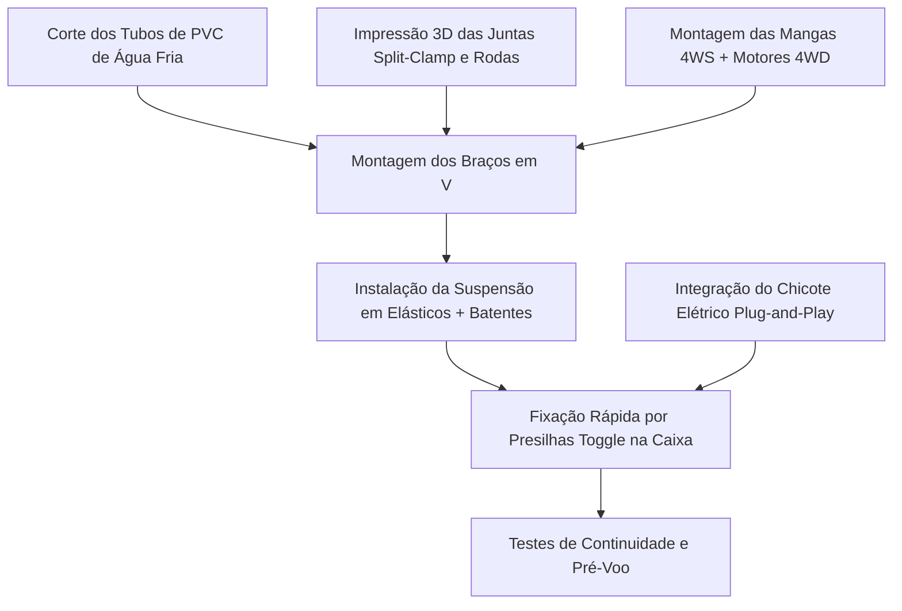

# 01. Roteiro Prático de Montagem, Mecanismos e Modularidade
## Guia Passo a Passo com Juntas Split-Clamp e Presilhas Toggle (Sclater & Chironis, 2001)

---

## 1. Visão Geral do Processo Construtivo

A montagem do rover é dividida em módulos mecânicos desacoplados, permitindo que a estrutura tubular de PVC, os conjuntos de roda 4WS/4WD e a caixa de carga sejam montados de forma modular e independente:



---

## 2. Passo a Passo Detalhado de Montagem

### Etapa 1: Corte e Preparação dos Tubos de PVC
1. Com serra manual de arco e caixa de esquadria, cortar os segmentos de tubo de PVC predial de água fria (diâmetro nominal 20 mm ou 25 mm):
   * 4x Hastes Superiores Ascendentes ($L_1 = 350 \text{ mm}$).
   * 4x Hastes Inferiores Descendentes ($L_2 = 400 \text{ mm}$).
2. Lixar suavemente as extremidades dos tubos com lixa d'água grão 220 para remover rebarbas e cantos vivos.

### Etapa 2: Montagem das Mangas de Eixo 4WS e Motores 4WD
1. Inserir sob leve pressão os rolamentos de esferas 608ZZ nos alojamentos das mangas de eixo 3D.
2. Fixar o servomotor de esterçamento digital de 25 kgf·cm no suporte da manga e conectar o braço mecânico (*servo horn*) metálico ao eixo vertical da manga.
3. Parafusar o motorredutor DC de tração 12V 4WD na flange inferior da manga de eixo.
4. Acoplar a roda *curved spokes* impressa em PETG ao eixo do motorredutor utilizando acoplador sextavado de latão com parafuso prisioneiro (*grub screw*).

### Etapa 3: Instalação da Suspensão Elástica com Batente de Fim-de-Curso (Sclater & Chironis, 2001)
1. Conectar a manga de eixo à haste de PVC inferior através do pino de articulação em aço inoxidável M4.
2. Posicionar os carretéis de ancoragem impressos em 3D.
3. Instalar o feixe de elásticos de escritório comuns (**4 elásticos nº 18 por perna**, sob pré-alongamento de aproximadamente $20\%$).
4. Verificar se o dente mecânico de **batente de fim-de-curso (*travel stop*)** limita a deflexão a $\pm 25^\circ$, protegendo os elásticos contra sobre-extensão destrutiva.

### Etapa 4: Montagem do Vértice Superior em "V Invertido" com Juntas *Split-Clamp*
1. Inserir a haste superior e a haste inferior na junta angular do vértice 3D.
2. Apertar os parafusos tangenciais Allen M4 com porcas autotravantes (*parlock*).
3. **Torque de Aperto Recomendado**: Aplicar torque de $1,8 \text{ a } 2,2 \text{ N}\cdot\text{m}$ (suficiente para travar o PVC por atrito de $360^\circ$ sem esmagar a parede do tubo).

### Etapa 5: Acoplamento na Caixa por Presilhas *Toggle Over-Center*
1. Posicionar os 4 suportes de fixação rápida nas quatro quinas do **terço superior** da caixa organizadora plástica.
2. Travar as **4 presilhas articuladas rápidas (*toggle clamps*)** sobre a borda reforçada da caixa. O mecanismo deve fazer um estalo suave ao cruzar o ponto morto central (*over-center*).

---

## 3. Protocolo de Desmontagem Rápida e Troca de Caixa (< 2 Minutos)

Se a caixa organizadora for danificada ou for necessário substituí-la por uma caixa com outra configuração de divisórias:

```
                      FLUXO DE SUBSTITUIÇÃO ULTRA-RÁPIDO
 [1. Desconectar Plugue Central] -> [2. Abrir 4 Presilhas Toggle] -> [3. Transferir Braços]
```

1. **Passo 1 (Elétrica)**: Desconectar o conector elétrico multipolar de engate rápido (padrão automotivo ou DB9/XT60) que liga a caixa aos braços.
2. **Passo 2 (Mecânica)**: Soltar manualmente as 4 alavancas das presilhas *toggle* (sem necessidade de nenhuma ferramenta).
3. **Passo 3 (Transferência)**: Erguer o conjunto estrutural completo de braços/rodas e assentá-lo sobre a nova caixa organizadora.
4. **Passo 4 (Travamento)**: Fechar as 4 alavancas *toggle* e reconectar o plugue elétrico.
* **Tempo Total Cronometrado**: $< 90\text{ segundos}$.
