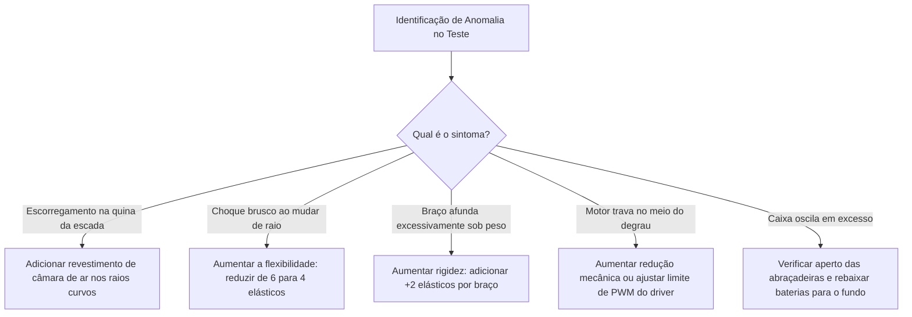

# 02. Protocolo de Testes Incrementais e Ciclo de Iterações
## Roteiro Experimental de Validação Física do Protótipo

> [!IMPORTANT]
> **Revisão R2 — expandido**
> Os cinco níveis de ensaio continuam válidos. Foram acrescentados os ensaios de **caracterização** que o modelo de simulação precisa para ser validado (ENS-04, ENS-11, ENS-12, ENS-13) — sem eles, os parâmetros de suspensão são estimativas. Ver [Verificação e Validação](../03_Simulacao_e_Prototipacao_Digital/04_Verificacao_e_Validacao_do_Modelo.md).
>
> Parâmetros vigentes: [`00_Especificacao_Mestre/00_Parametros_Mestres.md`](../00_Especificacao_Mestre/00_Parametros_Mestres.md) ·
> Achados: [`02_Auditoria_Tecnica.md`](../00_Especificacao_Mestre/02_Auditoria_Tecnica.md)

---

---

## 1. Metodologia de Testes Incrementais (Fase 4)

Para garantir que cada subsistema seja validado antes de ser submetido a estresses mecânicos severos, os ensaios são organizados em uma progressão de 5 níveis de complexidade:

---

## 2. Roteiro dos Ensaios Físicos

| Nível de Teste | Procedimento Experimental | Parâmetros e Métricas de Aceite | Ação em Caso de Reprovação |
| :--- | :--- | :--- | :--- |
| **1. Bancada & Calibração** | Rover suspenso sem tocar o solo. Acionamento individual de cada motor e servo. | Corrente a vazio $< 0,8\text{A}$ por motor. Alinhamento de $0^\circ, 45^\circ, 90^\circ$ nos servos 4WS. | Ajuste de offsets de PWM no código do ESP32 e verificação mecânica de cabos. |
| **2. Solo Plano & Manobras** | Condução em piso liso e asfalto. Testar Ackermann duplo, caranguejo e giro no próprio eixo. | Resposta imediata aos comandos do rádio. Raio de giro no próprio eixo perfeitamente circular. | Calibração de ganho nos motores e alinhamento das mangas de eixo. |
| **3. Meio-fio e Desníveis** | Transposição frontal e em ângulo de meio-fio urbano de $12 \text{ cm}$ e $15 \text{ cm}$. | Engate suave do raio curvo sem parada do motor e sem derrapagem excessiva. | Aumentar a tensão dos elásticos de suspensão ou aplicar banda de borracha nos raios. |
| **4. Subida de Escadas com Carga** | Subida de 1 lance de escada padrão com peso simulado de $3,0 \text{ kg}$ na caixa organizadora. | Não tombar para trás. Aceleração vertical de choque na carga $< 2,0g$. | Rebaixar mais os pesos para o fundo da caixa ou aumentar a pré-tensão elástica. |
| **5. Teste de Rádio e Failsafe** | Operador a 300m de distância em ambiente com obstáculos prediais. Desligar o transmissor propositalmente. | Failsafe deve parar os motores em $< 300\text{ ms}$. Vídeo FPV sem congelamentos severos. | Otimizar posicionamento das antenas de 5.8GHz e 915MHz no alto da caixa. |

---

## 3. Matriz de Iteração e Ajustes Práticos

---

## 4. Teste de Fadiga e Durabilidade dos Elásticos

* **Procedimento**: Submissão do rover a 50 ciclos consecutivos de subida de rampa e 20 subidas de degrau.
* **Critério de Inspeção**: Medição do comprimento em repouso dos elásticos antes e depois do teste.
* **Limite de Deformação Plástica**: Se o alongamento residual permanente ultrapassar $15\%$, descarta-se o feixe e instala-se um conjunto novo.
