# 03. Missão Operacional de Homologação: Resgate e Entrega de Notebook na T.I.
## Roteiro Executivo da Prova de Sucesso no Itaipu Parquetec

---

## 1. Contexto e Definição da Missão

A **Fase 5** é o ápice executivo do projeto. A missão simula um caso de uso real de logística predial no campus do **Itaipu Parquetec**: um funcionário ou pesquisador em um edifício remoto solicita a entrega de um notebook institucional para a equipe de Tecnologia da Informação (T.I.) para manutenção urgente.

```mermaid
graph LR
    subgraph 1. Ponto de Partida
        Base[Laboratório / Base do Rover]
    end

    subgraph 2. Percurso de Ida
        Base -->|Navegação Mista: Asfalto + Rampas + Calçadas| Remoto[Edifício / Ponto Remoto do Solicitante]
    end

    subgraph 3. Embarque da Carga
        Remoto -->|Acomodação do Notebook na Caixa Organizadora| Carga[Carga Útil Travada]
    end

    subgraph 4. Percurso de Retorno
        Carga -->|Subida de Escadas + Corredores Internos| TI[Departamento de T.I. do Parquetec]
    end

    subgraph 5. Homologação Final
        TI -->|Entrega do Notebook + Teste de Funcionamento| Conclusao[Declaração Oficial de Sucesso]
    end
```

---

## 2. Roteiro e Fases da Operação de Campo

### Fase A: Checklist Pré-Missão (*Briefing & Pre-Flight Check*)
1. Verificar carga das baterias principais ($\ge 12,4\text{V}$ para 3S ou $\ge 16,4\text{V}$ para 4S).
2. Verificar integridade e tensão dos elásticos de escritório nas 4 pernas.
3. Testar resposta dos 4 servos 4WS e dos 4 motores 4WD pelo rádio transmissor.
4. Confirmar nitidez da transmissão de vídeo FPV de 5.8GHz e telemetria na tela do piloto.
5. Iniciar gravação contínua da câmera externa e dos logs do acelerômetro embarcado.

### Fase B: Deslocamento até o Solicitante (Trecho de Ida)
* O piloto, posicionado na estação de comando, guia o rover pelo campus do parque.
* O rover vence meios-fios e irregularidades no trajeto até chegar à porta da sala do solicitante.

### Fase C: Embarque Seguro do Equipamento
* O usuário abre a tampa da caixa organizadora plástica do rover.
* O notebook corporativo (peso médio $\sim 2,2 \text{ kg}$) é acomodado sobre a camada interna de espuma absorvente de impacto no fundo da caixa.
* A tampa da caixa é travada por fecho rápido.

### Fase D: Deslocamento com Carga até a T.I. (Trecho Crítico de Retorno)
* O piloto conduz o UGV de volta, enfrentando os lances de escadas externos ou internos do prédio da T.I.
* O rover sobe os degraus utilizando as rodas *curved spokes*, com a suspensão elástica absorvendo os picos de aceleração e o efeito pendular mantendo o centro de gravidade rebaixado.
* O veículo adentra a porta do departamento de T.I. utilizando manobra em Ackermann duplo ou caranguejo se o vão for estreito.

### Fase E: Desembarque e Validação Funcional
* A equipe de T.I. recebe o rover, abre a caixa e retira o notebook.
* **Teste de Integridade Imediato**: O notebook é ligado na presença de testemunhas e da equipe avaliadora, comprovando que o disco, a tela e o hardware estão 100% íntegros e operacionais.

---

## 3. Ata de Homologação e Conclusão Executiva

Cumprida a missão sem intervenção física humana no rover durante o trajeto (exceto o embarque do notebook) e comprovada a integridade do equipamento:
1. É emitida a **Ata de Conclusão da Prova de Conceito**.
2. Declara-se encerrada com sucesso a fase executiva principal do projeto (Fase 6).
3. Habilita-se formalmente o início do desenvolvimento dos roadmaps de longo alcance e da versão tática com fibra óptica (Fase 7).
