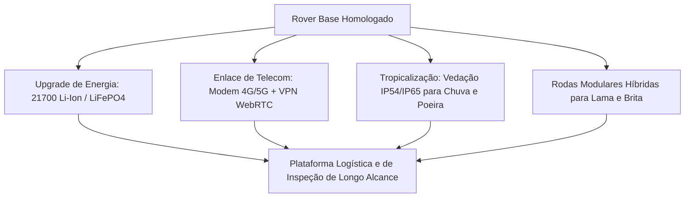

# 01. Roadmap Futuro — Fase A: Extensão de Distâncias e Ambientes Reais
## Operação de Longo Alcance, Conectividade Celular e Tropicalização

---

## 1. Contexto e Objetivos da Fase de Extensão (Fase 7.1)

Com a homologação do protótipo base no transporte de notebooks (Fases 1 a 6), a **Fase A** tem como objetivo transformar o rover em uma plataforma operacional capaz de atuar em grandes extensões territoriais (como parques industriais, usinas hidrelétricas, lavouras agrícolas ou áreas de fronteira):

---

## 2. Pilares Tecnológicos da Fase A

### 2.1. Autonomia Energética Estendida
* **Pack de Baterias de Alta Densidade**: Substituição de packs convencionais por células de íons de lítio formato **21700 (padrão automotivo 5000mAh)** configuradas em arranjo 4S4P (14.8V nominal, 20Ah / ~300Wh).
* **Autonomia Alvo**: $\ge 3 \text{ a } 4 \text{ horas}$ de deslocamento contínuo sob velocidade de cruzeiro de $1,2 \text{ m/s}$ (alcance útil linear de mais de 10 km).
* **Frenagem Regenerativa**: Aproveitamento da descida de longas rampas para realimentar parcialmente o banco de baterias através dos drivers MOSFET.

### 2.2. Telemetria e Controle Celular Sem Limite de Visada (NLOS - *Non-Line-Of-Sight*)
* **Módulo Celular 4G/5G Integrado**: Acoplamento de modem industrial (ex.: SIM7600 ou Quectel) comunicando-se via túnel criptografado seguro (VPN / WireGuard).
* **Transmissão de Vídeo WebRTC de Baixa Latência**: Streaming de vídeo em alta definição (720p/1080p @ 30fps) com latência $< 100\text{ ms}$ através da rede celular pública.
* **Estação de Comando Web**: O piloto pode operar o rover de qualquer lugar do mundo através de um navegador web ou joystick USB conectado a um PC.

### 2.3. Tropicalização, Intemperismo e Proteção IP54/IP65
* **Vedação da Caixa de Carga**: Instalação de gaxetas de borracha EPDM nas bordas da tampa da caixa organizadora plástica, tornando-a estanque contra chuvas fortes e jatos d'água.
* **Blindagem das Articulações de PVC**: Aplicação de anéis de vedação O-ring e labirintos plásticos nas mangas de eixo de esterçamento 4WS para impedir a entrada de poeira e areia fina nos rolamentos.

### 2.4. Adaptação a Solos Deformáveis e Granulares (Shrivastava et al., 2020)
* Baseando-se nas descobertas de **Shrivastava et al. (2020)** sobre locomoção robofísica em terrenos granulares:
  * Criação de rodas *curved spokes* com perfis de aletas de descolamento de areia/lama, evitando o atolamento em solos soltos através da redistribuição de torque (*material remodeling*).
