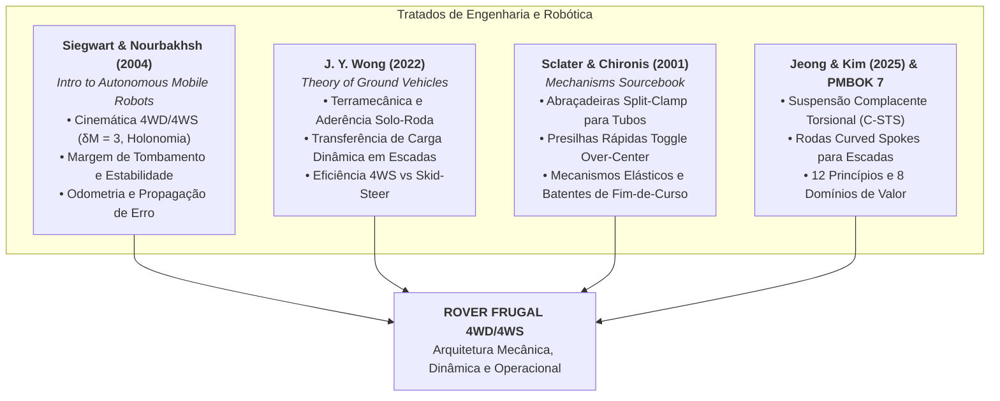

# Projeto Rover Modular de Baixo Custo (Frugal UGV)
## Repositório Mestre de Planejamento, Engenharia, Terramecânica e Gestão

> **Missão do Projeto**: Desenvolver um Veículo Terrestre Não Tripulado (UGV / Rover) de baixo custo, simples construção e alta manobrabilidade para transporte de pequenas cargas (ex.: notebooks e insumos de TI), fundamentado nos princípios da inovação frugal, componentes comerciais de prateleira (COTS), manufatura aditiva 3D, elementos estruturais acessíveis (tubos de PVC e elastômeros) e sólida teoria de engenharia veicular e robótica móvel.

---

## 📸 Conceito Visual do Protótipo Montado

*(Visualização conceitual do UGV: chassi em PVC em V invertido, juntas 3D split-clamp, caixa organizadora pendular com notebook, rodas curved spokes 3D e suspensão por elásticos comuns)*

---

## 📚 Base Teórica e Tratados Científicos de Referência

O projeto integra formalmente os conceitos fundamentais de três obras clássicas mundiais e artigos de ponta em robótica e terramecânica presentes em [`Materiais de apoio`](file:///d:/Downloads/Rascunho%20Rover/Materiais%20de%20apoio):

---

## 🧭 Mapa de Navegação da Documentação

A estrutura documental do projeto está organizada em 6 diretórios temáticos de engenharia e gestão:

```mermaid
graph TD
    Root[Repositório Rover] --> P1[01. Planejamento Geral]
    Root --> P2[02. Engenharia e Arquitetura]
    Root --> P3[03. Simulação e Prototipação Digital]
    Root --> P4[04. Proposta Itaipu Parquetec]
    Root --> P5[05. Execução, Testes e Operação]
    Root --> P6[06. Roadmap Futuro Pós-Sucesso]
    Root --> P7[Materiais de Apoio]

    P1 --> P1_1[Visão Geral e Escopo]
    P1 --> P1_2[Fases e Cronograma]
    P1 --> P1_3[Gestão e PMBOK 7]
    P1 --> P1_4[Critérios de Sucesso]

    P2 --> P2_1[Mecânica, Geometria e Terramecânica]
    P2 --> P2_2[Rodas Curved Spokes e Suspensão Elástica]
    P2 --> P2_3[Cinemática 4WD/4WS e ICR]
    P2 --> P2_4[Eletrônica, Controle e Potência]

    P3 --> P3_1[Modelagem CAD 3D e Clamps]
    P3 --> P3_2[Simulação Dinâmica e Física]
    P3 --> P3_3[Gêmeo Digital e Cenário Parquetec]

    P4 --> P4_1[Pitch Executivo e Proposta]
    P4 --> P4_2[Alocação de Equipe e Infraestrutura]
    P4 --> P4_3[Orçamento e Aporte Próprio $1k USD]

    P5 --> P5_1[Roteiro de Montagem e Presilhas Rápidas]
    P5 --> P5_2[Protocolo de Testes e Iterações]
    P5 --> P5_3[Missão Operacional Entrega TI]

    P6 --> P6_1[Fase A: Extensão de Distâncias]
    P6 --> P6_2[Fase B: Uso Dual e Fibra Óptica]
```

---

## 📁 Índice Detalhado de Documentos

### 📂 [01_Planejamento_Geral](file:///d:/Downloads/Rascunho%20Rover/01_Planejamento_Geral/)
* [01_Visao_Geral_e_Escopo.md](file:///d:/Downloads/Rascunho%20Rover/01_Planejamento_Geral/01_Visao_Geral_e_Escopo.md) — Filosofia da inovação frugal, limites do projeto, premissas de terramecânica e cinemática veicular.
* [02_Estrutura_Fases_e_Cronograma.md](file:///d:/Downloads/Rascunho%20Rover/01_Planejamento_Geral/02_Estrutura_Fases_e_Cronograma.md) — Detalhamento das 7 fases do ciclo de vida, marcos (milestones) e WBS/EAP.
* [03_Gestao_e_PMBOK7.md](file:///d:/Downloads/Rascunho%20Rover/01_Planejamento_Geral/03_Gestao_e_PMBOK7.md) — Aplicação dos 12 princípios e 8 domínios de desempenho do PMBOK 7ª Ed., matriz de riscos mecatrônicos.
* [04_Criterios_de_Sucesso_e_Validacao.md](file:///d:/Downloads/Rascunho%20Rover/01_Planejamento_Geral/04_Criterios_de_Sucesso_e_Validacao.md) — Definição do teste de sucesso definitivo (buscar notebook no Parquetec e entregar na TI) e métricas de desempenho.

### 📂 [02_Engenharia_e_Arquitetura](file:///d:/Downloads/Rascunho%20Rover/02_Engenharia_e_Arquitetura/)
* [01_Arquitetura_Mecanica_e_Geometria.md](file:///d:/Downloads/Rascunho%20Rover/02_Engenharia_e_Arquitetura/01_Arquitetura_Mecanica_e_Geometria.md) — Configuração em X radial, braços em V invertido, fixação pendular no terço superior da caixa, equações de transferência de carga (Wong) e estabilidade de tombamento (Siegwart).
* [02_Rodas_Curved_Spokes_e_Suspensao.md](file:///d:/Downloads/Rascunho%20Rover/02_Engenharia_e_Arquitetura/02_Rodas_Curved_Spokes_e_Suspensao.md) — Mecânica das rodas de raios curvos, suspensão complacente por elásticos de escritório (teoria C-STS Jeong & Kim e Sclater & Chironis), amortecimento histerético e batentes de sobrecurso.
* [03_Tracao_4WD_e_Direcao_4WS.md](file:///d:/Downloads/Rascunho%20Rover/02_Engenharia_e_Arquitetura/03_Tracao_4WD_e_Direcao_4WS.md) — Matriz cinemática completa, manobrabilidade $\delta_M = 3$ (Siegwart), cálculo do Centro Instantâneo de Rotação (ICR), modos Ackermann duplo, Caranguejo e Spin, e comparação de consumo com Skid-Steer (Wong).
* [04_Eletronica_Controle_e_Potencia.md](file:///d:/Downloads/Rascunho%20Rover/02_Engenharia_e_Arquitetura/04_Eletronica_Controle_e_Potencia.md) — Dimensionamento elétrico, trade-off ESP32 vs RPi, drivers de potência MOSFET, odometria e fusão sensorial IMU, e telemetria de vídeo sem latência.
* [05_Dimensionamento_Blondel_e_Dinamica_Colisao.md](file:///d:/Downloads/Rascunho%20Rover/02_Engenharia_e_Arquitetura/05_Dimensionamento_Blondel_e_Dinamica_Colisao.md) — Aplicação da Lei de Blondel ($2E + P = 64\text{ cm}$), dimensionamento analítico das rodas ($\Phi = 300\text{ mm}$, $r_{max} = 150\text{ mm}$), modelo de colisão multicorpo das 4 rodas independentes e transferência dinâmica de cargas normais.

### 📂 [03_Simulacao_e_Prototipacao_Digital](file:///d:/Downloads/Rascunho%20Rover/03_Simulacao_e_Prototipacao_Digital/)
* [01_Plano_de_Modelagem_CAD_3D.md](file:///d:/Downloads/Rascunho%20Rover/03_Simulacao_e_Prototipacao_Digital/01_Plano_de_Modelagem_CAD_3D.md) — Modelagem de abraçadeiras *split-clamp* (Sclater), juntas de PVC, parâmetros de impressão 3D (PETG/PLA) e presilhas rápidas.
* [02_Simulacao_Dinamica_e_Controle.md](file:///d:/Downloads/Rascunho%20Rover/03_Simulacao_e_Prototipacao_Digital/02_Simulacao_Dinamica_e_Controle.md) — Modelagem multicorpo (URDF/SDF), simulação de transposição de degraus, dinâmica da suspensão elastomérica e equações de tração em rampa.
* [03_Ambiente_Virtual_e_Digital_Twin.md](file:///d:/Downloads/Rascunho%20Rover/03_Simulacao_e_Prototipacao_Digital/03_Ambiente_Virtual_e_Digital_Twin.md) — Criação do cenário virtual do Itaipu Parquetec e cockpit de pilotagem com FPV simulado.

### 📂 [04_Proposta_Itaipu_Parquetec](file:///d:/Downloads/Rascunho%20Rover/04_Proposta_Itaipu_Parquetec/)
* [01_Pitch_e_Plano_de_Apoio.md](file:///d:/Downloads/Rascunho%20Rover/04_Proposta_Itaipu_Parquetec/01_Pitch_e_Plano_de_Apoio.md) — Proposta executiva de parceria institucional para apresentação à diretoria do parque tecnológico.
* [02_Alocacao_Equipe_e_Infraestrutura.md](file:///d:/Downloads/Rascunho%20Rover/04_Proposta_Itaipu_Parquetec/02_Alocacao_Equipe_e_Infraestrutura.md) — Especificação dos papéis solicitados (1 Hardware, 1 Software, 1 Bolsista) e uso de laboratórios/impressoras 3D.
* [03_Orcamento_e_Aporte_Proprio_1k_USD.md](file:///d:/Downloads/Rascunho%20Rover/04_Proposta_Itaipu_Parquetec/03_Orcamento_e_Aporte_Proprio_1k_USD.md) — Destinação dos US$ 1.000,00 de aporte próprio para aquisição exclusiva de insumos críticos não disponíveis no parque.

### 📂 [05_Execucao_Testes_e_Operacao](file:///d:/Downloads/Rascunho%20Rover/05_Execucao_Testes_e_Operacao/)
* [01_Roteiro_de_Montagem_e_Modularidade.md](file:///d:/Downloads/Rascunho%20Rover/05_Execucao_Testes_e_Operacao/01_Roteiro_de_Montagem_e_Modularidade.md) — Processo de montagem DIY/Frugal, fixação por presilhas *toggle over-center* na caixa organizadora e desmontabilidade em $< 5$ minutos.
* [02_Protocolo_de_Testes_e_Iteracoes.md](file:///d:/Downloads/Rascunho%20Rover/05_Execucao_Testes_e_Operacao/02_Protocolo_de_Testes_e_Iteracoes.md) — Roteiros de testes incrementais: bancada, tração em rampa, transposição de degraus e durabilidade elástica.
* [03_Missao_Operacional_Parquetec_TI.md](file:///d:/Downloads/Rascunho%20Rover/05_Execucao_Testes_e_Operacao/03_Missao_Operacional_Parquetec_TI.md) — Plano de execução da missão de homologação: rota no parque, coleta remota do notebook e entrega na TI.

### 📂 [06_Roadmap_Futuro_Fases_Pos_Sucesso](file:///d:/Downloads/Rascunho%20Rover/06_Roadmap_Futuro_Fases_Pos_Sucesso/)
* [01_Fase_A_Extensao_Distancias_e_Ambientes_Reais.md](file:///d:/Downloads/Rascunho%20Rover/06_Roadmap_Futuro_Fases_Pos_Sucesso/01_Fase_A_Extensao_Distancias_e_Ambientes_Reais.md) — Planejamento de longo alcance: baterias de alta densidade (21700), telemetria 4G/5G celular, proteção climática IP54/IP65.
* [02_Fase_B_Uso_Dual_e_Controle_Fibra_Optica.md](file:///d:/Downloads/Rascunho%20Rover/06_Roadmap_Futuro_Fases_Pos_Sucesso/02_Fase_B_Uso_Dual_e_Controle_Fibra_Optica.md) — Adaptação tática e uso dual em defesa: carretel de microfibra óptica descartável de 1 km a 5 km, imunidade total a guerra eletrônica (EW / Jamming) e transmissão de vídeo HD sem latência.

---

## 🔬 Síntese do Embasamento Teórico Integrado
1. **Siegwart & Nourbakhsh (2004)**: Grau de mobilidade $\delta_m = 2$, grau de dirigibilidade $\delta_s = 4$, grau de manobrabilidade $\delta_M = 3$ (capacidade de locomoção omnidirecional no plano com rodas convencionais/curvas orientáveis).
2. **J. Y. Wong (2022)**: Formulação rigorosa da transferência de carga dinâmica ($W_f, W_r$), determinação do esforço trativo (*Drawbar Pull*), resistência ao rolamento em degraus e minimização de potência eliminando o arrasto lateral de skid-steering.
3. **Sclater & Chironis (2001)**: Soluções mecânicas clássicas para acoplamento rápido (grampos articulados *toggle*), abraçadeiras bipartidas (*split-clamps*) para tubulação sem fragilização do PVC e tensores elásticos com batentes mecânicos.
4. **Jeong & Kim (2025)**: Eliminação do choque de descontinuidade do raio de curvatura em rodas *curved spokes* através de suspensão complacente elastomérica (*C-STS*).
5. **Cálculo de Blondel (1675) & NBR 9050**: Dimensionamento das rodas de 3 raios ($r_{max} = 150\text{ mm}$, $\Phi = 300\text{ mm}$) para transposição de degraus padrão ($E = 17\text{ cm}$, $P = 30\text{ cm}$, $2E + P = 64\text{ cm}$).

---

## 🎮 Protótipo e Simulador 3D Interativo (Three.js)

O repositório inclui um simulador 3D completo com **detecção de colisão independente nas 4 rodas**, física de transposição de escadas de Blondel, telemetria em tempo real, horizonte artificial IMU e comutação de modos 4WS:

* ⚡ **Inicializador Direto no Windows**: Duplo clique em [`iniciar_simulador_3d.bat`](file:///d:/Downloads/Rascunho%20Rover/iniciar_simulador_3d.bat)
* 🌐 **Execução Direta no Navegador**: Abra [`prototipo_3d_standalone.html`](file:///d:/Downloads/Rascunho%20Rover/prototipo_3d_standalone.html)
* 📦 **Código-Fonte Modular**: Diretório [`prototipo_3d/`](file:///d:/Downloads/Rascunho%20Rover/prototipo_3d/)

---

## 🐍 Simulador Físico Avançado em Python (Tkinter + Matplotlib)

Para modelagem matemática rigorosa, análise de estabilidade e testes automatizados, desenvolveu-se o pacote [`simulador_python/`](file:///d:/Downloads/Rascunho%20Rover/simulador_python/):

* ⚡ **Execução Imediata no Windows**: Duplo clique em [`executar_simulador_python.bat`](file:///d:/Downloads/Rascunho%20Rover/executar_simulador_python.bat)
* 💻 **Execução via Terminal**: `python -m simulador_python.main`
* 📊 **Modo Benchmark Científico**: `python -m simulador_python.main --benchmark`
* 📑 **Módulos Físicos**:
  - `kinematics.py`: Cinemática inversa 4WS/4WD ($\delta_M = 3$, Siegwart & Nourbakhsh, 2004).
  - `terramechanics.py`: Transferência dinâmica de cargas normais $F_z$ e Drawbar Pull (Wong, 2022).
  - `curved_spoke_csts.py`: Modelo analítico de 3 raios curvos e mola espiral C-STS (Jeong & Kim, 2025).
  - `blondel_collision.py`: Colisão de 4 rodas independentes na escada de Blondel ($2E+P = 64\text{ cm}$).
  - `multibody_dynamics.py`: Simulador 6-DOF com balanço pendular da carga e elásticos de suspensão.
  - `gui_app.py`: Interface gráfica interativa (Tkinter) com cockpit de telemetria e gráficos em tempo real.

