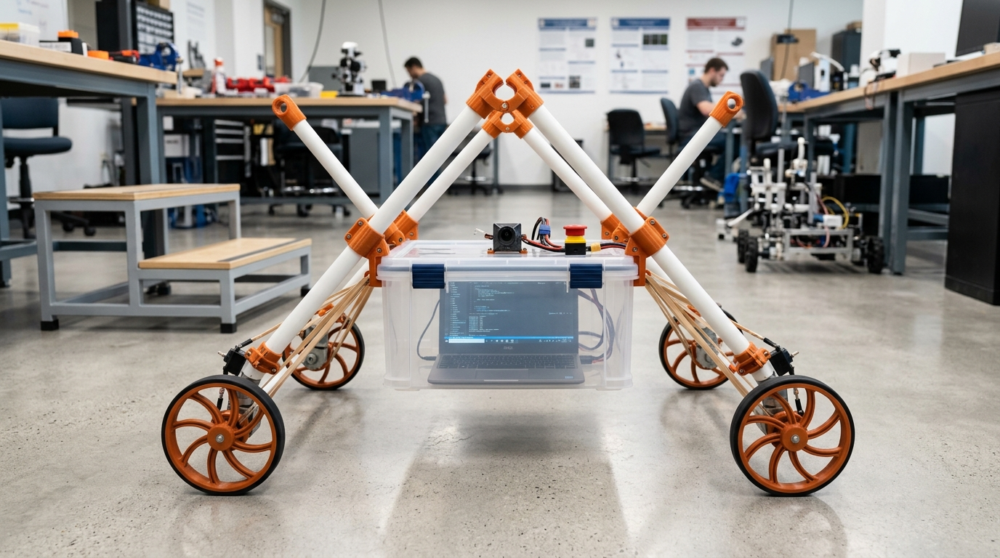
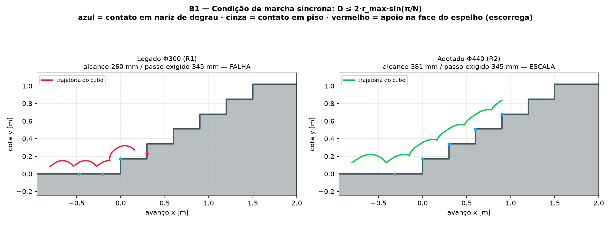
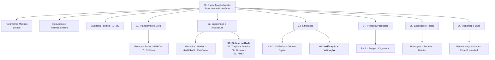

# Rover Frugal 4WD/4WS
## UGV de baixo custo para logística predial — engenharia, simulação e gêmeo digital

[](testes/)
[](00_Especificacao_Mestre/parametros_mestres.yaml)
[](#licença)

> **Missão.** Desenvolver um Veículo Terrestre Não Tripulado capaz de buscar um
> notebook em qualquer ponto do Itaipu Parquetec e entregá-lo no departamento de
> T.I., **subindo escadas**, operado remotamente por um piloto — construído com
> tubos de PVC, impressão 3D, elásticos de escritório e eletrônica de prateleira.



---

## Onde começar

| Se você quer... | Vá para |
| :--- | :--- |
| entender **as decisões de engenharia e por que mudaram** | [Auditoria Técnica R1→R2](00_Especificacao_Mestre/02_Auditoria_Tecnica.md) |
| ver **todos os números do projeto num lugar só** | [Parâmetros Mestres](00_Especificacao_Mestre/00_Parametros_Mestres.md) |
| saber **o que ainda falta provar** | [Requisitos e Rastreabilidade](00_Especificacao_Mestre/01_Requisitos_e_Rastreabilidade.md) |
| **pilotar** o rover num percurso simulado | [Gêmeo digital 3D](#gêmeo-digital-3d) |
| **rodar as contas** você mesmo | [Simulador Python](#simulador-físico-em-python) |
| avaliar a **proposta institucional** | [Pitch ao Parquetec](04_Proposta_Itaipu_Parquetec/01_Pitch_e_Plano_de_Apoio.md) |

---

## Estado do projeto

O projeto está na **Fase 2 — engenharia de detalhe e simulação**. Nenhuma peça
foi fabricada ainda. Isso importa para ler o resto do repositório:

* ✅ **18 requisitos** verificados por análise ou simulação automatizada;
* 🟡 **13 requisitos** verificados em simulação, aguardando ensaio físico;
* ⬜ **14 requisitos** dependem de hardware montado.

Todas as conclusões numéricas aqui são **previsões de modelo**, com domínio de
validade declarado em [Verificação e Validação](03_Simulacao_e_Prototipacao_Digital/04_Verificacao_e_Validacao_do_Modelo.md).

---

## O que a revisão R2 mudou no projeto

A engenharia foi reconstruída sobre uma fonte única de parâmetros e sobre modelos
sem fatores de ajuste. Cinco achados alteraram o projeto físico:

| Achado | R1 | R2 |
| :--- | :--- | :--- |
| **Diâmetro da roda** — a roda precisa alcançar o nariz do degrau seguinte, não apenas rolar | Φ300 mm (critério de rolamento em plano) | **Φ420 mm** por marcha síncrona e robustez de fase |
| **Aro elástico** — sem ele o cubo cai 105 mm por raio em piso plano | "opcional" | **item crítico** |
| **Curso da suspensão** — dimensionado pela energia da queda de cubo | 35 mm (4,2 g na carga) | **90 mm** (0,8 g) |
| **Rigidez do C-STS** — não se copia rigidez entre escalas | 0,55 N·m/rad (do artigo → 566° de deflexão) | **10,31 N·m/rad** por semelhança dimensional |
| **Classificação cinemática** | δm=2, δs=4, δM=3 (soma 6) | **δm=1, δs=2, δM=3** — não holonômico |

Mais dois limites operacionais que ninguém tinha visto:

* o gargalo da escada é **térmico**, não energético: 27 s de subida contínua antes
  do limite do enrolamento — a missão inteira usa só 15% da bateria;
* o rover **não sobe escada molhada**: exige μ ≥ 0,72 e o concreto úmido dá 0,55.

Cada achado está documentado com evidência reproduzível na
[Auditoria Técnica](00_Especificacao_Mestre/02_Auditoria_Tecnica.md).

---

## A ideia central, em uma equação

Uma roda de raios não rola sobre a escada — ela **salta de nariz em nariz**. Para
que o raio seguinte alcance o degrau seguinte:

$$\underbrace{\sqrt{E^2+P^2}}_{\text{passo do degrau}} \;\le\; 2\,r_{max}\sin\!\left(\frac{\pi}{N}\right)$$

Para o degrau de referência (E = 170 mm, P = 300 mm) e N = 3 raios:
**r_max ≥ 199 mm**. A roda de Φ300 mm alcança 260 mm contra 345 mm exigidos — e
por isso trava na face do espelho. A dedução completa está em
[Síntese da Roda](02_Engenharia_e_Arquitetura/06_Sintese_da_Roda_e_Geometria_de_Escalada.md).



---

## Como o repositório se sustenta

**Nenhum número de engenharia é digitado duas vezes.** Tudo vive em
[`parametros_mestres.yaml`](00_Especificacao_Mestre/parametros_mestres.yaml):

```
00_Especificacao_Mestre/parametros_mestres.yaml   ← fonte única de verdade
        │
        ├─→ simulador_python/config.py ────────── simulador, benchmarks, relatório
        ├─→ prototipo_3d/parametros.js ────────── gêmeo digital 3D
        └─→ 00_Parametros_Mestres.md ──────────── tabela da documentação
                                                  (os dois últimos são gerados)
```

Mudar o diâmetro da roda no YAML muda o simulador, o modelo 3D e a documentação
ao mesmo tempo. Testes automatizados verificam a coerência a cada alteração.

---

## Simulador físico em Python

```bash
pip install -r requirements.txt

python3 -m simulador_python.main --parametros   # configuração resolvida
python3 -m simulador_python.main --marcha       # marcha na escada de referência
python3 -m simulador_python.main --sintese      # varredura do espaço de projeto
python3 -m simulador_python.main --benchmark    # 6 benchmarks + figuras
python3 -m simulador_python.main --relatorio    # Relatório de Engenharia completo
python3 -m pytest testes/ -q                    # 73 verificações
```

| Módulo | O que resolve |
| :--- | :--- |
| [`geometria_escada.py`](simulador_python/geometria_escada.py) | marcha da roda de raios por **eventos de contato** — o núcleo do projeto |
| [`csts.py`](simulador_python/csts.py) | dimensionamento da mola espiral por semelhança dimensional e modelo de impacto |
| [`kinematics.py`](simulador_python/kinematics.py) | cinemática 4WS e classificação de Siegwart calculada por posto de matriz |
| [`terramechanics.py`](simulador_python/terramechanics.py) | cargas normais, estabilidade e comparação com skid-steer (Wong) |
| [`powertrain.py`](simulador_python/powertrain.py) | motor CC, redutor, bateria, modelo térmico e orçamento de missão |
| [`multibody_dynamics.py`](simulador_python/multibody_dynamics.py) | dinâmica sagital com a carga a bordo, alimentada pela marcha real |
| [`relatorio.py`](simulador_python/relatorio.py) | gera o Relatório de Engenharia — nenhum número é digitado à mão |

---

## Gêmeo digital 3D

Percurso completo de homologação — calçada, meio-fio, rampa, escadaria de 8
degraus, porta estreita e sala da T.I. — com física real de contato dos raios
curvos, C-STS integrada, bateria, modelo térmico e telemetria exportável.

```bash
# opção 1: arquivo único, duplo clique, sem servidor e sem internet
prototipo_3d_standalone.html

# opção 2: versão modular (recomendada para desenvolvimento)
python3 -m http.server 8000
# abrir http://localhost:8000/prototipo_3d/
```

O botão **"Comparar com a roda Φ300 (R1)"** reconstrói o rover com a geometria
original e reproduz a falha do achado A-01 na prática. As chaves de suspensão
ligam e desligam aro, elásticos e C-STS para ver o efeito de cada estágio na
aceleração sentida pelo notebook.

> Three.js r160 está versionado em `prototipo_3d/vendor/` (licença MIT): o
> protótipo **funciona offline**, sem depender de CDN.

---

## 🤖 Simulação em ROS 2 e Gazebo Sim (`ros_gz_bridge` + `rclpy`)

Para navegação autônoma (**Nav2**), mapeamento (**SLAM**) e controle cinemático 4WS/4WD completo:

* 📦 **Pacote ROS 2**: [`rover_gazebo_ros2/`](rover_gazebo_ros2/)
* 📄 **Guia de Execução**: [`rover_gazebo_ros2/README_ROS2_GAZEBO.md`](rover_gazebo_ros2/README_ROS2_GAZEBO.md)
* 🪜 **Mundo SDF**: Escadaria de Blondel normatizada em `rover_gazebo_ros2/worlds/blondel_stairs.sdf`
* 🔌 **Ponte de Tópicos**: Mapeamento de `/cmd_vel`, `/odom`, `/joint_states`, `/scan` (LiDAR) e `/imu/data`.

```bash
# Executar a simulação no ROS 2 (Humble / Jazzy):
ros2 launch rover_gazebo_ros2 gazebo_sim.launch.py
```


---

## Mapa da documentação



### Índice

**[00. Especificação Mestre](00_Especificacao_Mestre/)** — fonte única de verdade
* [`parametros_mestres.yaml`](00_Especificacao_Mestre/parametros_mestres.yaml) — todos os números do projeto
* [00. Parâmetros Mestres](00_Especificacao_Mestre/00_Parametros_Mestres.md) *(gerado)* — tabela e verificações de coerência
* [01. Requisitos e Rastreabilidade](00_Especificacao_Mestre/01_Requisitos_e_Rastreabilidade.md) — 45 requisitos com método de verificação
* [02. Auditoria Técnica](00_Especificacao_Mestre/02_Auditoria_Tecnica.md) — 20 achados de R1 com evidência e resolução

**[01. Planejamento Geral](01_Planejamento_Geral/)**
* [01. Visão Geral e Escopo](01_Planejamento_Geral/01_Visao_Geral_e_Escopo.md) · [02. Fases e Cronograma](01_Planejamento_Geral/02_Estrutura_Fases_e_Cronograma.md) · [03. Gestão e PMBOK 7](01_Planejamento_Geral/03_Gestao_e_PMBOK7.md) · [04. Critérios de Sucesso](01_Planejamento_Geral/04_Criterios_de_Sucesso_e_Validacao.md)

**[02. Engenharia e Arquitetura](02_Engenharia_e_Arquitetura/)**
* [01. Arquitetura Mecânica](02_Engenharia_e_Arquitetura/01_Arquitetura_Mecanica_e_Geometria.md) · [02. Rodas e Suspensão](02_Engenharia_e_Arquitetura/02_Rodas_Curved_Spokes_e_Suspensao.md) · [03. Tração 4WD e Direção 4WS](02_Engenharia_e_Arquitetura/03_Tracao_4WD_e_Direcao_4WS.md) · [04. Eletrônica e Potência](02_Engenharia_e_Arquitetura/04_Eletronica_Controle_e_Potencia.md) · [05. Blondel e Colisão](02_Engenharia_e_Arquitetura/05_Dimensionamento_Blondel_e_Dinamica_Colisao.md)
* **[06. Síntese da Roda e Geometria de Escalada](02_Engenharia_e_Arquitetura/06_Sintese_da_Roda_e_Geometria_de_Escalada.md)** — documento central de R2
* **[07. Tração, Energia e Térmica](02_Engenharia_e_Arquitetura/07_Orcamento_de_Tracao_Energia_e_Termica.md)**
* **[08. Firmware e Segurança Funcional](02_Engenharia_e_Arquitetura/08_Arquitetura_de_Firmware_e_Seguranca_Funcional.md)**
* **[09. FMEA](02_Engenharia_e_Arquitetura/09_FMEA_e_Analise_de_Falhas.md)**

**[03. Simulação e Prototipação Digital](03_Simulacao_e_Prototipacao_Digital/)**
* [01. Modelagem CAD 3D](03_Simulacao_e_Prototipacao_Digital/01_Plano_de_Modelagem_CAD_3D.md) · [02. Simulação Dinâmica](03_Simulacao_e_Prototipacao_Digital/02_Simulacao_Dinamica_e_Controle.md) · [03. Gêmeo Digital](03_Simulacao_e_Prototipacao_Digital/03_Ambiente_Virtual_e_Digital_Twin.md)
* **[04. Verificação e Validação do Modelo](03_Simulacao_e_Prototipacao_Digital/04_Verificacao_e_Validacao_do_Modelo.md)**

**[04. Proposta Itaipu Parquetec](04_Proposta_Itaipu_Parquetec/)**
* [01. Pitch e Plano de Apoio](04_Proposta_Itaipu_Parquetec/01_Pitch_e_Plano_de_Apoio.md) · [02. Equipe e Infraestrutura](04_Proposta_Itaipu_Parquetec/02_Alocacao_Equipe_e_Infraestrutura.md) · [03. Orçamento e Aporte](04_Proposta_Itaipu_Parquetec/03_Orcamento_e_Aporte_Proprio_1k_USD.md)

**[05. Execução, Testes e Operação](05_Execucao_Testes_e_Operacao/)**
* [01. Roteiro de Montagem](05_Execucao_Testes_e_Operacao/01_Roteiro_de_Montagem_e_Modularidade.md) · [02. Protocolo de Testes](05_Execucao_Testes_e_Operacao/02_Protocolo_de_Testes_e_Iteracoes.md) · [03. Missão de Homologação](05_Execucao_Testes_e_Operacao/03_Missao_Operacional_Parquetec_TI.md)

**[06. Roadmap Futuro](06_Roadmap_Futuro_Fases_Pos_Sucesso/)**
* [01. Fase A — Longo Alcance](06_Roadmap_Futuro_Fases_Pos_Sucesso/01_Fase_A_Extensao_Distancias_e_Ambientes_Reais.md) · [02. Fase B — Uso Dual e Fibra Óptica](06_Roadmap_Futuro_Fases_Pos_Sucesso/02_Fase_B_Uso_Dual_e_Controle_Fibra_Optica.md)

**[07. Curso ROS 2 Aplicado](07_Curso_ROS2_Rover_Frugal/)** — 11 módulos completos baseados em Francisco Martín Rico (2022)
* [00. Plano do Curso e Ementa](07_Curso_ROS2_Rover_Frugal/README.md) · [01. Fundamentos & Workspace](07_Curso_ROS2_Rover_Frugal/01_Fundamentos_ROS2_e_Workspace.md) · [02. Tópicos & QoS](07_Curso_ROS2_Rover_Frugal/02_Topicos_Mensagens_e_Telemetria.md) · [03. Serviços & Ações](07_Curso_ROS2_Rover_Frugal/03_Servicos_e_Acoes_de_Missao.md) · [04. Parâmetros](07_Curso_ROS2_Rover_Frugal/04_Parametros_e_Configuracoes.md) · [05. TF2 & Cinemática](07_Curso_ROS2_Rover_Frugal/05_Transformadas_TF2_e_Cinematica.md) · [06. URDF/Xacro & Gazebo](07_Curso_ROS2_Rover_Frugal/06_URDF_Xacro_e_Gemeo_Digital_Gazebo.md) · [07. Percepção & EKF](07_Curso_ROS2_Rover_Frugal/07_Sensores_Odometria_e_Fusao_EKF.md) · [08. SLAM & Costmaps](07_Curso_ROS2_Rover_Frugal/08_Mapeamento_SLAM_e_Costmaps.md) · [09. Nav2 Autônomo](07_Curso_ROS2_Rover_Frugal/09_Navegacao_Autonoma_Nav2.md) · [10. Behavior Trees](07_Curso_ROS2_Rover_Frugal/10_Behavior_Trees_e_Missao_Final.md) · [11. micro-ROS no ESP32](07_Curso_ROS2_Rover_Frugal/11_microROS_e_Hardware_ESP32.md)

---

## Base teórica

| Obra | O que este projeto usa |
| :--- | :--- |
| **Francisco Martín Rico (2022)**, *A Concise Introduction to Robot Programming with ROS2* | arquitetura DDS, QoS, Action Servers para escadas, TF2 dinâmico, Nav2 e Behavior Trees |
| **Siegwart & Nourbakhsh (2004)**, *Introduction to Autonomous Mobile Robots* | restrições de rolamento e deslizamento, grau de manobrabilidade (Tabela 3.1), odometria, margem de estabilidade |
| **J. Y. Wong (2022)**, *Theory of Ground Vehicles* | transferência de carga em rampa, esforço trativo, resistência ao rolamento, momento resistente de derrapagem |
| **Sclater & Chironis (2001)**, *Mechanisms and Mechanical Devices Sourcebook* | abraçadeiras bipartidas, presilhas toggle over-center, tensores elásticos com batente |
| **Jeong & Kim (2025)**, *Appl. Sci.* 15, 5985 | roda de raios curvos, suspensão complacente torsional C-STS, fator de correção FDM |
| **Blondel (1675)** e **ABNT NBR 9050** | 2E + P = 63 a 65 cm — a geometria de escada que define o projeto da roda |
| **PMBOK 7ª edição** | princípios de entrega de valor e domínios de desempenho |

Os originais estão em [`Materiais de apoio`](<Materiais de apoio>).

---

## Ferramentas de manutenção do repositório

```bash
python3 ferramentas/gerar_parametros_js.py   # YAML → prototipo_3d/parametros.js
python3 ferramentas/gerar_documentacao.py    # YAML → 00_Parametros_Mestres.md
python3 ferramentas/gerar_standalone.py      # prototipo_3d/ → HTML único offline
```

Rode os três sempre que alterar `parametros_mestres.yaml`.

---

## Licença

**Ainda não definida.** O projeto declara intenção de ser aberto (Open Hardware /
Open Source) em `01_Planejamento_Geral/02`, mas a escolha da licença é decisão do
proponente e precisa ser combinada com o Itaipu Parquetec antes da publicação dos
CADs. Sugestão para avaliação: **CERN-OHL-S v2** para o hardware e **Apache-2.0**
ou **MIT** para o firmware e o simulador.

Three.js (`prototipo_3d/vendor/three/`) é distribuído sob licença MIT — ver
[LICENSE-three.txt](prototipo_3d/vendor/three/LICENSE-three.txt).
